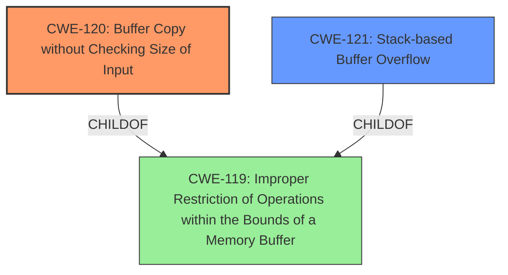

# Analysis Report for CVE-2024-39802

# Vulnerability Analysis Report: CVE-2024-39802

## Description

Multiple buffer overflow vulnerabilities exist in the qos.cgi qos_settings() functionality of Wavlink AC3000 M33A8.V5030.210505. A specially crafted HTTP request can lead to stack-based buffer overflow. An attacker can make an authenticated HTTP request to trigger these vulnerabilities.A buffer overflow vulnerability exists in the `qos_dat` POST parameter.

## Vulnerability Description Key Phrases

- **Component:** qos.cgi qos_settings() functionality
- **Vector:** specially crafted HTTP request
- **Weakness:** ['buffer overflow', 'stack-based buffer overflow']
- **Product:** Wavlink AC3000 M33A8
- **Version:** V5030.210505

## Analysis (with Relationship Data)

# Summary
| CWE ID | CWE Name | Confidence | CWE Abstraction Level | CWE Vulnerability Mapping Label | CWE-Vulnerability Mapping Notes |
|---|---|---|---|---|---|
| CWE-120 | Buffer Copy without Checking Size of Input ('Classic Buffer Overflow') | 1.0 | Base | Allowed-with-Review | Primary CWE. The vulnerability description clearly states that the **buffer overflow** occurs due to copying data without checking the size of the input. |
| CWE-121 | Stack-based Buffer Overflow | 0.8 | Variant | Allowed | Secondary candidate. The vulnerability description specifies a **stack-based buffer overflow**, making this a relevant, more specific variant of a generic buffer overflow. |
| CWE-119 | Improper Restriction of Operations within the Bounds of a Memory Buffer | 0.6 | Class | Discouraged | Secondary candidate. While a general **buffer overflow**, the more specific CWE-120 and CWE-121 are more appropriate. |

## Evidence and Confidence

*   **Confidence Score:** 0.9
*   **Evidence Strength:** HIGH

## Relationship Analysis
The primary CWE is CWE-120 (Buffer Copy without Checking Size of Input), which is a base class weakness. CWE-121 (Stack-based Buffer Overflow) is a variant of a buffer overflow, specifying its location on the stack and making it a more precise classification if stack allocation can be confirmed from additional evidence or analysis. CWE-119 (Improper Restriction of Operations within the Bounds of a Memory Buffer) is a broader class that encompasses buffer overflows, but it's less specific than CWE-120 and CWE-121 and thus not preferred.



## Vulnerability Chain
1.  **Root Cause:** CWE-120: **Buffer Copy without Checking Size of Input**. The `qos_bandwidth`, `qos_dat`, and `sel_mode` parameters are copied into buffers without proper length checking.
2.  **Location:** Stack (CWE-121)
3.  **Impact:** Arbitrary code execution, leading to control of the device.

## Summary of Analysis
The initial analysis focused on identifying the root cause of the vulnerability, which is clearly a **buffer overflow** due to the lack of input size validation during a copy operation. The "CVE Reference Links Content Summary" explicitly mentions **CWE-120 - Buffer Copy without Checking Size of Input (‘Classic Buffer Overflow’)** as the core vulnerability. The vulnerability description and the summary both highlight the lack of size checking when copying data into buffers, making CWE-120 the most appropriate primary classification. The fact that it is a **stack-based buffer overflow** suggests considering CWE-121 as a secondary classification to provide more specificity.

The selection of CWE-120 is strongly supported by the provided evidence and aligns with the MITRE mapping guidance, which suggests using the most specific Base-level CWE when available. While CWE-119 is a broader category, CWE-120 captures the specific mechanism of the vulnerability more accurately.

Relevant CWE Information:

# Enhanced Context (25 CWEs)
The following CWEs were identified as potentially relevant to this vulnerability:

## CWE-131: Incorrect Calculation of Buffer Size
**Abstraction Level**: Base
**Similarity Score**: 0.76
**Source**: dense

**Description**:
The product does not correctly calculate the size to be used when allocating a buffer, which could lead to a buffer overflow.

**Mapping Guidance**:
- Usage: Allowed
- Rationale: This CWE entry is at the Base level of abstraction, which is a preferred level of abstraction for mapping to the root causes of vulnerabilities.

## CWE-121: Stack-based Buffer Overflow
**Abstraction Level**: Variant
**Similarity Score**: 0.75
**Source**: dense

**Description**:
A stack-based buffer overflow condition is a condition where the buffer being overwritten is allocated on the stack (i.e., is a local variable or, rarely, a parameter to a function).

**Mapping Guidance**:
- Usage: Allowed
- Rationale: This CWE entry is at the Variant level of abstraction, which is a preferred level of abstraction for mapping to the root causes of vulnerabilities.

## CWE-130: Improper Handling of Length Parameter Inconsistency
**Abstraction Level**: Base
**Similarity Score**: 0.74
**Source**: dense

**Description**:
The product parses a formatted message or structure, but it does not handle or incorrectly handles a length field that is inconsistent with the actual length of the associated data.

**Mapping Guidance**:
- Usage: Allowed
- Rationale: This CWE entry is at the Base level of abstraction, which is a preferred level of abstraction for mapping to the root causes of vulnerabilities.

## CWE-119: Improper Restriction of Operations within the Bounds of a Memory Buffer
**Abstraction Level**: Class
**Similarity Score**: 0.74
**Source**: dense

**Description**:
The product performs operations on a memory buffer, but it reads from or writes to a memory location outside the buffer's intended boundary. This may result in read or write operations on unexpected memory locations that could be linked to other variables, data structures, or internal program data.

**Mapping Guidance**:
- Usage: Discouraged
- Rationale: CWE-119 is commonly misused in low-information vulnerability reports when lower-level CWEs could be used instead, or when more details about the vulnerability are available.

## CWE-134: Use of Externally-Controlled Format String
**Abstraction Level**: Base
**Similarity Score**: 0.74
**Source**: dense

**Description**:
The product uses a function that accepts a format string as an argument, but the format string originates from an external source.

**Mapping Guidance**:
- Usage: Allowed
- Rationale: This CWE entry is at the Base level of abstraction, which is a preferred level of abstraction for mapping to the root causes of vulnerabilities.

## CWE-755: Improper Handling of Exceptional Conditions
**Abstraction Level**: Class
**Similarity Score**: 0.74
**Source**: dense

**Description**:
The product does not handle or incorrectly handles an exceptional condition.

**Mapping Guidance**:
- Usage: Discouraged
- Rationale: This CWE entry is a level-1 Class (i.e., a child of a Pillar). It might have lower-level children that would be more appropriate

## CWE-790: Improper Filtering of Special Elements
**Abstraction Level**: Class
**Similarity Score**: 0.74
**Source**: dense

**Description**:
The product receives data from an upstream component, but does not filter or incorrectly filters special elements before sending it to a downstream component.

**Mapping Guidance**:
- Usage: Allowed-with-Review
- Rationale: This CWE entry is a Class and might have Base-level children that would be more appropriate

## CWE-1285: Improper Validation of Specified Index, Position, or Offset in Input
**Abstraction Level**: Base
**Similarity Score**: 0.73
**Source**: dense

**Description**:
The product receives input that is expected to specify an index, position, or offset into an indexable resource such as a buffer or file, but it does not validate or incorrectly validates that the specified index/position/offset has the required properties.

**Mapping Guidance**:
- Usage: Allowed
- Rationale: This CWE entry is at the Base level of abstraction, which is a preferred level of abstraction for mapping to the root causes of vulnerabilities.

## CWE-425: Direct Request ('Forced Browsing')
**Abstraction Level**: Base
**Similarity Score**: 0.73
**Source**: dense

**Description**:
The web application does not adequately enforce appropriate authorization on all restricted URLs, scripts, or files.

**Mapping Guidance**:
- Usage: Allowed
- Rationale: This CWE entry is at the Base level of abstraction, which is a preferred level of abstraction for mapping to the root causes of vulnerabilities.

## CWE-193: Off-by-one Error
**Abstraction Level**: Base
**Similarity Score**: 0.73
**Source**: dense

**Description**:
A product calculates or uses an incorrect maximum or minimum value that is 1 more, or 1 less, than the correct value.

**Mapping Guidance**:
- Usage: Allowed
- Rationale: This CWE entry is at the Base level of abstraction, which is a preferred level of abstraction for mapping to the root causes of vulnerabilities.

## CWE-190: Integer Overflow or Wraparound


## CWE Relationship Analysis

Current CWEs represent these abstraction levels: .


### Vulnerability Chain Analysis

**Chain starting from CWE-121:**
- 121 (Stack-based Buffer Overflow) - ROOT


**Chain starting from CWE-130:**
- 130 (Improper Handling of Length Parameter Inconsistency) - ROOT


### CWE Relationship Diagram

```mermaid
graph TD
    classDef primary fill:#f96,stroke:#333,stroke-width:2px
    classDef secondary fill:#69f,stroke:#333
    classDef tertiary fill:#9e9,stroke:#333
```


*Report generated on 2025-07-13 11:54:45*
