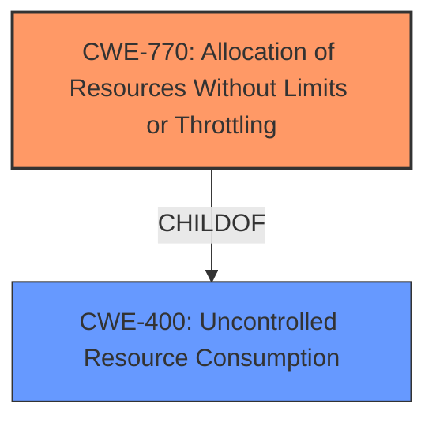

# Enhanced Analysis for CVE-2024-39810

# Summary

| CWE ID  | CWE Name                                                        | Confidence | CWE Abstraction Level | CWE Vulnerability Mapping Label | CWE-Vulnerability Mapping Notes |
| ------- | --------------------------------------------------------------- | ---------- | --------------------- | ------------------------------- | ------------------------------- |
| CWE-770 | Allocation of Resources Without Limits or Throttling | 0.75       | Base                  | Primary                         | Allowed                       |
| CWE-400 | Uncontrolled Resource Consumption | 0.50       | Class                  | Secondary                         | Discouraged                       |

## Evidence and Confidence

*   **Confidence Score:** 0.70
*   **Evidence Strength:** MEDIUM

## Relationship Analysis

The primary relationship that influences the mapping is the parent-child relationship between CWE-770 Allocation of Resources Without Limits or Throttling and CWE-400 Uncontrolled Resource Consumption. CWE-770 is a more specific case of CWE-400. The vulnerability description indicates a **failure to limit the size of the CA path file**, which directly corresponds to allocating resources without limits.



## Vulnerability Chain

The vulnerability chain starts with the **failure to limit and size the CA path file** (CWE-770). An attacker can then exploit this by providing an oversized file such as `/dev/zero`. This leads to the consumption of excessive resources, causing the application to crash (CWE-400).

## Summary of Analysis

The initial assessment identified several potential CWEs, but after careful consideration of the vulnerability description and the CWE specifications, CWE-770 appears to be the most accurate representation of the root cause. The vulnerability description explicitly states that the system **fails to limit and size the CA path file**. This directly aligns with the definition of CWE-770, which describes a situation where a product allocates resources without imposing restrictions on their size or number. The subsequent application crash is a result of this **uncontrolled resource consumption**, which is represented by CWE-400. However, CWE-400 is a more general weakness, and CWE-770 provides a more specific and accurate description of the root cause. The choice of CWE-770 is further supported by its Base abstraction level, which is preferred for root cause analysis.

The other CWEs that were considered but not chosen include:

*   CWE-835: Loop with Unreachable Exit Condition ('Infinite Loop') - This CWE doesn't fit the vulnerability because there's no mention of a loop.
*   CWE-789: Memory Allocation with Excessive Size Value - This is related, but CWE-770 is broader and more accurately captures the allocation of resources without limits, not just memory.
*   CWE-295: Improper Certificate Validation - This doesn't apply because the vulnerability isn't related to certificate validation.
*   CWE-863: Incorrect Authorization - While a System Role is required, the core issue isn't authorization, but resource management.
*   CWE-668: Exposure of Resource to Wrong Sphere - This is too high-level and doesn't pinpoint the root cause of the problem.
*   CWE-1284: Improper Validation of Specified Quantity in Input - This is related but focuses on input validation, whereas the core issue is the lack of resource limits during allocation.
*   CWE-22: Improper Limitation of a Pathname to a Restricted Directory ('Path Traversal') - This doesn't apply as the vulnerability is not related to path traversal.
*   CWE-1325: Improperly Controlled Sequential Memory Allocation - This is related but focuses specifically on sequential memory allocation, while the described vulnerability refers to the allocation of any file as a CA path.

The final selection is based on the evidence from the vulnerability description, which clearly indicates a **failure to limit the CA path file size**. This leads directly to uncontrolled resource consumption and the application crash. The selected CWEs are at the optimal level of specificity, with CWE-770 representing the root cause and CWE-400 representing the impact.

Relevant CWE Information:

# Enhanced Context (25 CWEs)
The following CWEs were identified as potentially relevant to this vulnerability:

## CWE-497: Exposure of Sensitive System Information to an Unauthorized Control Sphere
**Abstraction Level**: Base
**Similarity Score**: 0.74
**Source**: dense

**Description**:
The product does not properly prevent sensitive system-level information from being accessed by unauthorized actors who do not have the same level of access to the underlying system as the product does.

**Mapping Guidance**:
- Usage: Allowed
- Rationale: This CWE entry is at the Base level of abstraction, which is a preferred level of abstraction for mapping to the root causes of vulnerabilities.


## CWE-668: Exposure of Resource to Wrong Sphere
**Abstraction Level**: Class
**Similarity Score**: 0.74
**Source**: dense

**Description**:
The product exposes a resource to the wrong control sphere, providing unintended actors with inappropriate access to the resource.

**Mapping Guidance**:
- Usage: Discouraged
- Rationale: CWE-668 is high-level and is often misused as a catch-all when lower-level CWE IDs might be applicable. It is sometimes used for low-information vulnerability reports [REF-1287]. It is a level-1 Class (i.e., a child of a Pillar). It is not useful for trend analysis.


## CWE-755: Improper Handling of Exceptional Conditions
**Abstraction Level**: Class
**Similarity Score**: 0.74
**Source**: dense

**Description**:
The product does not handle or incorrectly handles an exceptional condition.

**Mapping Guidance**:
- Usage: Discouraged
- Rationale: This CWE entry is a level-1 Class (i.e., a child of a Pillar). It might have lower-level children that would be more appropriate


## CWE-346: Origin Validation Error
**Abstraction Level**: Class
**Similarity Score**: 0.74
**Source**: dense

**Description**:
The product does not properly verify that the source of data or communication is valid.

**Mapping Guidance**:
- Usage: Allowed-with-Review
- Rationale: This CWE entry is a Class and might have Base-level children that would be more appropriate


## CWE-923: Improper Restriction of Communication Channel to Intended Endpoints
**Abstraction Level**: Class
**Similarity Score**: 0.73
**Source**: dense

**Description**:
The product establishes a communication channel to (or from) an endpoint for privileged or protected operations, but it does not properly ensure that it is communicating with the correct endpoint.

**Mapping Guidance**:
- Usage: Allowed-with-Review
- Rationale: This CWE entry is a Class and might have Base-level children that would be more appropriate


## CWE-696: Incorrect Behavior Order
**Abstraction Level**: Class
**Similarity Score**: 0.73
**Source**: dense

**Description**:
The product performs multiple related behaviors, but the behaviors are performed in the wrong order in ways which may produce resultant weaknesses.

**Mapping Guidance**:
- Usage: Allowed-with-Review
- Rationale: This CWE entry is a Class and might have Base-level children that would be more appropriate


## CWE-789: Memory Allocation with Excessive Size Value
**Abstraction Level**: Variant
**Similarity Score**: 0.73
**Source**: dense

**Description**:
The product allocates memory based on an untrusted, large size value, but it does not ensure that the size is within expected limits, allowing arbitrary amounts of memory to be allocated.

**Mapping Guidance**:
- Usage: Allowed
- Rationale: This CWE entry is at the Variant level of abstraction, which is a preferred level of abstraction for mapping to the root causes of vulnerabilities.


## CWE-209: Generation of Error Message Containing Sensitive Information
**Abstraction Level**: Base
**Similarity Score**: 0.73
**Source**: dense

**Description**:
The product generates an error message that includes sensitive information about its environment, users, or associated data.

**Mapping Guidance**:
- Usage: Allowed
- Rationale: This CWE entry is at the Base level of abstraction, which is a preferred level of abstraction for mapping to the root causes of vulnerabilities.


## CWE-203: Observable Discrepancy
**Abstraction Level**: Base
**Similarity Score**: 0.72
**Source**: dense

**Description**:
The product behaves differently or sends different responses under different circumstances in a way that is observable to an unauthorized actor, which exposes security-relevant information about the state of the product, such as whether a particular operation was successful or not.

**Mapping Guidance**:
- Usage: Allowed
- Rationale: This CWE entry is at the Base level of abstraction, which is a preferred level of abstraction


## CWE Relationship Analysis

Current CWEs represent these abstraction levels: .


### Vulnerability Chain Analysis

**Chain starting from CWE-863:**
- 863 (Incorrect Authorization) - ROOT


**Chain starting from CWE-1284:**
- 1284 (Improper Validation of Specified Quantity in Input) - ROOT


### CWE Relationship Diagram

```mermaid
graph TD
    classDef primary fill:#f96,stroke:#333,stroke-width:2px
    classDef secondary fill:#69f,stroke:#333
    classDef tertiary fill:#9e9,stroke:#333
```