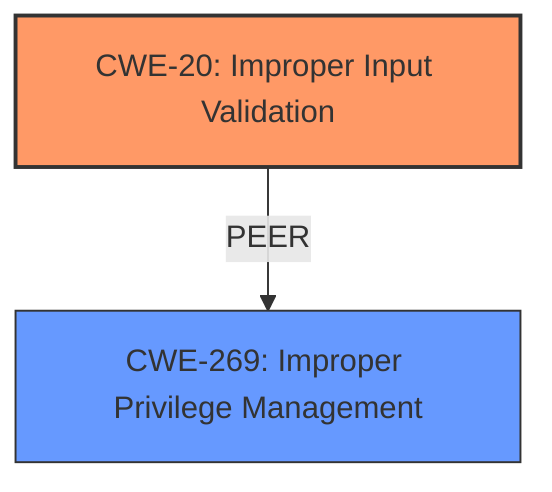

# Analysis for CVE-2024-39811

# Summary
| CWE ID | CWE Name | Confidence | CWE Abstraction Level | CWE Vulnerability Mapping Label | CWE-Vulnerability Mapping Notes |
|---|---|---|---|---|---|
| CWE-20 | Improper Input Validation | 1.0 | Class | Primary CWE | Discouraged |
| CWE-269 | Improper Privilege Management | 0.7 | Class | Secondary Candidate | Discouraged |

## Evidence and Confidence

*   **Confidence Score:** 0.9
*   **Evidence Strength:** HIGH

## Relationship Analysis
The primary relationship that influenced the decision was the parent-child relationship between CWE-20 and its potential child CWEs. While more specific child CWEs might exist, the provided information doesn't give enough detail to pinpoint the exact type of input validation error. CWE-269 is a peer that represents issues with privilege management, which is the high level impact but not the root cause.

## Vulnerability Chain
The vulnerability chain starts with **improper input validation** (CWE-20), which leads to a privileged user being able to perform actions that result in escalation of privilege (CWE-269 impact).

## Summary of Analysis
The initial analysis strongly points towards **CWE-20 Improper Input Validation** as the root cause due to the explicit mention of "**Improper input validation**" in both the vulnerability description and the CVE Reference Links Content Summary. The vulnerability allows a privileged user to escalate privileges via local access. While the impact is privilege escalation, the root cause is the **improper input validation** allowing the exploit. The retriever results also list CWE-20 as a potential candidate.

Although CWE-20 is a Class-level CWE and is generally discouraged for use when more specific CWEs exist, the information provided does not allow for a more specific mapping.

The high confidence score stems from the clear and direct evidence in the vulnerability description and summary, although it is tempered slightly by the lack of specificity that would allow for a more precise CWE selection.

Relevant CWE Information:

# Enhanced Context (25 CWEs)
The following CWEs were identified as potentially relevant to this vulnerability:

## CWE-20: Improper Input Validation
**Abstraction Level**: class
**Similarity Score**: 2.49
**Source**: graph

**Description**:
CWE-20: Improper Input Validation

**Mapping Guidance**:
- Usage: Discouraged
- Rationale: CWE-20 is commonly misused in low-information vulnerability reports when lower-level CWEs could be used instead, or when more details about the vulnerability are available [REF-1287]. It is not useful for trend analysis. It is also a level-1 Class (i.e., a child of a Pillar).

**Relationships**:
- CHILDOF -> CWE-707
- PEEROF -> CWE-345
- CANPRECEDE -> CWE-22
- CANPRECEDE -> CWE-41
- CANPRECEDE -> CWE-74

## CWE-269: Improper Privilege Management
**Abstraction Level**: Class
**Similarity Score**: 1364.12
**Source**: sparse

**Description**:
The product does not properly assign, modify, track, or check privileges for an actor, creating an unintended sphere of control for that actor.

**Mapping Guidance**:
- Usage: Discouraged
- Rationale: CWE-269 is commonly misused. It can be conflated with "privilege escalation," which is a technical impact that is listed in many low-information vulnerability reports [REF-1287]. It is not useful for trend analysis.