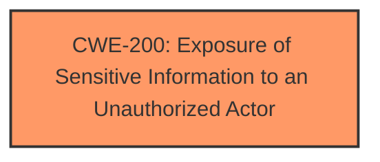

# Raw Analyzer Response for CVE-2024-39824

# Summary
| CWE ID  | CWE Name                                                  | Confidence | CWE Abstraction Level | CWE Vulnerability Mapping Label | CWE-Vulnerability Mapping Notes |
| :-------- | :-------------------------------------------------------- | :--------- | :-------------------- | :------------------------------ | :------------------------------ |
| CWE-200 | Exposure of Sensitive Information to an Unauthorized Actor | 0.8        | Class                 | Primary                         | Discouraged                  |

## Evidence and Confidence

*   **Confidence Score:** 0.8
*   **Evidence Strength:** MEDIUM

## Relationship Analysis
The primary relationship considered was the parent-child relationship. CWE-200 is a Class-level CWE, and while it is discouraged, no more specific Base or Variant CWEs were clearly indicated by the evidence. The retriever results also suggest CWE-200 as a strong candidate, although it is a class. There is no specific root cause, so we choose the class type.

## Vulnerability Chain
The vulnerability chain starts with an unspecified weakness that allows a **privileged user** with **network access** to perform **information disclosure**. The chain is:
1.  Unspecified Weakness => **Information Disclosure** (CWE-200)

CWE-200 represents the impact of the vulnerability.

## Summary of Analysis
The initial assessment focused on identifying a suitable CWE for the reported sensitive information disclosure vulnerability. The provided evidence indicates that a **privileged user** with **network access** can cause an **information disclosure**. The best match is **CWE-200 - Exposure of Sensitive Information to an Unauthorized Actor**. While CWE-200 is a class level CWE and discouraged, the vulnerability description lacks specific root cause details.

The retriever results suggested various CWEs, but most of them relate to specific root causes that are not mentioned in the vulnerability description. For example, CWE-126 (Buffer Over-read) and CWE-321 (Use of Hard-coded Cryptographic Key) are too specific. Other CWEs like CWE-284 (Improper Access Control) are too high-level.

Given the limited information on the root cause, CWE-200 is the most appropriate choice to represent the **impact** of the vulnerability which is **information disclosure**. It is a Class level CWE.

Relevant CWE Information:

# Enhanced Context (25 CWEs)
The following CWEs were identified as potentially relevant to this vulnerability:

## CWE-200: Exposure of Sensitive Information to an Unauthorized Actor
**Abstraction Level**: Class
**Similarity Score**: 0.75
**Source**: dense

**Description**:
The product exposes sensitive information to an actor that is not explicitly authorized to have access to that information.

**Mapping Guidance**:
- Usage: Discouraged
- Rationale: CWE-200 is commonly misused to represent the loss of confidentiality in a vulnerability, but confidentiality loss is a technical impact - not a root cause error. As of CWE 4.9, over 400 CWE entries can lead to a loss of confidentiality. Other options are often available. [REF-1287].