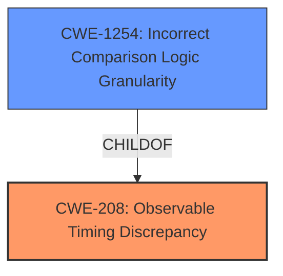

# Raw Analyzer Response for CVE-2024-39830

# Summary
| CWE ID | CWE Name | Confidence | CWE Abstraction Level | CWE Vulnerability Mapping Label | CWE-Vulnerability Mapping Notes |
|---|---|---|---|---|---|
| CWE-208 | Observable Timing Discrepancy | 0.9 | Base |  Primary CWE | Allowed |
| CWE-1254 | Incorrect Comparison Logic Granularity | 0.6 | Base |  Secondary Candidate | Allowed |

## Evidence and Confidence

*   **Confidence Score:** 0.8
*   **Evidence Strength:** HIGH

## Relationship Analysis
The primary CWE is CWE-208, which describes the root cause of the vulnerability: the observable timing discrepancy. CWE-1254, Incorrect Comparison Logic Granularity, is a child of CWE-208 and could be considered, however, is less descriptive of the root cause.

## Vulnerability Chain
The chain of events is as follows:
1.  **Root Cause:** CWE-208 Observable Timing Discrepancy due to the **failure to use constant time comparison for remote cluster tokens**.
2.  **Impact:** An attacker can retrieve the remote cluster token via a timing attack.

## Summary of Analysis
The vulnerability description clearly states that the product **fails to use constant time comparison for remote cluster tokens**. This **weakness** allows an attacker to perform a timing attack and retrieve the remote cluster token. The primary CWE is therefore CWE-208 (Observable Timing Discrepancy), as the timing difference in the comparison operation is observable and exploitable. This aligns with the description of CWE-208, which states: "Two separate operations in a product require different amounts of time to complete, in a way that is observable to an actor and reveals security-relevant information about the state of the product."

CWE-1254 (Incorrect Comparison Logic Granularity) could be considered as a secondary candidate since the comparison logic is not precise enough. However, CWE-208 is the more direct representation of the **root cause**.

Relevant CWE Information:

# Enhanced Context (25 CWEs)
The following CWEs were identified as potentially relevant to this vulnerability:

## CWE-208: Observable Timing Discrepancy
**Abstraction Level**: Base
**Similarity Score**: 0.77
**Source**: dense

**Description**:
Two separate operations in a product require different amounts of time to complete, in a way that is observable to an actor and reveals security-relevant information about the state of the product, such as whether a particular operation was successful or not.

**Mapping Guidance**:
- Usage: Allowed
- Rationale: This CWE entry is at the Base level of abstraction, which is a preferred level of abstraction for mapping to the root causes of vulnerabilities.

## CWE-1254: Incorrect Comparison Logic Granularity
**Abstraction Level**: base
**Similarity Score**: 2.47
**Source**: graph

**Description**:
CWE-1254: Incorrect Comparison Logic Granularity

**Mapping Guidance**:
- Usage: Allowed
- Rationale: This CWE entry is at the Base level of abstraction, which is a preferred level of abstraction for mapping to the root causes of vulnerabilities.

### CWE Selection

*   **CWE-208: Observable Timing Discrepancy**
    *   **Justification:** The vulnerability description explicitly mentions a timing attack due to the **failure to use constant time comparison**. This directly corresponds to CWE-208, where the timing difference in operations is observable and exploitable.
    *   **Technical Explanation:** The `fail to use constant time comparison` means that the time it takes to compare tokens varies depending on how much the tokens match. An attacker can send many tokens and measure the time it takes to get a response to guess at the real value of the token.
    *   **Security Implications:** An attacker can retrieve sensitive information (the remote cluster token) by exploiting the timing discrepancy.
    *   **Relationship:** CWE-208 is the root cause of the vulnerability.
    *   **Mapping Guidance:** Allowed, as it is at the Base level of abstraction.
    *   **Confidence:** 0.9

*   **CWE-1254: Incorrect Comparison Logic Granularity**
    *   **Justification:** While the timing discrepancy is the primary issue, the root cause is the logic is **incorrect** allowing for timing discrepancy. However, it is too high level.
    *   **Technical Explanation:** The comparison logic has an issue that allows observable timing discrepancies, allowing an attacker to differentiate tokens.
    *   **Security Implications:** Could allow access to sensitive information.
    *   **Relationship:** ChildOf CWE-208
    *   **Mapping Guidance:** Allowed, as it is at the Base level of abstraction.
    *   **Confidence:** 0.6