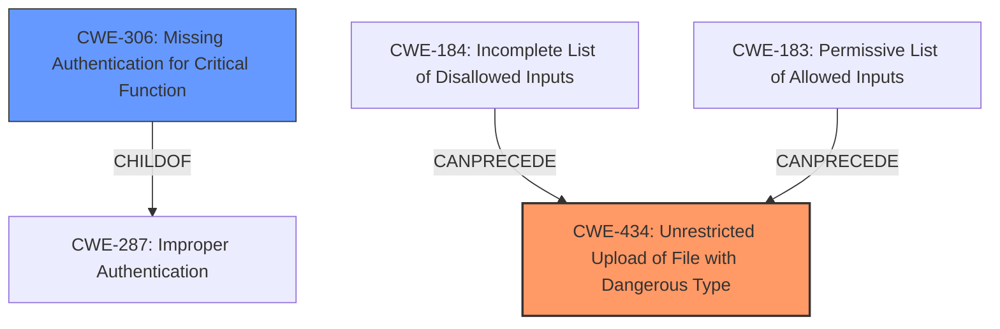

# Enhanced Analysis for CVE-2024-39865

# Summary
| CWE ID | CWE Name | Confidence | CWE Abstraction Level | CWE Vulnerability Mapping Label | CWE-Vulnerability Mapping Notes |
|---|---|---|---|---|---|
| CWE-434 | Unrestricted Upload of File with Dangerous Type | 0.9 | Base | Allowed | Primary CWE. The **improper file restoration** allows for an attacker with access to the backup encryption key to upload malicious files. |
| CWE-306 | Missing Authentication for Critical Function | 0.6 | Base | Allowed | Secondary CWE. There is a suggestion that authentication is missing for the file restore functionality. |

## Evidence and Confidence

*   **Confidence Score:** 0.8
*   **Evidence Strength:** MEDIUM

## Relationship Analysis
The primary CWE is CWE-434, which has no direct parent or child relationships that are highly relevant in this context. However, it can be preceded by CWE-184 (Incomplete List of Disallowed Inputs) or CWE-183 (Permissive List of Allowed Inputs). CWE-306 (Missing Authentication for Critical Function) is another considered CWE.



## Vulnerability Chain
The vulnerability chain starts with **improper file restoration**, leading to the ability to upload malicious files, and potentially resulting in remote code execution.
1.  **Root Cause:** **Improper file restoration** leads to unrestricted upload. (CWE-434)
2.  **Impact:** Remote code execution.

## Summary of Analysis
The primary focus is on the **improper file restoration** that enables uploading malicious files. This aligns directly with CWE-434 (Unrestricted Upload of File with Dangerous Type), which is at the Base level of abstraction. The "CVE Reference Links Content Summary" section mentions "Insufficient path validation during file restoration" which supports this assessment.

CWE-306 (Missing Authentication for Critical Function) is a secondary consideration as it is possible authentication may be missing for the file restore functionality and the retriever results suggest it, but this is not explicitly stated.

The selection of CWE-434 is based on the ability to upload a malicious file and restore it due to the **improper file restoration**. This is a direct match for the CWE description.

Other CWEs Considered but Not Used:

*   CWE-311 (Missing Encryption of Sensitive Data): While the description mentions encrypted backup files, the core issue isn't the lack of encryption, but the **improper file restoration** and unrestricted upload.
*   CWE-425 (Direct Request ('Forced Browsing')): Not applicable as the vulnerability isn't about bypassing authorization on URLs or files.
*   CWE-321 (Use of Hard-coded Cryptographic Key): The vulnerability involves access to the backup encryption key, but the root cause isn't the key itself being hard-coded, but rather the **improper file restoration**.
*   CWE-259 (Use of Hard-coded Password): The vulnerability involves access to the backup encryption key, but the root cause isn't the password itself being hard-coded, but rather the **improper file restoration**.


## CWE Relationship Analysis

Current CWEs represent these abstraction levels: .


### Vulnerability Chain Analysis

**Chain starting from CWE-183:**
- 183 (Permissive List of Allowed Inputs) - ROOT


**Chain starting from CWE-321:**
- 321 (Use of Hard-coded Cryptographic Key) - ROOT


### CWE Relationship Diagram

```mermaid
graph TD
    classDef primary fill:#f96,stroke:#333,stroke-width:2px
    classDef secondary fill:#69f,stroke:#333
    classDef tertiary fill:#9e9,stroke:#333
```