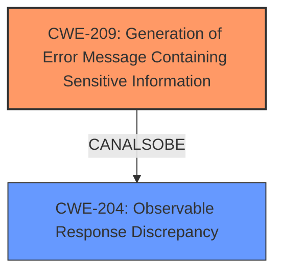

# Raw Analyzer Response for CVE-2024-39896

# Summary
| CWE ID  | CWE Name                                                        | Confidence | CWE Abstraction Level | CWE Vulnerability Mapping Label | CWE-Vulnerability Mapping Notes |
| :-------- | :-------------------------------------------------------------- | :--------- | :-------------------- | :------------------------------ | :------------------------------ |
| CWE-209   | Generation of Error Message Containing Sensitive Information   | 0.9        | Base                  | Primary                         | Allowed                       |
| CWE-204   | Observable Response Discrepancy                                | 0.7        | Base                  | Secondary                       | Allowed                       |

## Evidence and Confidence

*   **Confidence Score:** 0.8
*   **Evidence Strength:** HIGH

## Relationship Analysis
The primary relationship influencing the CWE selection is the hierarchical structure. CWE-209 is a base-level CWE that directly addresses the core issue of generating error messages containing sensitive information. While other CWEs like CWE-204 (Observable Response Discrepancy) are related, they are more general. The analysis focuses on the specific act of generating an error message revealing sensitive data, making CWE-209 the more precise choice. There are no relevant chain relationships to consider.

## Vulnerability Chain
The vulnerability chain starts with **improper error handling**, which leads to the generation of an error message containing sensitive information (CWE-209). This, in turn, allows for account enumeration. The chain can be summarized as follows:
1.  **Improper Error Handling**
2.  CWE-209: Generation of Error Message Containing Sensitive Information
3.  Account Enumeration

## Summary of Analysis
The analysis is based on the vulnerability description, CVE reference links, and retriever results. The key phrase "**improper error handling**" and the description of Directus throwing a "helpful error that the user belongs to another provider" directly support the selection of CWE-209 (Generation of Error Message Containing Sensitive Information). The CVE reference confirms that the vulnerability arises from the way Directus handles authentication attempts, specifically when a user attempts to log in using an email address already associated with an SSO provider, leading to a specific error message being displayed.

The retriever results suggest several CWEs, including CWE-1390 (Weak Authentication), CWE-204 (Observable Response Discrepancy), and CWE-209 (Generation of Error Message Containing Sensitive Information). However, CWE-209 is the most specific and accurately reflects the vulnerability's root cause.

The choice of CWE-209 is at the optimal level of specificity as it directly addresses the generation of sensitive information in error messages, which is the core of the vulnerability. While CWE-204 (Observable Response Discrepancy) is a valid secondary consideration, it's less specific and more of a consequence of the primary weakness.

Relevant CWE Information:

# Enhanced Context (25 CWEs)
The following CWEs were identified as potentially relevant to this vulnerability:

## CWE-204: Observable Response Discrepancy
**Abstraction Level**: Base
**Similarity Score**: 0.78
**Source**: dense

**Description**:
The product provides different responses to incoming requests in a way that reveals internal state information to an unauthorized actor outside of the intended control sphere.

**Mapping Guidance**:
- Usage: Allowed
- Rationale: This CWE entry is at the Base level of abstraction, which is a preferred level of abstraction for mapping to the root causes of vulnerabilities.

## CWE-209: Generation of Error Message Containing Sensitive Information
**Abstraction Level**: Base
**Similarity Score**: 0.75
**Source**: dense

**Description**:
The product generates an error message that includes sensitive information about its environment, users, or associated data.

**Mapping Guidance**:
- Usage: Allowed
- Rationale: This CWE entry is at the Base level of abstraction, which is a preferred level of abstraction for mapping to the root causes of vulnerabilities.

### Detailed Analysis of Selected CWEs:

**1. CWE-209: Generation of Error Message Containing Sensitive Information**

*   **Technical Explanation:** The vulnerability description clearly states that Directus throws an error message revealing whether an email address is associated with an SSO provider. This aligns directly with the definition of CWE-209, which involves generating error messages containing sensitive information.
*   **Security Implications and Potential Impact:** The information disclosure enables user enumeration, which can be used for targeted phishing attacks or other social engineering tactics.
*   **Parent-Child Relationships and Chain Patterns:** CWE-209 can be a part of a chain leading to information exposure.
*   **Primary/Secondary:** This is the primary weakness as the root cause is the **improper error handling** leading to information exposure.
*   **MITRE Mapping Guidance:** The usage is "ALLOWED," and the rationale is that it's at the Base level of abstraction, which is preferred.

**2. CWE-204: Observable Response Discrepancy**

*   **Technical Explanation:** Directus provides different responses based on whether the email is an SSO user or not. This falls under the definition of CWE-204, where the system provides different responses that reveal internal state information.
*   **Security Implications and Potential Impact:** The differing responses allow an attacker to determine valid SSO users, aiding in account enumeration.
*   **Parent-Child Relationships and Chain Patterns:** Can be related to information disclosure vulnerabilities.
*   **Primary/Secondary:** This is a secondary weakness, as it is a consequence of the primary weakness (CWE-209) rather than the direct root cause. The root cause is generating the detailed error message (CWE-209), while CWE-204 is the observable difference.
*   **MITRE Mapping Guidance:** The usage is "ALLOWED," and the rationale is that it's at the Base level of abstraction.

### CWEs Considered but Not Used:

*   **CWE-287 Improper Authentication, CWE-306 Missing Authentication for Critical Function, CWE-862 Missing Authorization, CWE-863 Incorrect Authorization:** These CWEs were considered but deemed less appropriate because the vulnerability is not directly related to authentication or authorization failures. The core issue is the **improper error handling** revealing sensitive information, rather than a failure in authenticating or authorizing users.

*   **CWE-613 Insufficient Session Expiration:** Not applicable as the vulnerability doesn't involve session management issues.

*   **CWE-201 Insertion of Sensitive Information Into Sent Data:** While related to information exposure, CWE-209 is more specific as it focuses on error messages.

*   **CWE-347 Improper Verification of Cryptographic Signature:** Not relevant as the vulnerability does not involve cryptographic signatures.

*   **CWE-756 Missing Custom Error Page:** Not applicable as the vulnerability doesn't involve missing error pages.