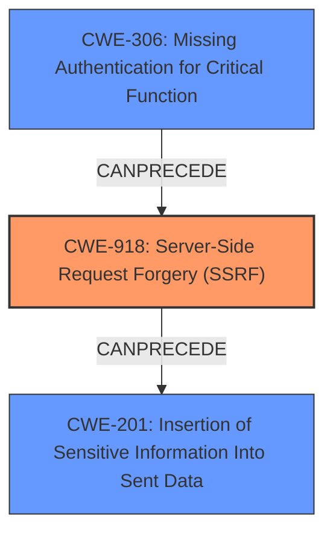

# Analysis Report for CVE-2024-39919

# Vulnerability Analysis Report: CVE-2024-39919

## Description

@jmondi/url-to-png is an open source URL to PNG utility featuring parallel rendering using Playwright for screenshots and with storage caching via Local, S3, or CouchDB. The package includes an `ALLOW_LIST` where the host can specify which services the user is permitted to capture screenshots of. By default, capturing screenshots of web services running on localhost, 127.0.0.1, or the [] is allowed. If someone hosts this project on a server, users could then capture screenshots of other web services running locally. This issue has been addressed in version 2.1.1 with the addition of a blocklist. Users are advised to upgrade. There are no known workarounds for this vulnerability.

## Vulnerability Description Key Phrases

- **Impact:** capture screenshots of other web services running locally
- **Attacker:** users
- **Product:** url-to-png
- **Version:** before 2.1.1

## Analysis (with Relationship Data)

# Summary
| CWE ID | CWE Name | Confidence | CWE Abstraction Level | CWE Vulnerability Mapping Label | CWE-Vulnerability Mapping Notes |
|---|---|---|---|---|---|
| CWE-918 | Server-Side Request Forgery (SSRF) | 0.9 | Base | Allowed | Primary CWE. The vulnerability allows an attacker to capture screenshots of internal web services, which is a form of SSRF.|
| CWE-306 | Missing Authentication for Critical Function | 0.6 | Base | Allowed | Secondary candidate. The product does not perform authentication to restrict the ability to capture screenshots of web services.|
| CWE-201 | Insertion of Sensitive Information Into Sent Data | 0.5 | Base | Allowed | Secondary candidate. Capturing screenshots of internal web services may lead to insertion of sensitive information into sent data.|

## Evidence and Confidence

*   **Confidence Score:** 0.8
*   **Evidence Strength:** MEDIUM

## Relationship Analysis
The primary CWE selected is CWE-918 (Server-Side Request Forgery), which is a Base level CWE. It accurately describes the vulnerability where an attacker can cause the server to make requests to unintended locations (internal services in this case). CWE-306 (Missing Authentication for Critical Function) is a possible secondary CWE, as the lack of authentication allows unauthorized screenshot captures. CWE-201 (Insertion of Sensitive Information Into Sent Data) is also considered, as the screenshots could contain sensitive information.



## Vulnerability Chain
The vulnerability chain starts with the **lack of a default block list** in the `url-to-png` package. This leads to the possibility of **Server-Side Request Forgery (SSRF)** (CWE-918) as users can manipulate the URL parameter to capture screenshots of internal web services. If sensitive information is present in those internal services, it can result in **Insertion of Sensitive Information Into Sent Data** (CWE-201). The **Missing Authentication for Critical Function** (CWE-306) exacerbates this issue as it allows anyone to trigger the screenshot functionality without proper authorization.

## Summary of Analysis
The primary CWE mapping to CWE-918 is based on the vulnerability description and CVE reference links. The core issue is that the `url-to-png` package, due to the **lack of a block list**, allows attackers to capture screenshots of other web services running locally on the server. This directly aligns with the description of SSRF, where the server retrieves the contents of a URL without proper validation. The vulnerability description key phrases "capture screenshots of other web services running locally" and the CVE reference links content summary specifically highlight the exposure of internal services as the main impact. While other CWEs were considered, CWE-918 best captures the root cause of the vulnerability. The confidence level is high (0.9) because there is direct evidence in the vulnerability description and CVE reference links.

CWE-306 is a secondary candidate because the **missing authentication** allows unauthorized users to use the service, potentially capturing sensitive information. This is a contributing factor but not the primary weakness.

CWE-201 is a tertiary candidate because the captured screenshots **may contain sensitive information**, but this is a consequence of the SSRF rather than the root cause.

Other CWEs considered but not used:

*   CWE-74 (Improper Neutralization of Special Elements in Output Used by a Downstream Component ('Injection')): This was considered due to the manipulation of the URL parameter. However, the primary issue is not about injection but rather the server making requests to unintended locations. Therefore, CWE-918 is a better fit.
*   CWE-434 (Unrestricted Upload of File with Dangerous Type): This is not applicable as the vulnerability does not involve file uploads.
*   CWE-306 (Missing Authentication for Critical Function): While the product does not require authentication to take screenshots, the main issue is that the product by design, allows screenshots of localhost if no block list is specified.


## CWE Relationship Analysis

Current CWEs represent these abstraction levels: .


### Vulnerability Chain Analysis

**Chain starting from CWE-306:**
- 306 (Missing Authentication for Critical Function) - ROOT


**Chain starting from CWE-201:**
- 201 (Insertion of Sensitive Information Into Sent Data) - ROOT


### CWE Relationship Diagram

```mermaid
graph TD
    classDef primary fill:#f96,stroke:#333,stroke-width:2px
    classDef secondary fill:#69f,stroke:#333
    classDef tertiary fill:#9e9,stroke:#333
```


*Report generated on 2025-07-13 12:04:37*
