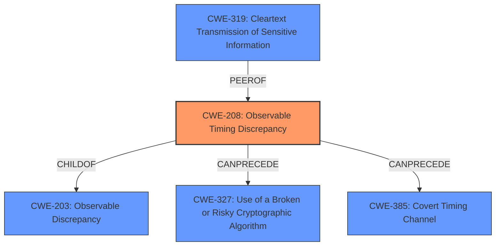

# Raw Analyzer Response for CVE-2024-39921

# Summary
| CWE ID | CWE Name | Confidence | CWE Abstraction Level | CWE Vulnerability Mapping Label | CWE-Vulnerability Mapping Notes |
|---|---|---|---|---|---|
| CWE-208 | Observable Timing Discrepancy | 1.0 | Base | Primary | Allowed |
| CWE-319 | Cleartext Transmission of Sensitive Information | 0.5 | Base | Secondary | Allowed |

## Evidence and Confidence

*   **Confidence Score:** 0.75
*   **Evidence Strength:** HIGH

## Relationship Analysis
The primary CWE is CWE-208, which is a Base level CWE. The retriever results and the CVE description both support this. CWE-208 is a child of CWE-203 (Observable Discrepancy). It can precede CWE-327 (Use of a Broken or Risky Cryptographic Algorithm) and CWE-385 (Covert Timing Channel).

## Vulnerability Chain
The vulnerability chain starts with a **timing discrepancy** (CWE-208) in the processing of SSL/TLS connections. This allows an attacker to potentially decrypt a portion of the communication, leading to information disclosure.

## Summary of Analysis
The primary weakness is CWE-208 (Observable Timing Discrepancy). The vulnerability description clearly states a **timing discrepancy** issue, and the CVE reference links confirm that the root cause is a **timing side-channel**. "Specifically, differences in processing time based on certain parameters can be observed by an attacker." This aligns perfectly with the definition of CWE-208.

I considered CWE-319 (Cleartext Transmission of Sensitive Information) because the impact is that "some of the encrypted communication may be decrypted." While the ultimate impact *could* be equivalent to cleartext transmission, the primary weakness is the timing discrepancy that *leads* to this potential decryption, not a failure to encrypt in the first place. Therefore, I'm including CWE-319 as a secondary issue.

The selected CWEs are at the optimal level of specificity, as CWE-208 is a Base level CWE that accurately describes the **timing discrepancy**, while CWE-319 describes the potential result of the vulnerability.

Relevant CWE Information:

# Enhanced Context (25 CWEs)
The following CWEs were identified as potentially relevant to this vulnerability:

## CWE-208: Observable Timing Discrepancy
**Abstraction Level**: Base
**Similarity Score**: 0.79
**Source**: dense

**Description**:
Two separate operations in a product require different amounts of time to complete, in a way that is observable to an actor and reveals security-relevant information about the state of the product, such as whether a particular operation was successful or not.

**Mapping Guidance**:
- Usage: Allowed
- Rationale: This CWE entry is at the Base level of abstraction, which is a preferred level of abstraction for mapping to the root causes of vulnerabilities.