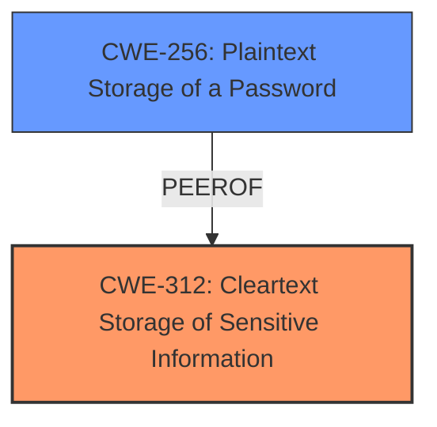

# Analysis Report for CVE-2024-39922

# Vulnerability Analysis Report: CVE-2024-39922

## Description

A vulnerability has been identified in LOGO! 12/24RCE (6ED1052-1MD08-0BA1) (All versions), LOGO! 12/24RCEo (6ED1052-2MD08-0BA1) (All versions), LOGO! 230RCE (6ED1052-1FB08-0BA1) (All versions), LOGO! 230RCEo (6ED1052-2FB08-0BA1) (All versions), LOGO! 24CE (6ED1052-1CC08-0BA1) (All versions), LOGO! 24CEo (6ED1052-2CC08-0BA1) (All versions), LOGO! 24RCE (6ED1052-1HB08-0BA1) (All versions), LOGO! 24RCEo (6ED1052-2HB08-0BA1) (All versions), SIPLUS LOGO! 12/24RCE (6AG1052-1MD08-7BA1) (All versions), SIPLUS LOGO! 12/24RCEo (6AG1052-2MD08-7BA1) (All versions), SIPLUS LOGO! 230RCE (6AG1052-1FB08-7BA1) (All versions), SIPLUS LOGO! 230RCEo (6AG1052-2FB08-7BA1) (All versions), SIPLUS LOGO! 24CE (6AG1052-1CC08-7BA1) (All versions), SIPLUS LOGO! 24CEo (6AG1052-2CC08-7BA1) (All versions), SIPLUS LOGO! 24RCE (6AG1052-1HB08-7BA1) (All versions), SIPLUS LOGO! 24RCEo (6AG1052-2HB08-7BA1) (All versions). Affected devices **store user passwords in plaintext** without proper protection. This could allow a physical attacker to retrieve them from the embedded storage ICs.

## Vulnerability Description Key Phrases

- **Rootcause:** store user passwords in plaintext
- **Impact:** retrieve them from the embedded storage ICs
- **Attacker:** physical attacker
- **Product:** ['LOGO!', 'SIPLUS LOGO!']
- **Version:** All versions

## Analysis (with Relationship Data)

# Summary
| CWE ID | CWE Name | Confidence | CWE Abstraction Level | CWE Vulnerability Mapping Label | CWE-Vulnerability Mapping Notes |
|---|---|---|---|---|---|
| CWE-312 | Cleartext Storage of Sensitive Information | 1.0 | Base | Primary | Allowed |
| CWE-256 | Plaintext Storage of a Password | 0.9 | Base | Secondary | Allowed |

## Evidence and Confidence

*   **Confidence Score:** 1.0
*   **Evidence Strength:** HIGH

## Relationship Analysis
The primary relationship considered was the hierarchical relationship between CWE-798 (Use of Hard-coded Credentials) and its children, specifically CWE-259 (Use of Hard-coded Password) and CWE-321 (Use of Hard-coded Cryptographic Key). However, these were deemed less relevant as the vulnerability involves storing user passwords in plaintext rather than using hard-coded credentials. The relationship between CWE-522 (Insufficiently Protected Credentials) and its potential base-level children was also considered, but CWE-312 and CWE-256 were more specific.



## Vulnerability Chain
The vulnerability chain is straightforward: the application **stores user passwords in plaintext** (CWE-312 & CWE-256), which allows a physical attacker to retrieve the passwords from the embedded storage (Impact). The root cause is the **insecure storage** of the passwords.

## Summary of Analysis
The initial analysis correctly identified the core issue: the **plaintext storage** of user passwords. This is directly supported by the vulnerability description, which states the device "**store user passwords in plaintext** without proper protection". The CVE Reference Links Content Summary also confirms this, stating, "The root cause is the **plaintext storage** of user-set passwords".

CWE-312 (Cleartext Storage of Sensitive Information) is the most appropriate primary CWE because it precisely describes the vulnerability. The retriever results also ranked CWE-312 highly. The evidence is strong, and the mapping guidance allows its use.

CWE-256 (Plaintext Storage of a Password) can also be considered as a secondary CWE since the vulnerability explicitly refers to passwords.

The other CWEs considered from the retriever results were not as relevant. For example, CWE-798 (Use of Hard-coded Credentials) and its children (CWE-259, CWE-321) were considered but rejected as the vulnerability does not involve hard-coded credentials. Instead, it concerns the storage of user-set passwords without encryption.

Relevant CWE Information:

# Enhanced Context (25 CWEs)
The following CWEs were identified as potentially relevant to this vulnerability:

## CWE-312: Cleartext Storage of Sensitive Information
**Abstraction Level**: Base
**Similarity Score**: 0.75
**Source**: dense

**Description**:
The product stores sensitive information in cleartext within a resource that might be accessible to another control sphere.

**Mapping Guidance**:
- Usage: Allowed
- Rationale: This CWE entry is at the Base level of abstraction, which is a preferred level of abstraction for mapping to the root causes of vulnerabilities.

**Explanation:**
CWE-312 is highly relevant. The vulnerability description clearly states that the device **stores user passwords in plaintext**. This CWE perfectly captures this weakness.

## CWE-256: Use of Hard-coded Password
**Abstraction Level**: Variant
**Similarity Score**: 2.61
**Source**: graph

**Description**:
The product contains a hard-coded password, which it uses for its own inbound authentication or for outbound communication to external components.

**Mapping Guidance**:
- Usage: Allowed
- Rationale: This CWE entry is at the Variant level of abstraction, which is a preferred level of abstraction for mapping to the root causes of vulnerabilities.

**Relationships**:
- CANFOLLOW -> CWE-656
- PEEROF -> CWE-257
- PEEROF -> CWE-321
- CHILDOF -> CWE-798
- CHILDOF -> CWE-798

**Explanation:**
CWE-256: This CWE addresses hardcoded passwords, not plaintext storage. It is related to CWE-798 (Use of Hard-coded Credentials), but the vulnerability here involves user-set passwords, not hardcoded ones. Therefore, it is less applicable than CWE-312.

## CWE-321: Use of Hard-coded Cryptographic Key
**Abstraction Level**: Variant
**Similarity Score**: 2.60
**Source**: graph

**Description**:
The use of a hard-coded cryptographic key significantly increases the possibility that encrypted data may be recovered.

**Mapping Guidance**:
- Usage: Allowed
- Rationale: This CWE entry is at the Variant level of abstraction, which is a preferred level of abstraction for mapping to the root causes of vulnerabilities.

**Relationships**:
- CANFOLLOW -> CWE-656
- CHILDOF -> CWE-798
- CHILDOF -> CWE-798
- CHILDOF -> CWE-798
- PARENTOF -> CWE-321

**Explanation:**
CWE-321: This CWE addresses hardcoded cryptographic keys, not plaintext storage. It is related to CWE-798 (Use of Hard-coded Credentials), but the vulnerability here involves user-set passwords, not hardcoded keys. Therefore, it is not applicable.

## CWE-798: Use of Hard-coded Credentials
**Abstraction Level**: Base
**Similarity Score**: 0.72
**Source**: dense

**Description**:
The product contains hard-coded credentials, such as a password or cryptographic key.

**Mapping Guidance**:
- Usage: Allowed
- Rationale: This CWE entry is at the Base level of abstraction, which is a preferred level of abstraction for mapping to the root causes of vulnerabilities.

**Explanation:**
CWE-798 is not the primary weakness. The passwords are not hard-coded. The vulnerability is in the way the user-defined passwords are being stored.

## CWE-522: Insufficiently Protected Credentials
**Abstraction Level**: Class
**Similarity Score**: 0.71
**Source**: dense

**Description**:
The product transmits or stores authentication credentials, but it uses an insecure method that is susceptible to unauthorized interception and/or retrieval.

**Mapping Guidance**:
- Usage: Allowed-with-Review
- Rationale: This CWE entry is a Class and might have Base-level children that would be more appropriate

**Explanation:**
CWE-522 is less specific than CWE-312. While the credentials are "insufficiently protected", the core issue is that they are stored in plaintext. CWE-312 is a better fit.

## CWE-311: Missing Encryption of Sensitive Data
**Abstraction Level**: Class
**Similarity Score**: 0.72
**Source**: dense

**Description**:
The product does not encrypt sensitive or critical information before storage or transmission.

**Mapping Guidance**:
- Usage: Discouraged
- Rationale: CWE-311 is high-level with more precise children available. It is a level-1 Class (i.e., a child of a Pillar).

**Explanation:**
CWE-311 is more generic than CWE-312. The vulnerability specifically involves plaintext storage, making CWE-312 the more accurate choice.


## CWE Relationship Analysis

Current CWEs represent these abstraction levels: .


### Vulnerability Chain Analysis

**Chain starting from CWE-321:**
- 321 (Use of Hard-coded Cryptographic Key) - ROOT


**Chain starting from CWE-257:**
- 257 (Storing Passwords in a Recoverable Format) - ROOT


### CWE Relationship Diagram

```mermaid
graph TD
    classDef primary fill:#f96,stroke:#333,stroke-width:2px
    classDef secondary fill:#69f,stroke:#333
    classDef tertiary fill:#9e9,stroke:#333
```


*Report generated on 2025-07-13 12:05:10*
