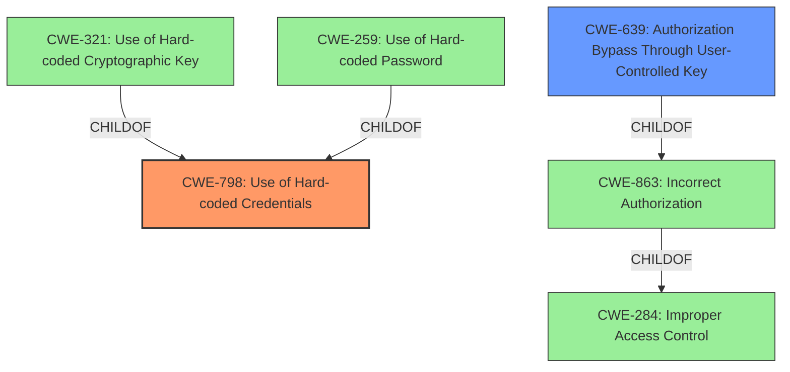

# Analysis for CVE-2024-39925

# Summary
| CWE ID | CWE Name | Confidence | CWE Abstraction Level | CWE Vulnerability Mapping Label | CWE-Vulnerability Mapping Notes |
|---|---|---|---|---|---|
| CWE-798 | Use of Hard-coded Credentials | 0.8 | Base | Primary | Allowed |
| CWE-639 | Authorization Bypass Through User-Controlled Key | 0.7 | Base | Secondary | Allowed |

## Evidence and Confidence

*   **Confidence Score:** 0.75
*   **Evidence Strength:** MEDIUM

## Relationship Analysis
The primary relationship influencing the decision is the parent-child relationship between CWE-798 and its variants, such as CWE-321 (Use of Hard-coded Cryptographic Key) and CWE-259 (Use of Hard-coded Password). While the vulnerability description doesn't explicitly state "hard-coded credentials," the core issue of the organization key not being rotated after a member leaves implies a form of static or default credential usage. CWE-639, Authorization Bypass Through User-Controlled Key, is a related weakness because the user is able to use a key they should no longer have to gain access. The base level of abstraction for both CWE-798 and CWE-639 is suitable as it captures the root cause directly without over-specifying the type of credential or the exact mechanism of authorization bypass.

## Vulnerability Chain
The vulnerability chain starts with the **lacking offboarding process** (**ROOTCAUSE**) which leads to the organization key not being rotated (**WEAKNESS**). This, in turn, allows former members to retain a valid key and decrypt data they should no longer have access to (**IMPACT**). Also, the application **fails to adequately protect some encrypted data stored on the server**, leading to unauthorized access (**IMPACT**).

## Summary of Analysis
The initial analysis focused on the **lacking offboarding process** and the implications of the shared key not being rotated when a member leaves an organization. This points to a scenario where credentials, in this case, the organization key, are not managed properly after a user's access is revoked. The "CVE Reference Links Content Summary" highlights the "Missing Organization Key Rotation" as a core weakness.

The selection of CWE-798 (Use of Hard-coded Credentials) is based on the fact that the organization key remains static and unchanged even after a member leaves, effectively making it a long-lived, shared credential that is not properly managed. While it's not literally "hard-coded" in the traditional sense, the lack of rotation mechanism means it functions similarly. The "CVE Reference Links Content Summary" points to "Insufficient Access Control," which aligns with CWE-639 (Authorization Bypass Through User-Controlled Key).

CWE-798 is at the optimal level of specificity because it captures the essence of the vulnerability: the use of a credential that should be invalidated but is not. The abstraction level (Base) is appropriate, as it is not as specific as a Variant like "Use of Hard-coded Cryptographic Key" (CWE-321), but more specific than a Class.

Relevant CWE Information:

# Enhanced Context (25 CWEs)
The following CWEs were identified as potentially relevant to this vulnerability:

## CWE-1391: Use of Weak Credentials
**Abstraction Level**: Class
**Similarity Score**: 0.73
**Source**: dense

**Description**:
The product uses weak credentials (such as a default key or hard-coded password) that can be calculated, derived, reused, or guessed by an attacker.

**Mapping Guidance**:
- Usage: Allowed-with-Review
- Rationale: This CWE entry is a Class and might have Base-level children that would be more appropriate

*Not Selected:* While relevant, it's a class-level CWE. CWE-798 is more specific.

## CWE-639: Authorization Bypass Through User-Controlled Key
**Abstraction Level**: Base
**Similarity Score**: 0.71
**Source**: dense

**Description**:
The system's authorization functionality does not prevent one user from gaining access to another user's data or record by modifying the key value identifying the data.

**Mapping Guidance**:
- Usage: Allowed
- Rationale: This CWE entry is at the Base level of abstraction, which is a preferred level of abstraction for mapping to the root causes of vulnerabilities.

*Selected as Secondary:* This is relevant because a former member is able to use an old key to bypass authorization.

## CWE-1390: Weak Authentication
**Abstraction Level**: Class
**Similarity Score**: 0.71
**Source**: dense

**Description**:
The product uses an authentication mechanism to restrict access to specific users or identities, but the mechanism does not sufficiently prove that the claimed identity is correct.

**Mapping Guidance**:
- Usage: Allowed-with-Review
- Rationale: This CWE entry is a Class and might have Base-level children that would be more appropriate

*Not Selected:* It is related, but too generic.

## CWE-267: Privilege Defined With Unsafe Actions
**Abstraction Level**: Base
**Similarity Score**: 0.70
**Source**: dense

**Description**:
A particular privilege, role, capability, or right can be used to perform unsafe actions that were not intended, even when it is assigned to the correct entity.

**Mapping Guidance**:
- Usage: Allowed
- Rationale: This CWE entry is at the Base level of abstraction, which is a preferred level of abstraction for mapping to the root causes of vulnerabilities.

*Not Selected:* Not directly applicable.

## CWE-303: Incorrect Implementation of Authentication Algorithm
**Abstraction Level**: Base
**Similarity Score**: 0.70
**Source**: dense

**Description**:
The requirements for the product dictate the use of an established authentication algorithm, but the implementation of the algorithm is incorrect.

**Mapping Guidance**:
- Usage: Allowed
- Rationale: This CWE entry is at the Base level of abstraction, which is a preferred level of abstraction for mapping to the root causes of vulnerabilities.

*Not Selected:* Not directly applicable.

## CWE-610: Externally Controlled Reference to a Resource in Another Sphere
**Abstraction Level**: Class
**Similarity Score**: 0.69
**Source**: dense

**Description**:
The product uses an externally controlled name or reference that resolves to a resource that is outside of the intended control sphere.

**Mapping Guidance**:
- Usage: Discouraged
- Rationale: This CWE entry is a level-1 Class (i.e., a child of a Pillar). It might have lower-level children that would be more appropriate

*Not Selected:* Not directly applicable.

## CWE-497: Exposure of Sensitive System Information to an Unauthorized Control Sphere
**Abstraction Level**: Base
**Similarity Score**: 0.69
**Source**: dense

**Description**:
The product does not properly prevent sensitive system-level information from being accessed by unauthorized actors who do not have the same level of access to the underlying system as the product does.

**Mapping Guidance**:
- Usage: Allowed
- Rationale: This CWE entry is at the Base level of abstraction, which is a preferred level of abstraction for mapping to the root causes of vulnerabilities.

*Not Selected:* Not directly applicable.

## CWE-331: Insufficient Entropy
**Abstraction Level**: Base
**Similarity Score**: 0.69
**Source**: dense

**Description**:
The product uses an algorithm or scheme that produces insufficient entropy, leaving patterns or clusters of values that are more likely to occur than others.

**Mapping Guidance**:
- Usage: Allowed
- Rationale: This CWE entry is at the Base level of abstraction, which is a preferred level of abstraction for mapping to the root causes of vulnerabilities.

*Not Selected:* Not directly applicable.

## CWE-345: Insufficient Verification of Data Authenticity
**Abstraction Level**: Class
**Similarity Score**: 0.69
**Source**: dense

**Description**:
The product does not sufficiently verify the origin or authenticity of data, in a