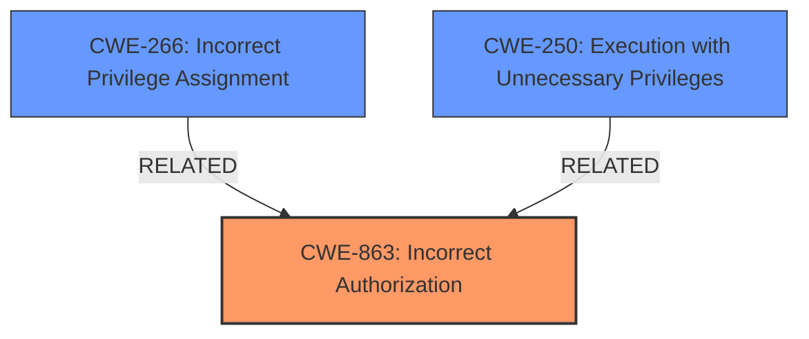

# Analysis Report for CVE-2024-39934

# Vulnerability Analysis Report: CVE-2024-39934

## Description

Robotmk before 2.0.1 allows a local user to escalate privileges (e.g., to SYSTEM) if automated Python environment setup is enabled, because the **shared holotree usage feature** allows any user to edit any Python environment.

## Vulnerability Description Key Phrases

- **Rootcause:** shared holotree usage feature
- **Impact:** escalate privileges to SYSTEM
- **Vector:** automated Python environment setup
- **Attacker:** local user
- **Product:** Robotmk
- **Version:** before 2.0.1

## Analysis (with Relationship Data)

# Summary
| CWE ID | CWE Name | Confidence | CWE Abstraction Level | CWE Vulnerability Mapping Label | CWE-Vulnerability Mapping Notes |
|---|---|---|---|---|---|
| CWE-863 | Incorrect Authorization | 0.9 | Class | Allowed-with-Review | Primary CWE. The product performs an authorization check when an actor attempts to access a resource or perform an action, but it does not correctly perform the check. |
| CWE-266 | Incorrect Privilege Assignment | 0.7 | Base | Allowed | Secondary. The product incorrectly assigns a privilege to a particular actor, creating an unintended sphere of control for that actor. |
| CWE-250 | Execution with Unnecessary Privileges | 0.6 | Base | Allowed | Secondary. Code runs with higher privileges than needed to complete its function. |

## Evidence and Confidence

*   **Confidence Score:** 0.8
*   **Evidence Strength:** HIGH

## Relationship Analysis
The primary CWE is CWE-863, which is a Class-level weakness describing incorrect authorization. The vulnerability involves a **shared holotree usage feature** that allows users to modify Python environments, leading to privilege escalation. This relates to assigning incorrect privileges, suggesting CWE-266, and executing with unnecessary privileges, suggesting CWE-250. CWE-863 captures the flawed authorization check, while CWE-266 and CWE-250 provide more specific details about the privilege management issues.



## Vulnerability Chain
The vulnerability chain starts with the **incorrect authorization** in the **shared holotree usage feature**, which allows unauthorized modification of Python environments. This leads to **incorrect privilege assignment**, where a local user can escalate privileges. Because the Robotmk scheduler runs with SYSTEM privileges, injected malicious code executes with elevated privileges, resulting in **execution with unnecessary privileges** and ultimately leading to SYSTEM privilege escalation.

## Summary of Analysis
The primary CWE is CWE-863, as the core issue lies in the **incorrect authorization** that allows any user to modify Python environments. The supporting evidence comes directly from the "CVE Reference Links Content Summary," which highlights the **shared holotree usage feature** as the root cause enabling privilege escalation. The "Vulnerability Description" also points to the **shared holotree usage feature** allowing any user to edit Python environments, confirming the authorization flaw.

The retriever results listed several CWEs, including CWE-184, CWE-94, and CWE-1336, but these are less relevant. CWE-184 (Incomplete List of Disallowed Inputs) doesn't fit because the issue isn't about a list of disallowed inputs. CWE-94 (Improper Control of Generation of Code) and CWE-1336 (Improper Neutralization of Special Elements Used in a Template Engine) are also less fitting because the vulnerability isn't directly related to code injection or template engine issues, but rather the underlying authorization flaw.

CWE-266 (Incorrect Privilege Assignment) and CWE-250 (Execution with Unnecessary Privileges) are considered as secondary CWEs because they describe the consequences of the **incorrect authorization**: users are assigned incorrect privileges, and code executes with unnecessary privileges.

The CWEs selected are at an appropriate level of specificity. CWE-863 is a Class, but it accurately represents the core authorization flaw. CWE-266 and CWE-250 provide additional context about the privilege management issues stemming from this flaw.

Relevant CWE Information:

# Enhanced Context (25 CWEs)
The following CWEs were identified as potentially relevant to this vulnerability:

## CWE-266: Incorrect Privilege Assignment
**Abstraction Level**: Base
**Similarity Score**: 0.80
**Source**: dense

**Description**:
A product incorrectly assigns a privilege to a particular actor, creating an unintended sphere of control for that actor.

**Mapping Guidance**:
- Usage: Allowed
- Rationale: This CWE entry is at the Base level of abstraction, which is a preferred level of abstraction for mapping to the root causes of vulnerabilities.

**How the Vulnerability's Details Match the CWE's Characteristics:**

The vulnerability description states that the **shared holotree usage feature** allows any user to edit any Python environment. This implies that users are incorrectly assigned privileges to modify environments they should not have access to.

**Security Implications and Potential Impact:**

The security implication is privilege escalation, where a local user can gain SYSTEM privileges.

**Parent-Child Relationships or Chain Patterns That Influenced Your Mapping:**

N/A

**Whether the Weakness Is Primary or Secondary in the Vulnerability:**

Secondary.

**How the Official MITRE Mapping Guidance Influenced Your Decision:**

The mapping guidance indicates that CWE-266 is at the Base level of abstraction, which is a preferred level.

## CWE-250: Execution with Unnecessary Privileges
**Abstraction Level**: Base
**Similarity Score**: 0.53
**Source**: dense

**Description**:
Code runs with higher privileges than needed to complete its function.

**Mapping Guidance**:
- Usage: Allowed
- Rationale: This CWE entry is at the Base level of abstraction, which is a preferred level of abstraction for mapping to the root causes of vulnerabilities.

**How the Vulnerability's Details Match the CWE's Characteristics:**

The vulnerability leads to code executing with SYSTEM privileges due to the **shared holotree usage feature** and the Robotmk scheduler running with elevated privileges.

**Security Implications and Potential Impact:**

The security implication is privilege escalation, where a local user can gain SYSTEM privileges.

**Parent-Child Relationships or Chain Patterns That Influenced Your Mapping:**

N/A

**Whether the Weakness Is Primary or Secondary in the Vulnerability:**

Secondary.

**How the Official MITRE Mapping Guidance Influenced Your Decision:**

The mapping guidance indicates that CWE-250 is at the Base level of abstraction, which is a preferred level.

## CWE-863: Incorrect Authorization
**Abstraction Level**: Class
**Similarity Score**: 2090.61
**Source**: sparse

**Description**:
The product performs an authorization check when an actor attempts to access a resource or perform an action, but it does not correctly perform the check.

**Mapping Guidance**:
- Usage: Allowed-with-Review
- Rationale: This CWE entry is a Class and might have Base-level children that would be more appropriate

**How the Vulnerability's Details Match the CWE's Characteristics:**

The **shared holotree usage feature** in Robotmk incorrectly allows any user to modify Python environments, indicating an **incorrect authorization** check. The system should prevent unauthorized users from modifying these environments, but it fails to do so.

**Security Implications and Potential Impact:**

The security implication is privilege escalation, where a local user can gain SYSTEM privileges.

**Parent-Child Relationships or Chain Patterns That Influenced Your Mapping:**

N/A

**Whether the Weakness Is Primary or Secondary in the Vulnerability:**

Primary.

**How the Official MITRE Mapping Guidance Influenced Your Decision:**

The mapping guidance suggests that while CWE-863 is a Class, it is allowed with review, and more specific Base-level children might be more appropriate. However, in this case, the core issue is the **incorrect authorization** itself.

## Other CWEs Considered

*   CWE-184 (Incomplete List of Disallowed Inputs): This was considered but deemed less relevant because the vulnerability isn't directly related to a list of disallowed inputs. The core issue is the **incorrect authorization** that allows any user to modify Python environments.
*   CWE-94 (Improper Control of Generation of Code): This was considered but rejected because the vulnerability isn't directly related to code injection. The **shared holotree usage feature** allows any user to modify Python environments, but the vulnerability isn't caused by improper code generation.
*   CWE-1336 (Improper Neutralization of Special Elements Used in a Template Engine): This was considered but rejected because the vulnerability isn't related to a template engine. The **shared holotree usage feature** allows any user to modify Python environments, but the vulnerability isn't caused by improper neutralization of special elements in a template.


## CWE Relationship Analysis

Current CWEs represent these abstraction levels: .


### Vulnerability Chain Analysis

**Chain starting from CWE-863:**
- 863 (Incorrect Authorization) - ROOT


**Chain starting from CWE-94:**
- 94 (Improper Control of Generation of Code ('Code Injection')) - ROOT


### CWE Relationship Diagram

```mermaid
graph TD
    classDef primary fill:#f96,stroke:#333,stroke-width:2px
    classDef secondary fill:#69f,stroke:#333
    classDef tertiary fill:#9e9,stroke:#333
```


*Report generated on 2025-07-13 12:06:34*
