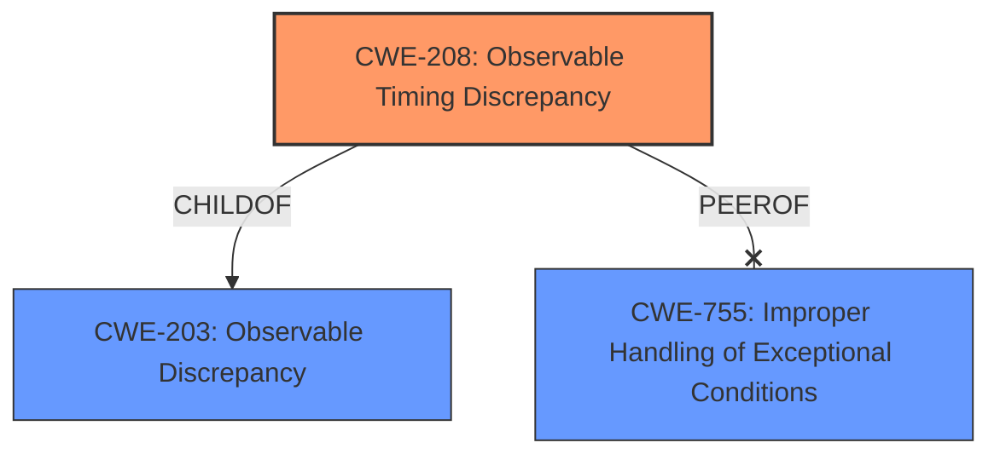

# Analysis Report for CVE-2024-39936

# Vulnerability Analysis Report: CVE-2024-39936

## Description

An issue was discovered in HTTP2 in Qt before 5.15.18, 6.x before 6.2.13, 6.3.x through 6.5.x before 6.5.7, and 6.6.x through 6.7.x before 6.7.3. Code to make security-relevant decisions about an established connection may execute too early, because the encrypted() signal has not yet been emitted and processed..

## Vulnerability Description Key Phrases

- **Rootcause:** encrypted() signal not emitted
- **Weakness:** timing issue
- **Product:** Qt
- **Version:** before 5.15.18, 6.x before 6.2.13, 6.3.x through 6.5.x before 6.5.7, and 6.6.x through 6.7.x before 6.7.3
- **Component:** HTTP2

## Analysis (with Relationship Data)

# Summary
| CWE ID | CWE Name | Confidence | CWE Abstraction Level | CWE Vulnerability Mapping Label | CWE-Vulnerability Mapping Notes |
|---|---|---|---|---|---|
| CWE-208 | Observable Timing Discrepancy | 0.8 | Base | Allowed | Primary CWE |
| CWE-755 | Improper Handling of Exceptional Conditions | 0.4 | Class | Discouraged | Secondary Candidate |

## Evidence and Confidence

*   **Confidence Score:** 0.8
*   **Evidence Strength:** MEDIUM

## Relationship Analysis
The primary relationship that influenced my decision was the parent-child relationship between CWE-203 (Observable Discrepancy) and CWE-208 (Observable Timing Discrepancy), as CWE-208 is a more specific type of observable discrepancy directly related to timing issues. I also considered the hierarchical position of CWE-755 as a high-level class, making it less preferable than the base-level CWE-208.



## Vulnerability Chain
The vulnerability chain starts with a **timing issue** where the **encrypted() signal is not emitted** in time, leading to security-relevant decisions being made prematurely.

## Summary of Analysis
The primary CWE is CWE-208, which directly addresses the **observable timing discrepancy** described in the vulnerability. The vulnerability description clearly indicates a **timing issue** where security-relevant decisions are made before the `encrypted()` signal is emitted and processed. This aligns precisely with the characteristics of CWE-208. The retriever results also strongly suggest CWE-208. The **rootcause** is the **timing issue** in processing the `encrypted()` signal.

CWE-755 was considered but deemed less appropriate because it is a more general class related to handling exceptional conditions, while CWE-208 specifically addresses the **timing discrepancy** that is the **rootcause** of this vulnerability.

Relevant CWE Information:

# Enhanced Context (25 CWEs)

## CWE-208: Observable Timing Discrepancy
**Abstraction Level**: Base
**Similarity Score**: 0.77
**Source**: dense

**Description**:
Two separate operations in a product require different amounts of time to complete, in a way that is observable to an actor and reveals security-relevant information about the state of the product, such as whether a particular operation was successful or not.

**Mapping Guidance**:
- Usage: Allowed
- Rationale: This CWE entry is at the Base level of abstraction, which is a preferred level of abstraction for mapping to the root causes of vulnerabilities.

## CWE-755: Improper Handling of Exceptional Conditions
**Abstraction Level**: Class
**Similarity Score**: 0.75
**Source**: dense

**Description**:
The product does not handle or incorrectly handles an exceptional condition.

**Mapping Guidance**:
- Usage: Discouraged
- Rationale: This CWE entry is a level-1 Class (i.e., a child of a Pillar). It might have lower-level children that would be more appropriate

## CWE-208: Observable Timing Discrepancy
**Abstraction Level**: Base
**Similarity Score**: 479.68
**Source**: sparse

**Description**:
Two separate operations in a product require different amounts of time to complete, in a way that is observable to an actor and reveals security-relevant information about the state of the product, such as whether a particular operation was successful or not.

**Mapping Guidance**:
- Usage: Allowed
- Rationale: This CWE entry is at the Base level of abstraction, which is a preferred level of abstraction for mapping to the root causes of vulnerabilities.


## CWE Relationship Analysis

Current CWEs represent these abstraction levels: .


### Vulnerability Chain Analysis

**Chain starting from CWE-203:**
- 203 (Observable Discrepancy) - ROOT


**Chain starting from CWE-208:**
- 208 (Observable Timing Discrepancy) - ROOT


### CWE Relationship Diagram

```mermaid
graph TD
    classDef primary fill:#f96,stroke:#333,stroke-width:2px
    classDef secondary fill:#69f,stroke:#333
    classDef tertiary fill:#9e9,stroke:#333
```


*Report generated on 2025-07-13 12:06:49*
