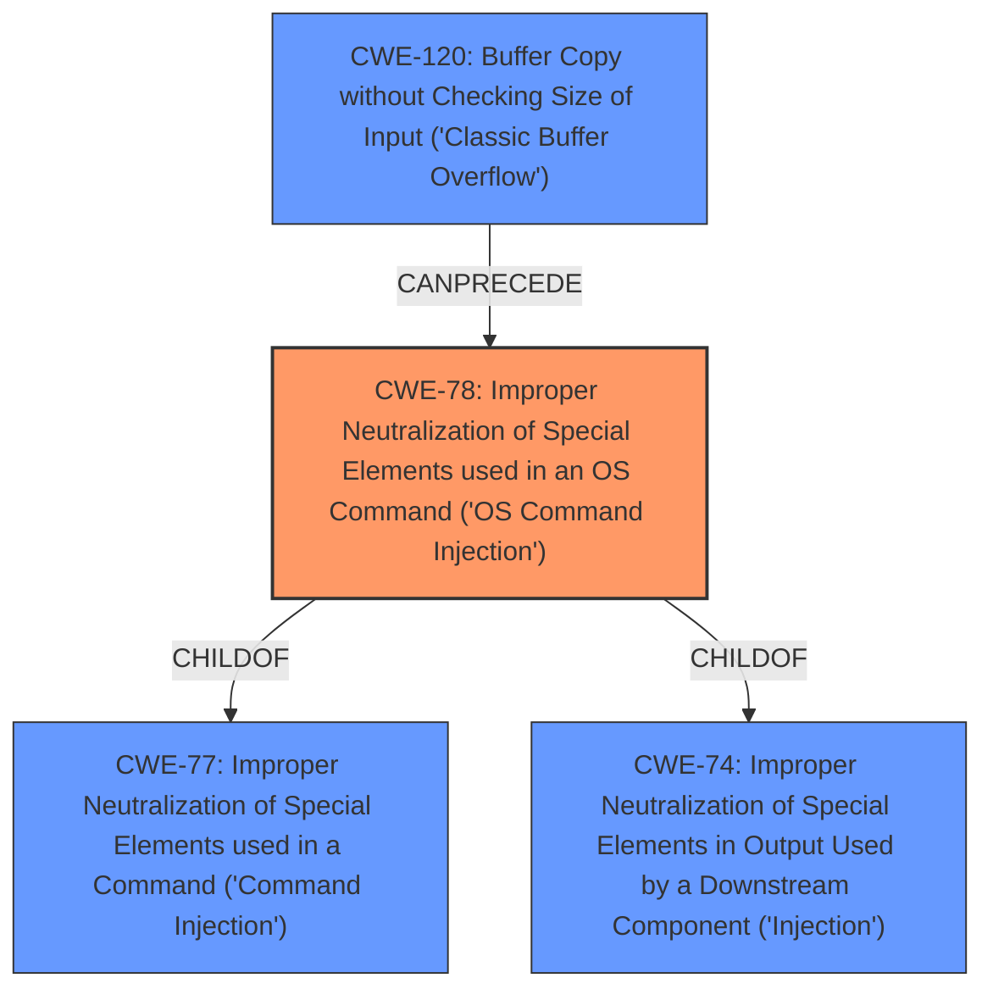

# Analysis Report for CVE-2024-39963

# Vulnerability Analysis Report: CVE-2024-39963

## Description

AX3000 Dual-Band Gigabit Wi-Fi 6 Router AX9 V22.03.01.46 and AX3000 Dual-Band Gigabit Wi-Fi 6 Router AX12 V1.0 V22.03.01.46 were discovered to contain an authenticated remote command execution (RCE) vulnerability via the macFilterType parameter at /goform/setMacFilterCfg.

## Vulnerability Description Key Phrases

- **Impact:** remote command execution
- **Vector:** macFilterType parameter
- **Attacker:** authenticated
- **Product:** ['AX3000 Dual-Band Gigabit Wi-Fi 6 Router', 'AX3000 Dual-Band Gigabit Wi-Fi 6 Router']
- **Version:** ['V22.03.01.46', 'V22.03.01.46']
- **Component:** /goform/setMacFilterCfg

## Analysis (with Relationship Data)

# Summary

| CWE ID | CWE Name | Confidence | CWE Abstraction Level | CWE Vulnerability Mapping Label | CWE-Vulnerability Mapping Notes |
|---|---|---|---|---|---|
| CWE-78 | Improper Neutralization of Special Elements used in an OS Command ('OS Command Injection') | 1.0 | Base | Allowed | Primary CWE: **Root cause** is **improper neutralization** of `macFilterType` parameter leading to OS Command Injection. |
| CWE-120 | Buffer Copy without Checking Size of Input ('Classic Buffer Overflow') | 0.75 | Base | Allowed-with-Review | Secondary candidate: The `strcpy` without sufficient bounds checking contributes to the vulnerability, although the primary issue is the command injection. The check for length of 17 bytes is not sufficient to prevent command injection. |

## Evidence and Confidence

*   **Confidence Score:** 0.9
*   **Evidence Strength:** HIGH

## Relationship Analysis

The primary relationship impacting the decision is that CWE-78 is a specific type of injection that can be triggered by insufficient input validation. CWE-78 is a `CHILDOF` CWE-77 (Command Injection) and CWE-74 (Improper Neutralization of Special Elements in Output Used by a Downstream Component). CWE-120 is a `CANPRECEDE` CWE-78 as a buffer overflow can lead to overwriting memory and injecting commands. Choosing the `Base` level CWE provides the most specific description of the vulnerability.



## Vulnerability Chain

The vulnerability chain starts with the **improper neutralization** of the `macFilterType` parameter (CWE-78), which is then used in an insecure `strcpy` operation (CWE-120). This allows an attacker to inject a malicious command, leading to remote command execution.

## Summary of Analysis

The primary CWE is CWE-78 because the **root cause** of the vulnerability lies in the **lack of proper input sanitization** of the `macFilterType` parameter, which allows an attacker to inject OS commands. The detailed CVE description includes evidence that the router's web server directly uses this unsanitized input in a `strcpy` operation, and then executes a command via `doSystemCmd` if the value has changed. This aligns perfectly with the description of CWE-78.

CWE-120 is a secondary weakness because the `strcpy` without sufficient bounds checking contributes to the vulnerability, but the primary issue is the command injection.

The choice of CWE-78 is supported by the "Retriever Results", which lists it as the top candidate CWE. The evidence provided in the CVE description strongly supports this classification.

Other CWEs were considered but ultimately not selected as the primary CWE:

*   CWE-20 (Improper Input Validation): While input validation is missing, CWE-78 is more specific to the type of vulnerability.
*   CWE-77 (Improper Neutralization of Special Elements used in a Command ('Command Injection')): CWE-78 is a specific type of command injection related to OS commands.
*   CWE-74 (Improper Neutralization of Special Elements in Output Used by a Downstream Component ('Injection')): CWE-78 is a specific type of injection related to OS commands.
*   CWE-121 (Stack-based Buffer Overflow): While a stack-based buffer overflow could be a contributing factor, the core issue is the ability to inject commands, making CWE-78 more relevant.


## CWE Relationship Analysis

Current CWEs represent these abstraction levels: .


### Vulnerability Chain Analysis

**Chain starting from CWE-121:**
- 121 (Stack-based Buffer Overflow) - ROOT


**Chain starting from CWE-77:**
- 77 (Improper Neutralization of Special Elements used in a Command ('Command Injection')) - ROOT


### CWE Relationship Diagram

```mermaid
graph TD
    classDef primary fill:#f96,stroke:#333,stroke-width:2px
    classDef secondary fill:#69f,stroke:#333
    classDef tertiary fill:#9e9,stroke:#333
```


*Report generated on 2025-07-13 12:09:06*
