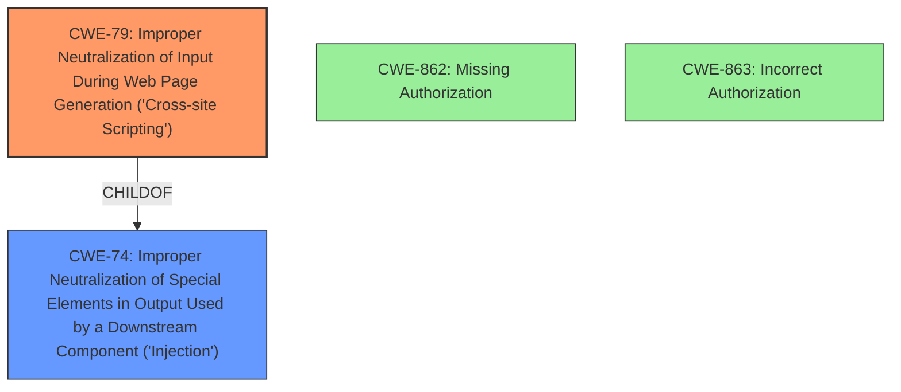

# Analysis Report for CVE-2024-4004

# Vulnerability Analysis Report: CVE-2024-4004

## Description

The Advanced Cron Manager WordPress plugin before 2.5.7 **does not sanitise and escape some of its settings**, which could allow high privilege users such as admin to perform Stored Cross-Site Scripting attacks even when the unfiltered_html capability is disallowed (for example in multisite setup)

## Vulnerability Description Key Phrases

- **Rootcause:** does not sanitise and escape some of its settings
- **Weakness:** stored Cross-Site Scripting
- **Impact:** ['Stored Cross-Site Scripting attacks', 'XSS']
- **Attacker:** high privilege users
- **Product:** Advanced Cron Manager WordPress plugin
- **Version:** before 2.5.7

## Analysis (with Relationship Data)

# Summary

| CWE ID  | CWE Name                                                                            | Confidence | CWE Abstraction Level | CWE Vulnerability Mapping Label | CWE-Vulnerability Mapping Notes |
| :-------- | :---------------------------------------------------------------------------------- | :--------- | :-------------------- | :------------------------------ | :------------------------------ |
| CWE-79    | Improper Neutralization of Input During Web Page Generation ('Cross-site Scripting') | 1          | Base                  | Primary CWE                     | Allowed                       |

## Evidence and Confidence

*   **Confidence Score:** 1
*   **Evidence Strength:** HIGH

## Relationship Analysis

The primary CWE selected is CWE-79, which directly addresses the **weakness** of Stored Cross-Site Scripting (XSS) due to **improper sanitization and escaping of settings**. While other CWEs like CWE-862 (Missing Authorization) and CWE-863 (Incorrect Authorization) were considered, they did not align as directly with the root cause. CWE-79 is a Base level CWE, which is preferred.



## Vulnerability Chain

The vulnerability chain starts with the **root cause**: **improper sanitization and escaping of settings** in the Advanced Cron Manager WordPress plugin. This leads directly to the **weakness**: Stored Cross-Site Scripting (XSS). The impact is that high-privilege users can inject arbitrary JavaScript code into the settings, which is then executed in other users' browsers.

## Summary of Analysis

The analysis is based on the clear evidence that the Advanced Cron Manager WordPress plugin before 2.5.7 **does not sanitise and escape some of its settings**, leading to a Stored Cross-Site Scripting vulnerability.

The **Vulnerability Description Key Phrases** states:
- **rootcause:** **does not sanitise and escape some of its settings**
- **weakness:** **stored Cross-Site Scripting**

The **CVE Reference Links Content Summary** states:

**Root cause of vulnerability:**

The plugin does not sanitize and escape some of its settings, allowing for XSS attacks.

**Weaknesses/vulnerabilities present:**

*   Stored Cross-Site Scripting (XSS)

The selection of CWE-79 is based on this direct evidence. The retriever results also listed CWE-79, although not at the top. The relationship graph shows that CWE-79 is a child of CWE-74 (Improper Neutralization of Special Elements in Output Used by a Downstream Component ('Injection')), but CWE-79 is more specific and thus more appropriate. The level of specificity is optimal because it directly addresses the nature of the XSS vulnerability.

Relevant CWE Information:

*   **CWE-79: Improper Neutralization of Input During Web Page Generation ('Cross-site Scripting')** The product does not neutralize or incorrectly neutralizes user-controllable input before it is placed in output that is used as a web page that is served to other users.


## CWE Relationship Analysis

Current CWEs represent these abstraction levels: .


### Vulnerability Chain Analysis

**Chain starting from CWE-863:**
- 863 (Incorrect Authorization) - ROOT


**Chain starting from CWE-79:**
- 79 (Improper Neutralization of Input During Web Page Generation ('Cross-site Scripting')) - ROOT


### CWE Relationship Diagram

```mermaid
graph TD
    classDef primary fill:#f96,stroke:#333,stroke-width:2px
    classDef secondary fill:#69f,stroke:#333
    classDef tertiary fill:#9e9,stroke:#333
```


*Report generated on 2025-07-13 12:09:42*
