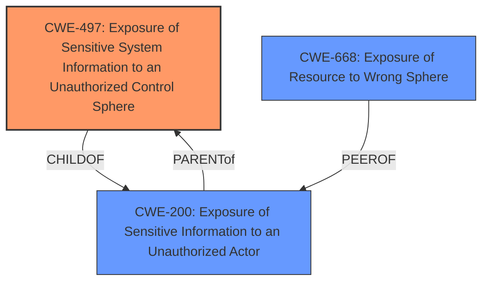

# Analysis Report for CVE-2024-4008

# Vulnerability Analysis Report: CVE-2024-4008

## Description

**FDSK Leak** in ABB, Busch-Jaeger, FTS Display (version 1.00) and BCU (version 1.3.0.33) allows attacker to take control via access to local KNX Bus-System

## Vulnerability Description Key Phrases

- **Rootcause:** FDSK Leak
- **Impact:** take control
- **Vector:** access to local KNX Bus-System
- **Attacker:** attacker
- **Product:** ['ABB', 'Busch-Jaeger', 'FTS Display', 'BCU']
- **Version:** ['1.00', '1.3.0.33']

## Analysis (with Relationship Data)

# Summary
| CWE ID | CWE Name | Confidence | CWE Abstraction Level | CWE Vulnerability Mapping Label | CWE-Vulnerability Mapping Notes |
|---|---|---|---|---|---|
| CWE-497 | Exposure of Sensitive System Information to an Unauthorized Control Sphere | 0.7 | Base | Allowed | Primary CWE |
| CWE-668 | Exposure of Resource to Wrong Sphere | 0.4 | Class | Discouraged | Secondary Candidate |
| CWE-200 | Exposure of Sensitive Information to an Unauthorized Actor | 0.3 | Class | Discouraged | Secondary Candidate |

## Evidence and Confidence

*   **Confidence Score:** 0.7
*   **Evidence Strength:** LOW

## Relationship Analysis
The primary CWE selected, CWE-497, is a Base level weakness, which is preferred. CWE-668 and CWE-200 are higher level Class weaknesses that are more general. The relationship between CWE-497 and CWE-200 is that CWE-497 is more specific type of information exposure.



## Vulnerability Chain
The vulnerability chain begins with the **FDSK Leak** which leads to exposure of sensitive system information, ultimately allowing an attacker to take control of the local KNX Bus-System.

## Summary of Analysis
The initial analysis identified several potential CWEs based on the retriever results, including CWE-200, CWE-522, and CWE-306. However, after reviewing the vulnerability description, the **rootcause** of the vulnerability is a **FDSK Leak**, which falls under the broader category of exposing sensitive information. Given the context of the KNX Bus-System, CWE-497, Exposure of Sensitive System Information to an Unauthorized Control Sphere, is the most appropriate primary CWE. It directly addresses the **leak** of sensitive system information, which is the **rootcause** of the vulnerability.

The evidence is weak because the CVE description summary is UNRELATED, so the selection is based primarily on the vulnerability description's key phrases.

Relevant CWE Information:

# Enhanced Context (25 CWEs)
The following CWEs were identified as potentially relevant to this vulnerability:

## CWE-497: Exposure of Sensitive System Information to an Unauthorized Control Sphere
**Abstraction Level**: Base
**Similarity Score**: 0.74
**Source**: dense

**Description**:
The product does not properly prevent sensitive system-level information from being accessed by unauthorized actors who do not have the same level of access to the underlying system as the product does.

**Mapping Guidance**:
- Usage: Allowed
- Rationale: This CWE entry is at the Base level of abstraction, which is a preferred level of abstraction for mapping to the root causes of vulnerabilities.

This CWE aligns well with the description because the **FDSK leak** directly leads to sensitive system information being exposed, potentially allowing unauthorized control.

## CWE-668: Exposure of Resource to Wrong Sphere
**Abstraction Level**: Class
**Similarity Score**: 0.72
**Source**: dense

**Description**:
The product exposes a resource to the wrong control sphere, providing unintended actors with inappropriate access to the resource.

**Mapping Guidance**:
- Usage: Discouraged
- Rationale: CWE-668 is high-level and is often misused as a catch-all when lower-level CWE IDs might be applicable. It is sometimes used for low-information vulnerability reports [REF-1287]. It is a level-1 Class (i.e., a child of a Pillar). It is not useful for trend analysis.

CWE-668 is a possible secondary CWE because the **FDSK** can be considered a resource that's exposed to the wrong sphere. However, it is less specific than CWE-497.

## CWE-200: Exposure of Sensitive Information to an Unauthorized Actor
**Abstraction Level**: Class
**Similarity Score**: 0.74
**Source**: dense

**Description**:
The product exposes sensitive information to an actor that is not explicitly authorized to have access to that information.

**Mapping Guidance**:
- Usage: Discouraged
- Rationale: CWE-200 is commonly misused to represent the loss of confidentiality in a vulnerability, but confidentiality loss is a technical impact - not a root cause error. As of CWE 4.9, over 400 CWE entries can lead to a loss of confidentiality. Other options are often available. [REF-1287].

CWE-200 is a potential secondary CWE as it describes the general exposure of sensitive information. However, it is a Class level CWE and less specific than CWE-497.

CWEs Considered but Not Used:

*   CWE-522 (Insufficiently Protected Credentials): While the **FDSK** might contain credentials, the primary issue is the **leak** itself, not necessarily the protection of the credentials.
*   CWE-306 (Missing Authentication for Critical Function): This CWE is not directly related, as the **leak** is the primary **rootcause**, not a missing authentication mechanism.
*   CWE-74 (Improper Neutralization of Special Elements in Output Used by a Downstream Component ('Injection')): This CWE is not applicable as there is no mention of injection in the vulnerability description.
*   CWE-287 (Improper Authentication): Similar to CWE-306, the primary issue is the information **leak**, not the authentication process.
*   CWE-912 (Hidden Functionality): There is no mention of hidden functionality in the vulnerability description.
*   CWE-923 (Improper Restriction of Communication Channel to Intended Endpoints): This CWE is not directly related to the **FDSK Leak**.
*   CWE-257 (Storing Passwords in a Recoverable Format): While the **FDSK** might store passwords, the main issue is the **leak** of the file.
*   CWE-401 (Missing Release of Memory after Effective Lifetime): This CWE is not relevant to the vulnerability description.
*   CWE-79 (Improper Neutralization of Input During Web Page Generation ('Cross-site Scripting')): This CWE is not applicable as it relates to web page generation and cross-site scripting.


## CWE Relationship Analysis

Current CWEs represent these abstraction levels: .


### Vulnerability Chain Analysis

**Chain starting from CWE-306:**
- 306 (Missing Authentication for Critical Function) - ROOT


**Chain starting from CWE-79:**
- 79 (Improper Neutralization of Input During Web Page Generation ('Cross-site Scripting')) - ROOT


### CWE Relationship Diagram

```mermaid
graph TD
    classDef primary fill:#f96,stroke:#333,stroke-width:2px
    classDef secondary fill:#69f,stroke:#333
    classDef tertiary fill:#9e9,stroke:#333
```


*Report generated on 2025-07-13 12:10:21*
