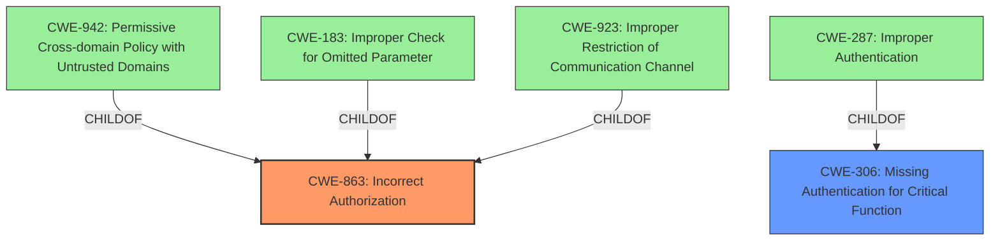

# Analysis for CVE-2024-40461

# Summary
| CWE ID | CWE Name | Confidence | CWE Abstraction Level | CWE Vulnerability Mapping Label | CWE-Vulnerability Mapping Notes |
|---|---|---|---|---|---|
| CWE-863 | Incorrect Authorization | 0.9 | Class | Primary | Allowed-with-Review |
| CWE-306 | Missing Authentication for Critical Function | 0.7 | Base | Secondary Candidate | Allowed |

## Evidence and Confidence

*   **Confidence Score:** 0.8
*   **Evidence Strength:** MEDIUM

## Relationship Analysis
The primary CWE is CWE-863, which is a Class-level CWE, and a child of several CWEs including CWE-942, indicating that it is related to cross-domain policy and authorization issues. The secondary CWE is CWE-306, which is a Base-level CWE and focuses on missing authentication for critical functions. These CWEs are related in that authorization typically follows authentication, meaning a missing authentication (CWE-306) can lead to incorrect authorization (CWE-863) if subsequent checks are bypassed or flawed.

## Vulnerability Chain
The vulnerability chain starts with the **missing authentication** (CWE-306) or the bypassing of authentication by manipulating TCP packets. This leads to **incorrect authorization** (CWE-863), ultimately allowing a local attacker to escalate privileges via the STOCKORDERENTRY.EXE component.

## Summary of Analysis
The initial analysis focused on the provided information and the retriever results. The key aspect of the vulnerability is the unauthorized access achieved by manipulating TCP packets, which allows bypassing intended security measures.

The primary classification is CWE-863 "Incorrect Authorization" because the attacker is able to gain unauthorized administrative access by manipulating TCP packets, effectively bypassing authorization checks. The CVE description states, "By intercepting and modifying TCP packets, an attacker can manipulate the software's login process and access the Application Manager function without authorization checks." This directly indicates a flaw in the authorization process.

A secondary classification is CWE-306 "Missing Authentication for Critical Function" because the vulnerability allows users to gain unauthorized administrative access to the software without proper authentication. The root cause is the **manipulation of TCP packets to bypass authentication**.

The final selection is based on the evidence from the CVE description and the relationships between the CWEs. CWE-863 is chosen because it directly addresses the **incorrect authorization** issue. CWE-306 is included to highlight the **missing authentication** aspect of the vulnerability. Both CWEs are at an appropriate level of specificity, with CWE-863 being a Class-level CWE and CWE-306 being a Base-level CWE.

Relevant CWE Information:
- CWE-863: Incorrect Authorization
- CWE-306: Missing Authentication for Critical Function