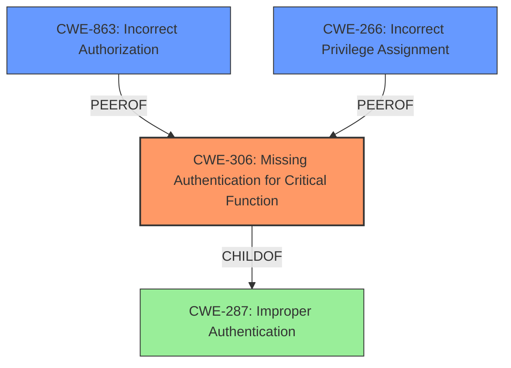

# Analysis Report for CVE-2024-40462

# Vulnerability Analysis Report: CVE-2024-40462

## Description

An issue in Ocuco Innovation v.2.10.24.51 allows a local attacker to escalate privileges via the SETTINGSVATIGATOR.EXE component

## Vulnerability Description Key Phrases

- **Impact:** escalate privileges
- **Attacker:** local attacker
- **Product:** Ocuco Innovation
- **Version:** v.2.10.24.51
- **Component:** SETTINGSVATIGATOR.EXE component

## Analysis (with Relationship Data)

# Summary
| CWE ID | CWE Name | Confidence | CWE Abstraction Level | CWE Vulnerability Mapping Label | CWE-Vulnerability Mapping Notes |
|---|---|---|---|---|---|
| CWE-306 | Missing Authentication for Critical Function | 0.9 | Base | Allowed | Primary CWE |
| CWE-863 | Incorrect Authorization | 0.7 | Class | Allowed-with-Review | Secondary Candidate |
| CWE-266 | Incorrect Privilege Assignment | 0.6 | Base | Allowed | Secondary Candidate |

## Evidence and Confidence

*   **Confidence Score:** 0.8
*   **Evidence Strength:** HIGH

## Relationship Analysis
The primary CWE is CWE-306 (Missing Authentication for Critical Function), which is a base-level CWE. CWE-306 is a child of CWE-287 (Improper Authentication) at the class level. CWE-863 (Incorrect Authorization) and CWE-266 (Incorrect Privilege Assignment) are considered as secondary candidates because the vulnerability also involves incorrect authorization/privilege assignment due to the missing authentication. CWE-863 is a class-level CWE, and CWE-266 is a base-level CWE.



## Vulnerability Chain
The vulnerability chain starts with **missing authentication (CWE-306)**, leading to **incorrect authorization (CWE-863)**, and ultimately resulting in **privilege escalation (CWE-266)**. The **lack of proper authentication** allows attackers to bypass security checks and gain administrative privileges.
  - **CWE-306**: Missing Authentication for Critical Function (Root Cause)
  - **CWE-863**: Incorrect Authorization (Intermediate Weakness)
  - **CWE-266**: Incorrect Privilege Assignment (Impact)

## Summary of Analysis
The initial assessment focused on privilege escalation as the primary impact. However, after analyzing the CVE reference and considering the retriever results, it became clear that the root cause is the **lack of proper authentication**. The vulnerability allows attackers to bypass authentication checks by manipulating TCP packets, leading to unauthorized administrative access.
The selection of CWE-306 is based on the evidence of **insufficient authentication** checks when intercepting and modifying TCP packets. This aligns with the CWE description of "Missing Authentication for Critical Function." The retriever results also listed CWE-306, supporting this selection.
CWE-863 (Incorrect Authorization) and CWE-266 (Incorrect Privilege Assignment) were considered as secondary candidates because the ultimate impact is privilege escalation. However, they are consequences of the **missing authentication** and not the primary cause.
The selected CWEs are at the optimal level of specificity. CWE-306 is a base-level CWE that accurately represents the **missing authentication** vulnerability. CWE-863 and CWE-266 are also at appropriate levels, representing the related authorization and privilege assignment issues. The "Privileges vs Permissions Guidance" section also indicates that escalation is a result of a misconfigured role, permission not dropped, or role-check bypass.

Relevant CWE Information:
- Vulnerability Description: "An issue in Ocuco Innovation v.2.10.24.51 allows a local attacker to escalate privileges via the SETTINGSVATIGATOR.EXE component"
- CVE Reference Links Content Summary: "The vulnerability lies in the **lack of proper authentication** checks when intercepting and modifying TCP packets."

---
Here's the breakdown of why each CWE was chosen or not:

*   **CWE-306: Missing Authentication for Critical Function** - **Chosen as Primary CWE**. The root cause of the vulnerability is the **lack of proper authentication** checks when intercepting and modifying TCP packets. This allows attackers to bypass security and gain administrative privileges. The evidence is: "The vulnerability lies in the **lack of proper authentication** checks when intercepting and modifying TCP packets."
*   **CWE-863: Incorrect Authorization** - **Chosen as Secondary Candidate**. Due to the missing authentication, authorization checks are bypassed or incorrectly performed. The system does not properly verify the identity of the user before granting access to resources, leading to **incorrect authorization**.
*   **CWE-266: Incorrect Privilege Assignment** - **Chosen as Secondary Candidate**. The ultimate impact of the vulnerability is privilege escalation. The missing authentication leads to the assignment of administrative privileges to unauthorized users. This aligns with the CWE description of **incorrectly assigning a privilege** to a particular actor.
*   **CWE-732: Incorrect Permission Assignment for Critical Resource** - **Not Chosen**. While the vulnerability results in unauthorized access, the root cause is not primarily related to incorrect permission assignments. The issue is the lack of authentication, which allows attackers to bypass permission checks.
*   **CWE-276: Incorrect Default Permissions** - **Not Chosen**. This CWE relates to incorrect default permissions being set during installation. The vulnerability is not related to default permissions.
*   **CWE-65: Windows Hard Link** - **Not Chosen**. This CWE is specific to Windows hard links, which are not relevant to the vulnerability.
*   **CWE-248: Uncaught Exception** - **Not Chosen**. While the PoC mentions an access violation error, this is a symptom of the vulnerability and not the root cause. The root cause is the **lack of authentication**.
*   **CWE-250: Execution with Unnecessary Privileges** - **Not Chosen**. The vulnerability is not directly related to a process or component running with unnecessary privileges. It is about gaining unauthorized privileges through a **lack of authentication**.
*   **CWE-427: Uncontrolled Search Path Element** - **Not Chosen**. This CWE is not relevant to the vulnerability.
*   **CWE-269: Improper Privilege Management** - **Not Chosen**. While privilege escalation is the impact, the root cause is the **missing authentication**, not improper management of existing privileges.
*   **CWE-912: Hidden Functionality** - **Not Chosen**. This CWE is not relevant to the vulnerability.
*   **CWE-782: Exposed IOCTL with Insufficient Access Control** - **Not Chosen**. This CWE is very specific to IOCTLs and is not relevant to the vulnerability.
*   **CWE-781: Improper Address Validation in IOCTL with METHOD_NEITHER I/O Control Code** - **Not Chosen**. This CWE is even more specific to IOCTLs and is not relevant to the vulnerability.


## CWE Relationship Analysis

Current CWEs represent these abstraction levels: .


### Vulnerability Chain Analysis

**Chain starting from CWE-863:**
- 863 (Incorrect Authorization) - ROOT


**Chain starting from CWE-427:**
- 427 (Uncontrolled Search Path Element) - ROOT


### CWE Relationship Diagram

```mermaid
graph TD
    classDef primary fill:#f96,stroke:#333,stroke-width:2px
    classDef secondary fill:#69f,stroke:#333
    classDef tertiary fill:#9e9,stroke:#333
```


*Report generated on 2025-07-13 12:18:15*
