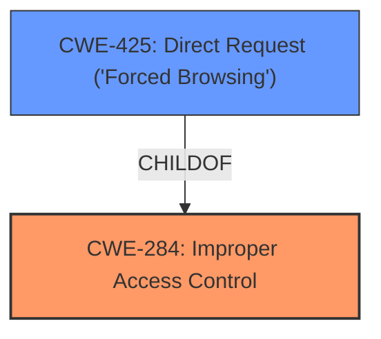

# Enhanced Analysis for CVE-2024-40475

# Summary
| CWE ID | CWE Name | Confidence | CWE Abstraction Level | CWE Vulnerability Mapping Label | CWE-Vulnerability Mapping Notes |
|---|---|---|---|---|---|
| CWE-284 | Improper Access Control | 0.8 | Class | Primary CWE | Allowed-with-Review |
| CWE-425 | Direct Request ('Forced Browsing') | 0.6 | Base | Secondary Candidate | Allowed |

## Evidence and Confidence

*   **Confidence Score:** 0.7
*   **Evidence Strength:** MEDIUM

## Relationship Analysis
The primary relationship influencing the CWE selection is the parent-child relationship. CWE-284 is a high-level class, while CWE-425 is a more specific base CWE. The retriever results pointed to CWE-425. However, the description of the vulnerability indicates a broader access control issue across multiple components, making the more general CWE-284 initially appropriate. The additional details from the CVE Reference Links, specifically the phrase "Broken Access Control - Deep URL" suggests that CWE-425, Direct Request ('Forced Browsing'), could be applicable because it involves direct URL manipulation to bypass access controls. Therefore, it is included as a secondary candidate.



## Vulnerability Chain
The vulnerability chain starts with **incorrect access control**, which allows unauthorized access to sensitive resources via direct requests (deep URLs). The impact is information disclosure and potential data modification.

## Summary of Analysis
Initially, the **rootcause** was identified as "**Incorrect Access Control**". Based on this and the guidance "CWE-284: *Improper Access Control* – top-level category used when access control failure exists but root cause is unclear. This should be avoided **if** a more specific child CWE like 285, 862, 863, or 306 is appropriate.", CWE-284 was selected. The additional details from the CVE Reference Links content summary indicated that the attack vector involved "deep URLs". This suggested CWE-425, Direct Request ('Forced Browsing'), which is a child of CWE-284. While CWE-425 is a more specific Base CWE, the description indicated the issue affected multiple components. Therefore, CWE-284 was selected as the primary, and CWE-425 as a secondary candidate. The retriever ranked CWE-425 and CWE-639 high, but CWE-639, Authorization Bypass Through User-Controlled Key, did not seem as relevant.

Relevant CWE Information:

# Enhanced Context (25 CWEs)
The following CWEs were identified as potentially relevant to this vulnerability:

## CWE-425: Direct Request ('Forced Browsing')
**Abstraction Level**: Base
**Similarity Score**: 0.78
**Source**: dense

**Description**:
The web application does not adequately enforce appropriate authorization on all restricted URLs, scripts, or files.

**Mapping Guidance**:
- Usage: Allowed
- Rationale: This CWE entry is at the Base level of abstraction, which is a preferred level of abstraction for mapping to the root causes of vulnerabilities.

## CWE-284: Improper Access Control
**Abstraction Level**: Class
**Similarity Score**: N/A
**Source**: Guidance

**Description**:
The product does not adequately restrict access to resources or actions to only the intended users.

**Mapping Guidance**:
- Usage: Allowed-with-Review
- Rationale: This CWE entry is a Class and might have Base-level children that would be more appropriate. Use only when a more specific CWE is not available.

## Technical Details for CWE-284: Improper Access Control
- **CWE-284**: Improper Access Control
    - **Explanation**: The software fails to adequately restrict access to resources or actions. This could occur because of a **flawed design** that does not properly consider access requirements. It can also happen through implementation errors that unintentionally grant access to unauthorized users.
    - **Consequences**:
        - **Data Exposure**: Unauthorized users may gain access to sensitive information.
        - **Data Modification**: Unauthorized users may be able to modify critical data.
        - **System Compromise**: Attackers can potentially gain complete control over the system.
    - **Mitigations**:
        - **Principle of Least Privilege**: Grant users only the minimum necessary access rights.
        - **Role-Based Access Control (RBAC)**: Assign permissions based on user roles.
        - **Multi-Factor Authentication (MFA)**: Add additional layers of authentication.
        - **Regular Audits**: Conduct frequent access control audits to identify and rectify any issues.

**CWE Selection and Justification:**

*   **CWE-284: Improper Access Control**
    *   **Match:** The vulnerability description states "**Incorrect Access Control** via /rental/payment_report.php, /rental/balance_report.php, /rental/invoices.php, /rental/tenants.php, and /rental/users.php," which directly aligns with the description of CWE-284: "The product does not adequately restrict access to resources or actions to only the intended users." The CVE Reference Links Content Summary also highlights "Broken Access Control" as a key vulnerability.
    *   **Security Implications:** Unauthorized access to sensitive information (tenant details, payment information) and the ability to modify data or perform unauthorized actions.
    *   **Relationship:** This is a high-level Class CWE.
    *   **Guidance:** The guidance suggests this should be avoided if a more specific child CWE is available. However, given the broad impact across multiple components, it serves as an appropriate initial classification.
    *   **Confidence:** 0.8

*   **CWE-425: Direct Request ('Forced Browsing')**
    *   **Match:** The CVE Reference Links Content Summary mentions "Broken Access Control - Deep URL". CWE-425 aligns with this since it addresses inadequate authorization enforcement on restricted URLs.
    *   **Security Implications:** Allows bypassing intended navigation and accessing restricted areas directly.
    *   **Relationship:** ChildOf CWE-284
    *   **Guidance:** The retriever results list this, and the mapping guidance allows it.
    *   **Confidence:** 0.6

CWEs Considered But Not Used:

*   CWE-862 (Missing Authorization), CWE-863 (Incorrect Authorization), and CWE-306 (Missing Authentication): While these CWEs relate to authorization and authentication issues, the provided description doesn't offer enough detail to determine whether the problem lies in missing authorization checks after authentication (CWE-862), incorrect authorization logic (CWE-863), or a complete lack of authentication for critical functions (CWE-306). Therefore, the more general CWE-284 is initially more appropriate.

*   CWE-73 (External Control of File Name or Path), CWE-434 (Unrestricted Upload of File with Dangerous Type), CWE-89 (Improper Neutralization of Special Elements used in an SQL Command ('SQL Injection')), CWE-79 (Improper Neutralization of Input During Web Page Generation ('Cross-site Scripting')), CWE-94 (Improper Control of Generation of Code ('Code Injection')): These are injection-related CWEs that were considered due to their presence in the retriever results. However, the primary issue described does not seem to directly involve injection vulnerabilities but rather **incorrect access control**.


## CWE Relationship Analysis

Current CWEs represent these abstraction levels: .


### Vulnerability Chain Analysis

**Chain starting from CWE-863:**
- 863 (Incorrect Authorization) - ROOT


**Chain starting from CWE-89:**
- 89 (Improper Neutralization of Special Elements used in an SQL Command ('SQL Injection')) - ROOT


### CWE Relationship Diagram

```mermaid
graph TD
    classDef primary fill:#f96,stroke:#333,stroke-width:2px
    classDef secondary fill:#69f,stroke:#333
    classDef tertiary fill:#9e9,stroke:#333
```