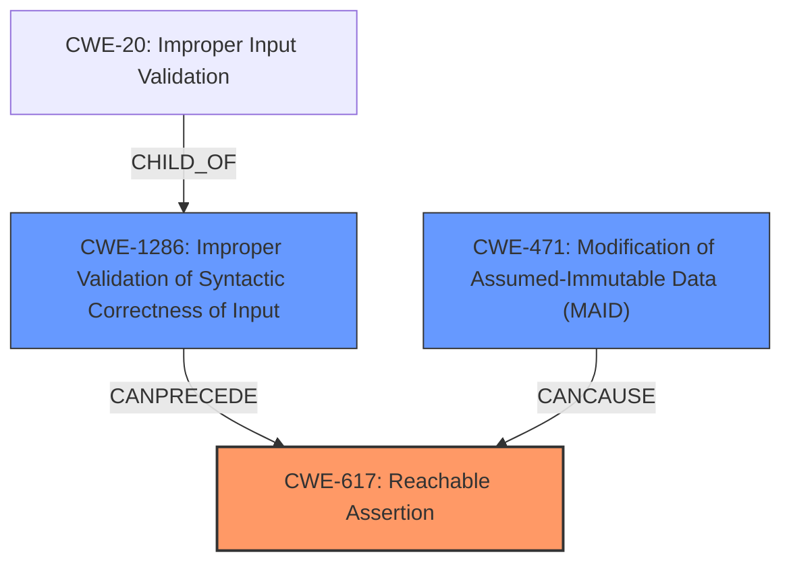

# Enhanced Analysis for CVE-2024-40575

# Summary

| CWE ID | CWE Name | Confidence | CWE Abstraction Level | CWE Vulnerability Mapping Label | CWE-Vulnerability Mapping Notes |
|---|---|---|---|---|---|
| CWE-617 | Reachable Assertion | 0.8 | Base | Allowed | Primary CWE. The vulnerability is triggered by an assertion failure due to modifications of table attributes. |
| CWE-1286 | Improper Validation of Syntactic Correctness of Input | 0.6 | Base | Allowed | Secondary candidate. The vulnerability description mentions a lack of input validation/sanitization. |
| CWE-471 | Modification of Assumed-Immutable Data (MAID) | 0.4 | Base | Allowed | Secondary candidate. The vulnerability description mentions modification of table attributes, which might be considered assumed-immutable data. |

## Evidence and Confidence

*   **Confidence Score:** 0.7
*   **Evidence Strength:** MEDIUM

## Relationship Analysis
The primary relationship that impacted my decision was the direct match between the vulnerability description indicating an assertion failure, and CWE-617's description. The potential lack of input validation (CWE-1286) is a common precursor to conditions that trigger assertions.



## Vulnerability Chain
The vulnerability chain starts with a potential **lack of input validation (CWE-1286)**, which leads to **modification of table attributes**, potentially modifying **assumed-immutable data (CWE-471)**. This then causes an **assertion failure (CWE-617)**, resulting in a **denial of service**.

## Summary of Analysis
My assessment is primarily based on the CVE reference links content summary. The key evidence is: "The core issue is an assertion failure within the openGauss database software, specifically related to how table attributes are handled." This directly maps to **CWE-617 (Reachable Assertion)**.

I also considered **CWE-1286 (Improper Validation of Syntactic Correctness of Input)** because the summary mentions: "There's likely an issue where the software doesn't properly validate or sanitize modifications to table attributes, leading to the assertion failure when an unexpected condition occurs." While this is not explicitly stated, it's a reasonable inference.

**CWE-471 (Modification of Assumed-Immutable Data (MAID))** was considered because the attack involves modifying table attributes, which might violate assumptions about their immutability.

The graph relationships helped me visualize how a lack of input validation could lead to the assertion failure.

The selected CWEs are at an appropriate level of specificity. **CWE-617** is a Base CWE that directly describes the assertion failure. **CWE-1286** and **CWE-471** are also Base CWEs that represent potential contributing factors.

Relevant CWE Information:

# Enhanced Context (25 CWEs)
The following CWEs were identified as potentially relevant to this vulnerability:

## CWE-755: Improper Handling of Exceptional Conditions
**Abstraction Level**: Class
**Similarity Score**: 0.75

**Description**:
The product does not handle or incorrectly handles an exceptional condition.

**Mapping Guidance**:
- Usage: Discouraged
- Rationale: This CWE entry is a level-1 Class (i.e., a child of a Pillar). It might have lower-level children that would be more appropriate

*Not Used:* While a reachable assertion can be considered an unhandled exception, CWE-617 is more specific.

## CWE-303: Incorrect Implementation of Authentication Algorithm
**Abstraction Level**: Base
**Similarity Score**: 0.73

**Description**:
The requirements for the product dictate the use of an established authentication algorithm, but the implementation of the algorithm is incorrect.

**Mapping Guidance**:
- Usage: Allowed
- Rationale: This CWE entry is at the Base level of abstraction, which is a preferred level of abstraction for mapping to the root causes of vulnerabilities.

*Not Used:* This CWE is not relevant as the vulnerability is not related to authentication.

## CWE-193: Off-by-one Error
**Abstraction Level**: Base
**Similarity Score**: 0.73

**Description**:
A product calculates or uses an incorrect maximum or minimum value that is 1 more, or 1 less, than the correct value.

**Mapping Guidance**:
- Usage: Allowed
- Rationale: This CWE entry is at the Base level of abstraction, which is a preferred level of abstraction for mapping to the root causes of vulnerabilities.

*Not Used:* This CWE is not relevant as the vulnerability is not related to off-by-one errors.

## CWE-1286: Improper Validation of Syntactic Correctness of Input
**Abstraction Level**: Base
**Similarity Score**: 0.73

**Description**:
The product receives input that is expected to be well-formed - i.e., to comply with a certain syntax - but it does not validate or incorrectly validates that the input complies with the syntax.

**Mapping Guidance**:
- Usage: Allowed
- Rationale: This CWE entry is at the Base level of abstraction, which is a preferred level of abstraction for mapping to the root causes of vulnerabilities.

*Used:* This CWE is a good fit, as the input to modify table attributes should have been validated.

## CWE-119: Improper Restriction of Operations within the Bounds of a Memory Buffer
**Abstraction Level**: Class
**Similarity Score**: 0.72

**Description**:
The product performs operations on a memory buffer, but it reads from or writes to a memory location outside the buffer's intended boundary. This may result in read or write operations on unexpected memory locations that could be linked to other variables, data structures, or internal program data.

**Mapping Guidance**:
- Usage: Discouraged
- Rationale: CWE-119 is commonly misused in low-information vulnerability reports when lower-level CWEs could be used instead, or when more details about the vulnerability are available.

*Not Used:* This CWE is too generic and doesn't accurately describe the root cause.

## CWE-267: Privilege Defined With Unsafe Actions
**Abstraction Level**: Base
**Similarity Score**: 0.72

**Description**:
A particular privilege, role, capability, or right can be used to perform unsafe actions that were not intended, even when it is assigned to the correct entity.

**Mapping Guidance**:
- Usage: Allowed
- Rationale: This CWE entry is at the Base level of abstraction, which is a preferred level of abstraction for mapping to the root causes of vulnerabilities.

*Not Used:* This CWE is not relevant because the vulnerability is not directly related to privilege management.

## CWE-824: Access of Uninitialized Pointer
**Abstraction Level**: Base
**Similarity Score**: 0.72

**Description**:
The product accesses or uses a pointer that has not been initialized.

**Mapping Guidance**:
- Usage: Allowed
- Rationale: This CWE entry is at the Base level of abstraction, which is a preferred level of abstraction for mapping to the root causes of vulnerabilities.

*Not Used:* This CWE is not relevant as the vulnerability is not related to uninitialized pointers.

## CWE-617: Reachable Assertion
**Abstraction Level**: Base
**Similarity Score**: 0.72

**Description**:
The product contains an assert() or similar statement that can be triggered by an attacker, which leads to an application exit or other behavior that is more severe than necessary.

**Mapping Guidance**:
- Usage: Allowed
- Rationale: This CWE entry is at the Base level of abstraction, which is a preferred level of abstraction for mapping to the root causes of vulnerabilities.

*Used:* This is the primary CWE.

## CWE-209: Generation of Error Message Containing Sensitive Information
**Abstraction Level**: Base
**Similarity Score**: 0.72

**Description**:
The product generates an error message that includes sensitive information about its environment, users, or associated data.

**Mapping Guidance**:
- Usage: Allowed
- Rationale: This CWE entry is at the Base level of abstraction, which is a preferred level of abstraction for mapping to the root causes of vulnerabilities.

*Not Used:* This CWE is not relevant as the vulnerability is not about information disclosure in error messages.

## CWE-203: Observable Discrepancy
**Abstraction Level**: Base
**Similarity Score**: 0.72

**


## CWE Relationship Analysis

Current CWEs represent these abstraction levels: .


### Vulnerability Chain Analysis

**Chain starting from CWE-471:**
- 471 (Modification of Assumed-Immutable Data (MAID)) - ROOT


**Chain starting from CWE-203:**
- 203 (Observable Discrepancy) - ROOT


### CWE Relationship Diagram

```mermaid
graph TD
    classDef primary fill:#f96,stroke:#333,stroke-width:2px
    classDef secondary fill:#69f,stroke:#333
    classDef tertiary fill:#9e9,stroke:#333
```