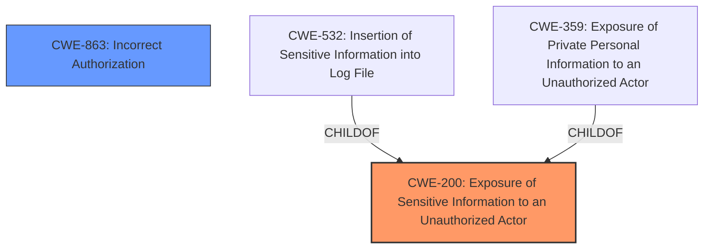

# Analysis for CVE-2024-40597

# Summary
| CWE ID | CWE Name | Confidence | CWE Abstraction Level | CWE Vulnerability Mapping Label | CWE-Vulnerability Mapping Notes |
|---|---|---|---|---|---|
| CWE-200 | Exposure of Sensitive Information to an Unauthorized Actor | 0.9 | Class | Primary | Allowed-with-Review |
| CWE-863 | Incorrect Authorization | 0.7 | Class | Secondary Candidate | Allowed-with-Review |

## Evidence and Confidence

*   **Confidence Score:** 0.9
*   **Evidence Strength:** HIGH

## Relationship Analysis
The primary CWE identified is CWE-200, which is a Class-level CWE. While it's generally discouraged to map to Class-level CWEs, in this case, the vulnerability's core issue is the exposure of suppressed information, which directly aligns with the description of CWE-200. The relationship analysis did not clearly point to a more specific Base or Variant CWE. CWE-863 is considered a secondary candidate because the root cause involves some form of authorization bypass, but the primary manifestation is the information exposure.

## Vulnerability Chain
The vulnerability chain starts with the **failure to respect the log_deleted attribute**, leading to the exposure of suppressed information to unauthorized actors.

1.  **Root Cause:** **Missing check or improper handling of the log_deleted attribute**.
2.  **Weakness:** The CheckUser extension **does not properly prevent access** to suppressed log events.
3.  **Impact:** Exposure of sensitive information to CheckUsers without oversight permissions.

## Summary of Analysis
The initial analysis focused on the fact that the **log_deleted attribute is not respected**, leading to information exposure. The primary decision is based on the "CVE Reference Links Content Summary" section which states: "The primary vulnerability is the exposure of suppressed log event information to users (CheckUsers) who should not have access to it, violating privacy and oversight mechanisms." This directly supports the selection of CWE-200.

CWE-200 is chosen because the core of the vulnerability lies in the exposure of sensitive information. While other CWEs like CWE-863 (Incorrect Authorization) are relevant, they describe the mechanism that led to the exposure rather than the exposure itself. CWE-200 is at a Class level, however, the provided information does not allow for a more specific base or variant selection.

The description aligns well with the definition of CWE-200: "The product exposes sensitive information to an actor that is not explicitly authorized to have access to that information." The **failure to respect the log_deleted attribute** directly leads to this exposure.

The alternative CWEs from the Retriever Results were considered, particularly CWE-359 (Exposure of Private Personal Information to an Unauthorized Actor) and CWE-532 (Insertion of Sensitive Information into Log File), but they were deemed less relevant than CWE-200. CWE-359 is more specific to personal information, while CWE-532 relates to log files specifically. The exposed information isn't necessarily *personal*, and the issue is not the insertion of information into a log file, but the failure to hide it when it *should* be hidden. Thus CWE-200 is a better fit.