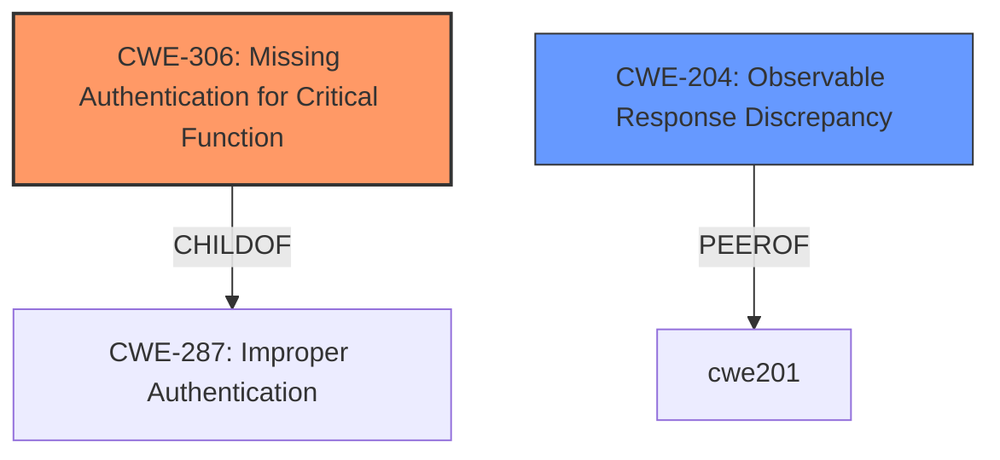

# Enhanced Analysis for CVE-2024-40627

# Summary
| CWE ID | CWE Name | Confidence | CWE Abstraction Level | CWE Vulnerability Mapping Label | CWE-Vulnerability Mapping Notes |
|---|---|---|---|---|---|
| CWE-306 | Missing Authentication for Critical Function | 0.9 | Base | Primary | Allowed |
| CWE-204 | Observable Response Discrepancy | 0.7 | Base | Secondary | Allowed |

## Evidence and Confidence

*   **Confidence Score:** 0.8
*   **Evidence Strength:** HIGH

## Relationship Analysis
The primary relationship that influenced my decision was the parent-child relationship between CWE-287 (Improper Authentication) and CWE-306 (Missing Authentication for Critical Function). Since the vulnerability description clearly indicates a complete lack of authentication for HTTP OPTIONS requests, CWE-306 was chosen as the more specific and accurate representation. CWE-204 was selected as a secondary weakness due to the potential for information disclosure, and it has a peer relationship with CWE-201 (Insertion of Sensitive Information Into Sent Data), suggesting it fits within the broader category of information exposure vulnerabilities.



## Vulnerability Chain
The vulnerability chain begins with the **missing authentication** for HTTP OPTIONS requests (CWE-306). This **root cause** allows an unauthenticated attacker to send these requests directly to the application. The application then processes these requests and potentially returns responses that reveal sensitive information, such as the existence of entities (CWE-204).

## Summary of Analysis
My analysis is primarily based on the evidence provided in the vulnerability description and CVE summary. The description explicitly states that HTTP OPTIONS requests are always allowed by `OpaMiddleware` even when they lack authentication. The CVE summary reinforces this by stating that the `OpaMiddleware` was not enforcing authentication and authorization checks for HTTP `OPTIONS` requests.

The selection of CWE-306 is justified by the fact that it directly addresses the **missing authentication** for critical functions. The selection of CWE-204 is justified because an attacker could use `OPTIONS` requests to determine the existence and properties of resources within the application without needing to authenticate.

The chosen CWEs are at the optimal level of specificity because they accurately represent the weakness and its potential impact. CWE-306 is a base-level CWE that directly addresses the **root cause** of the vulnerability, while CWE-204 is a base-level CWE that accurately reflects the potential for information disclosure.

**Evidence:**
- "HTTP `OPTIONS` requests are always allowed by `OpaMiddleware`, even when they lack authentication"
- "The `OpaMiddleware` in `fastapi-opa` was not enforcing authentication and authorization checks for HTTP `OPTIONS` requests."
- "If an application provides different responses to HTTP `OPTIONS` requests based on an entity existing... an unauthenticated attacker could discover which entities exist within an application."

The other CWEs were considered but not used:

*   **CWE-863 Incorrect Authorization:** While authorization is related, the primary issue is the **lack of authentication** *before* authorization, making CWE-306 more appropriate.
*   **CWE-201 Insertion of Sensitive Information Into Sent Data:** The vulnerability isn't directly about inserting sensitive information but about exposing it through the response. CWE-204 is a better fit.
*   **CWE-639 Authorization Bypass Through User-Controlled Key:** This CWE doesn't fit the scenario because there is no key being modified by the user.
*   **CWE-1390 Weak Authentication:** This CWE is not applicable because authentication is missing altogether, not just weak.
*   **CWE-918 Server-Side Request Forgery (SSRF):** There is no evidence of server-side request forgery in the description.
*   **CWE-88 Improper Neutralization of Argument Delimiters in a Command ('Argument Injection'):** There is no evidence of argument injection in the description.
*   **CWE-303 Incorrect Implementation of Authentication Algorithm:** This CWE is not applicable because authentication is missing altogether, not incorrectly implemented.
*   **CWE-226 Sensitive Information in Resource Not Removed Before Reuse:** There is no evidence of this in the description.


## CWE Relationship Analysis

Current CWEs represent these abstraction levels: .


### Vulnerability Chain Analysis

**Chain starting from CWE-1390:**
- 1390 (Weak Authentication) - ROOT


**Chain starting from CWE-863:**
- 863 (Incorrect Authorization) - ROOT


### CWE Relationship Diagram

```mermaid
graph TD
    classDef primary fill:#f96,stroke:#333,stroke-width:2px
    classDef secondary fill:#69f,stroke:#333
    classDef tertiary fill:#9e9,stroke:#333
```