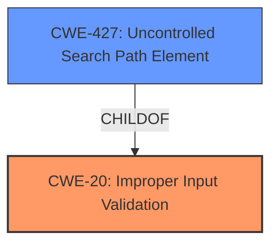

# Analysis for CVE-2024-40721

# Summary
| CWE ID | CWE Name | Confidence | CWE Abstraction Level | CWE Vulnerability Mapping Label | CWE-Vulnerability Mapping Notes |
|---|---|---|---|---|---|
| CWE-20 ([CWE-20: Improper Input Validation](https://cwe.mitre.org/data/definitions/20.html)) | Improper Input Validation | 0.9 | Class | Primary CWE | Discouraged: CWE-20 is commonly misused in low-information vulnerability reports when lower-level CWEs could be used instead, or when more details about the vulnerability are available. However, in this case, the provided information is limited to "improper input validation" and no more specific details are provided. |
| CWE-427 ([CWE-427: Uncontrolled Search Path Element](https://cwe.mitre.org/data/definitions/427.html)) | Uncontrolled Search Path Element | 0.6 | Base | Secondary | Allowed: The vulnerability description states that the TCBServiSign loads a DLL from an arbitrary path. This is related to the search path used to find the DLL. |

## Evidence and Confidence

*   **Confidence Score:** 0.75
*   **Evidence Strength:** MEDIUM

## Relationship Analysis
The primary relationship considered was the parent-child relationship between CWE-20 ([CWE-20: Improper Input Validation](https://cwe.mitre.org/data/definitions/20.html)) and its potential children. Although CWE-427 ([CWE-427: Uncontrolled Search Path Element](https://cwe.mitre.org/data/definitions/427.html)) was considered to be part of the root cause, it is being listed as a secondary weakness. The abstraction levels influenced the selection by prioritizing a more general class (CWE-20 ([CWE-20: Improper Input Validation](https://cwe.mitre.org/data/definitions/20.html))) due to lack of sufficient information.

## Vulnerability Chain
The vulnerability chain begins with **improper input validation** (CWE-20 ([CWE-20: Improper Input Validation](https://cwe.mitre.org/data/definitions/20.html))) which leads to the loading of a DLL from an arbitrary path due to an uncontrolled search path (CWE-427 ([CWE-427: Uncontrolled Search Path Element](https://cwe.mitre.org/data/definitions/427.html))).

## Summary of Analysis
The initial analysis focused on identifying the root cause of the vulnerability, which the description explicitly states as **improper input validation**. The analysis also considered the impact, which is the ability to load an arbitrary DLL. Based on the provided information, the selection of CWE-20 ([CWE-20: Improper Input Validation](https://cwe.mitre.org/data/definitions/20.html)) as the primary CWE is justified, although it is a high-level class. CWE-427 ([CWE-427: Uncontrolled Search Path Element](https://cwe.mitre.org/data/definitions/427.html)) is chosen as a secondary CWE because the **improper input validation** leads to the condition of loading a DLL from an arbitrary path.

The evidence supporting this decision comes directly from the "Vulnerability Description Key Phrases" section, which identifies **improper input validation** as the **rootcause**.

Other CWEs considered but not used:

*   CWE-295 ([CWE-295: Improper Certificate Validation](https://cwe.mitre.org/data/definitions/295.html)), CWE-346 ([CWE-346: Origin Validation Error](https://cwe.mitre.org/data/definitions/346.html)), CWE-93 ([CWE-93: Improper Neutralization of CRLF Sequences ('CRLF Injection')](https://cwe.mitre.org/data/definitions/93.html)), CWE-472 ([CWE-472: External Control of Assumed-Immutable Web Parameter](https://cwe.mitre.org/data/definitions/472.html)), CWE-138 ([CWE-138: Improper Neutralization of Special Elements](https://cwe.mitre.org/data/definitions/138.html)), CWE-22 ([CWE-22: Improper Limitation of a Pathname to a Restricted Directory ('Path Traversal')](https://cwe.mitre.org/data/definitions/22.html)), CWE-1336 ([CWE-1336: Improper Neutralization of Special Elements Used in a Template Engine](https://cwe.mitre.org/data/definitions/1336.html)), CWE-115 ([CWE-115: Misinterpretation of Input](https://cwe.mitre.org/data/definitions/115.html)), CWE-117 ([CWE-117: Improper Output Neutralization for Logs](https://cwe.mitre.org/data/definitions/117.html)): These were not selected because the vulnerability description and key phrases clearly point to **improper input validation** as the root cause. The description lacks specific details that would align with certificate validation, origin validation, CRLF injection, web parameter control, special element neutralization, path traversal, template engine issues, input misinterpretation, or log output issues.