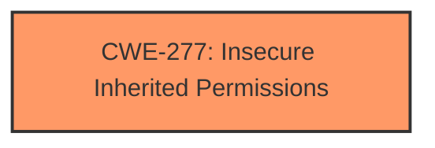

# Analysis Report for CVE-2024-40783

# Vulnerability Analysis Report: CVE-2024-40783

## Description

The issue was addressed with improved restriction of data container access. This issue is fixed in macOS Sonoma 14.6, macOS Monterey 12.7.6, macOS Ventura 13.6.8. A malicious application may be able to bypass Privacy preferences.

## Vulnerability Description Key Phrases

- **Impact:** bypass Privacy preferences
- **Attacker:** malicious application
- **Product:** ['macOS Sonoma', 'macOS Monterey', 'macOS Ventura']
- **Version:** ['14.6', '12.7.6', '13.6.8']

## Analysis (with Relationship Data)

# Summary
| CWE ID | CWE Name | Confidence | CWE Abstraction Level | CWE Vulnerability Mapping Label | CWE-Vulnerability Mapping Notes |
|---|---|---|---|---|---|
| CWE-277 | Insecure Inherited Permissions | 0.75 | Variant | Allowed | Primary CWE. The vulnerability lies in **insufficient restrictions on data container access**, which is an insecure permission that is inherited by objects created by the program. |

## Evidence and Confidence

*   **Confidence Score:** 0.75
*   **Evidence Strength:** MEDIUM

## Relationship Analysis
The primary relationship considered was the direct match of CWE-277 to the described weakness: insufficient restrictions leading to bypassed privacy preferences. While CWE-732 (Incorrect Permission Assignment for Critical Resource) was considered, the description of CWE-277, specifically related to *inherited* permissions, makes it a more precise fit given the context of data container access. There are no identified parent-child or chain relationships to influence this decision further.



## Vulnerability Chain
The vulnerability chain starts with the **root cause** of **insufficient restrictions on data container access**, which directly leads to the **impact** of bypassing privacy preferences.
  - **Root Cause:** CWE-277 (Insecure Inherited Permissions)
  - **Impact:** Bypass of Privacy Preferences

## Summary of Analysis
The analysis focused on identifying the **root cause** of the vulnerability, which is the **insufficient restriction on data container access**. The vulnerability description clearly states that "The issue was addressed with improved restriction of data container access," indicating that the initial lack of proper restrictions was the core problem. The evidence from "CVE Reference Links Content Summary" shows "Weakness: Insufficient restrictions on data container access allowed a malicious application to bypass privacy preferences."

CWE-277 (Insecure Inherited Permissions) aligns well with this description. The "Vulnerability Description Key Phrases" highlight the impact as "bypass Privacy preferences," and the "attacker" is a "malicious application," further supporting the context of an application exploiting an insecure permission setting.

CWE-732 (Incorrect Permission Assignment for Critical Resource) was considered but deemed less specific because it does not explicitly address the *inheritance* aspect of the permissions, which is relevant in this scenario.

The final selection of CWE-277 is at the Variant level of abstraction, providing a more precise categorization of the weakness.


## CWE Relationship Analysis

Current CWEs represent these abstraction levels: .


### Vulnerability Chain Analysis

**Chain starting from CWE-277:**
- 277 (Insecure Inherited Permissions) - ROOT


**Chain starting from CWE-732:**
- 732 (Incorrect Permission Assignment for Critical Resource) - ROOT


### CWE Relationship Diagram

```mermaid
graph TD
    classDef primary fill:#f96,stroke:#333,stroke-width:2px
    classDef secondary fill:#69f,stroke:#333
    classDef tertiary fill:#9e9,stroke:#333
```


*Report generated on 2025-07-13 12:31:44*
