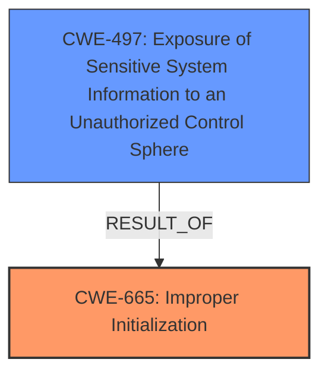

# Raw Analyzer Response for CVE-2024-40786

# Summary
| CWE ID | CWE Name | Confidence | CWE Abstraction Level | CWE Vulnerability Mapping Label | CWE-Vulnerability Mapping Notes |
|---|---|---|---|---|---|
| CWE-665 | Improper Initialization | 0.8 | Class | Primary CWE | Allowed-with-Review |
| CWE-497 | Exposure of Sensitive System Information to an Unauthorized Control Sphere | 0.7 | Base | Secondary Candidate | Allowed |

## Evidence and Confidence

*   **Confidence Score:** 0.75
*   **Evidence Strength:** MEDIUM

## Relationship Analysis
The primary relationship considered was the parent-child relationship between CWE-665 and its potential base-level children. CWE-665 is a Class-level CWE, and the analysis explored more specific children. CWE-497 was considered as a potential consequence of **improper initialization** leading to the exposure of sensitive information.

## Vulnerability Chain
The vulnerability chain starts with **improper state management** (which translates to **improper initialization**), leading to the exposure of sensitive information.

## Summary of Analysis
The initial analysis focused on identifying the root cause of the vulnerability. The vulnerability description mentions "**improper state management**" as the **weakness**. The CVE Reference Links Content Summary confirms this by stating, "The vulnerability is due to a state management issue" and "Improper state management leading to sensitive information exposure."

Given the **weakness** is **improper state management**, and considering that state management often involves initialization, CWE-665 (Improper Initialization) seems like a strong candidate. The impact is the ability to view sensitive user information, which aligns with CWE-497 (Exposure of Sensitive System Information to an Unauthorized Control Sphere).

CWE-20 (Improper Input Validation), CWE-119 (Improper Restriction of Operations within the Bounds of a Memory Buffer), CWE-787 (Out-of-bounds Write), CWE-843 (Access of Resource Using Incompatible Type) were deemed less relevant as they don't directly address the **improper state management** aspect described in the vulnerability. Specifically, the provided information doesn't point towards issues related to buffer overflows, input validation or type confusion.

CWE-665 is at the Class level, which suggests there might be more specific children CWEs. However, based on the available information, it is challenging to pinpoint a more specific CWE related to initialization. Given that the **improper state management** leads to sensitive information exposure, CWE-497 is added as a secondary CWE representing the impact.

The final selection is based on the evidence available, focusing on the root cause (**improper state management**) and its direct impact (sensitive information exposure).

Relevant CWE Information:

# Enhanced Context (25 CWEs)
The following CWEs were identified as potentially relevant to this vulnerability:

## CWE-203: Observable Discrepancy
**Abstraction Level**: Base
**Similarity Score**: 0.72
**Source**: dense

**Description**:
The product behaves differently or sends different responses under different circumstances in a way that is observable to an unauthorized actor, which exposes security-relevant information about the state of the product, such as whether a particular operation was successful or not.

**Mapping Guidance**:
- Usage: Allowed
- Rationale: This CWE entry is at the Base level of abstraction, which is a preferred level of abstraction for mapping to the root causes of vulnerabilities.

## CWE-451: User Interface (UI) Misrepresentation of Critical Information
**Abstraction Level**: Class
**Similarity Score**: 0.72
**Source**: dense

**Description**:
The user interface (UI) does not properly represent critical information to the user, allowing the information - or its source - to be obscured or spoofed. This is often a component in phishing attacks.

**Mapping Guidance**:
- Usage: Allowed-with-Review
- Rationale: This CWE entry is a Class and might have Base-level children that would be more appropriate

## CWE-843: Access of Resource Using Incompatible Type ('Type Confusion')
**Abstraction Level**: Base
**Similarity Score**: 0.71
**Source**: dense

**Description**:
The product allocates or initializes a resource such as a pointer, object, or variable using one type, but it later accesses that resource using a type that is incompatible with the original type.

**Mapping Guidance**:
- Usage: Allowed
- Rationale: This CWE entry is at the Base level of abstraction, which is a preferred level of abstraction for mapping to the root causes of vulnerabilities.

## CWE-754: Improper Check for Unusual or Exceptional Conditions
**Abstraction Level**: Class
**Similarity Score**: 0.70
**Source**: dense

**Description**:
The product does not check or incorrectly checks for unusual or exceptional conditions that are not expected to occur frequently during day to day operation of the product.

**Mapping Guidance**:
- Usage: Allowed-with-Review
- Rationale: This CWE entry is a Class and might have Base-level children that would be more appropriate

## CWE-497: Exposure of Sensitive System Information to an Unauthorized Control Sphere
**Abstraction Level**: Base
**Similarity Score**: 0.70
**Source**: dense

**Description**:
The product does not properly prevent sensitive system-level information from being accessed by unauthorized actors who do not have the same level of access to the underlying system as the product does.

**Mapping Guidance**:
- Usage: Allowed
- Rationale: This CWE entry is at the Base level of abstraction, which is a preferred level of abstraction for mapping to the root causes of vulnerabilities.

**CWE-497 Justification:**
The vulnerability description states "An attacker may be able to view sensitive user information.".
This aligns with the CWE-497 description, "The product does not properly prevent sensitive system-level information from being accessed by unauthorized actors".
The "CVE Reference Links Content Summary" further states "Improper state management leading to sensitive information exposure.".
This confirms that due to **improper state management**, sensitive information is being exposed.
CWE-497 is at the Base level of abstraction.
The mapping guidance is "Allowed".

## CWE-665: Improper Initialization
**Abstraction Level**: Class
**Similarity Score**: 0.69
**Source**: dense

**Description**:
The product does not initialize or incorrectly initializes a resource, which might leave the resource in an unexpected state when it is accessed or used.

**Mapping Guidance**:
- Usage: Discouraged
- Rationale: This CWE entry is a level-1 Class (i.e., a child of a Pillar). It might have lower-level children that would be more appropriate

**CWE-665 Justification:**
The vulnerability description mentions "**improper state management**".
State management involves initializing and maintaining the state of an application or system.
The CWE-665 description aligns with this, stating "The product does not initialize or incorrectly initializes a resource, which might leave the resource in an unexpected state when it is accessed or used.".
The "CVE Reference Links Content Summary" states "The vulnerability is due to a state management issue.".
CWE-665 is at the Class level of abstraction.
The mapping guidance is "Discouraged" because "It might have lower-level children that would be more appropriate".
However, no more specific child is evident from the provided information.

## CWE-755: Improper Handling of Exceptional Conditions
**Abstraction Level**: Class
**Similarity Score**: 0.69
**Source**: dense

**Description**:
The product does not handle or incorrectly handles an exceptional condition.

**Mapping Guidance**:
- Usage: Discouraged
- Rationale: This CWE entry is a level-1 Class (i.e., a child of a Pillar). It might have lower-level children that would be more appropriate

## CWE-131: Incorrect Calculation of Buffer Size
**Abstraction Level**: Base
**Similarity Score**: 0.69
**Source**: dense

**Description**:
The product does not correctly calculate the size to be used when allocating a buffer, which could lead to a buffer overflow.

**Mapping Guidance**:
- Usage: Allowed
- Rationale: This CWE entry is at the Base level of abstraction, which is a preferred level of abstraction for mapping to the root causes of vulnerabilities.

## CWE-824: Access of Uninitialized Pointer
**Abstraction Level**: Base
**Similarity Score**: 0.69
**Source**: dense

**Description**:
The product accesses or uses a pointer that has not been initialized.

**Mapping Guidance**:
- Usage: Allowed
- Rationale: This CWE entry is at the Base level of abstraction, which is a preferred level of abstraction for mapping to the root causes of vulnerabilities.

## CWE-212: Improper Removal of Sensitive Information Before Storage or Transfer
**Abstraction Level**: Base
**