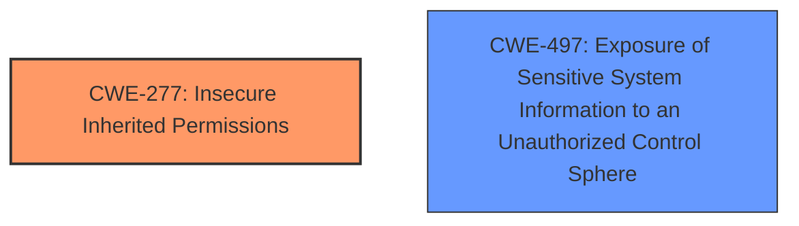

# Enhanced Analysis for CVE-2024-40804

# Summary

| CWE ID | CWE Name | Confidence | CWE Abstraction Level | CWE Vulnerability Mapping Label | CWE-Vulnerability Mapping Notes |
|---|---|---|---|---|---|
| CWE-277 | Insecure Inherited Permissions | 0.7 | Variant | Primary CWE | Allowed |
| CWE-497 | Exposure of Sensitive System Information to an Unauthorized Control Sphere | 0.6 | Base | Secondary Candidate | Allowed |

## Evidence and Confidence

*   **Confidence Score:** 0.7
*   **Evidence Strength:** MEDIUM

## Relationship Analysis
The primary CWE, CWE-277 **Insecure Inherited Permissions**, is a variant-level CWE, offering a more specific classification than its parent classes. CWE-497 **Exposure of Sensitive System Information to an Unauthorized Control Sphere** is a potential secondary weakness because the malicious application is able to access private information, which could be considered sensitive system information. The relationships influenced the decision to select a variant-level CWE where possible and to consider related weaknesses.



## Vulnerability Chain
The chain starts with **insecure inherited permissions** (CWE-277), which allows a malicious application to **access private information**. The private information **exposure** (CWE-497) is a consequence of the initial permission flaw.

## Summary of Analysis
The analysis is based on the provided evidence, which indicates that a malicious application can access private information due to **insecure permissions**. The "CVE Reference Links Content Summary" states that the **root cause of the vulnerability** is present in the "Accounts" component of macOS Sonoma, which aligns with the concept of permissions.
CWE-277, **Insecure Inherited Permissions**, best describes this scenario as it focuses on permissions granted to objects, including applications, and the potential for those permissions to be insecure.
The relationships between CWEs, particularly the parent-child relationship and chain relationships, were considered to ensure that the selected CWE was the most specific and accurate representation of the vulnerability. The retriever scores were used as supporting evidence for the decisions. The selection of CWE-277 and CWE-497 are at the optimal level of specificity given the available information.

Relevant CWE Information:

# Enhanced Context (25 CWEs)
The following CWEs were identified as potentially relevant to this vulnerability:

## CWE-277: Insecure Inherited Permissions
**Abstraction Level**: Variant
**Similarity Score**: 0.71
**Source**: dense

**Description**:
A product defines a set of insecure permissions that are inherited by objects that are created by the program.

**Mapping Guidance**:
- Usage: Allowed
- Rationale: This CWE entry is at the Variant level of abstraction, which is a preferred level of abstraction for mapping to the root causes of vulnerabilities.

**Why CWE-277 was selected**: The vulnerability description indicates a permission issue, where a malicious application can access private information. The root cause is described as being in the "Accounts" component, further suggesting a permission-related problem. CWE-277 directly addresses the concept of **insecure permissions** being inherited, which perfectly matches the given scenario.

## CWE-497: Exposure of Sensitive System Information to an Unauthorized Control Sphere
**Abstraction Level**: Base
**Similarity Score**: 0.70
**Source**: dense

**Description**:
The product does not properly prevent sensitive system-level information from being accessed by unauthorized actors who do not have the same level of access to the underlying system as the product does.

**Mapping Guidance**:
- Usage: Allowed
- Rationale: This CWE entry is at the Base level of abstraction, which is a preferred level of abstraction for mapping to the root causes of vulnerabilities.

**Why CWE-497 was selected**: The vulnerability description mentions that a malicious application can access private information. This directly relates to the exposure of sensitive information to an unauthorized entity. This CWE is a good fit for describing the impact of the vulnerability.

## Other CWEs Considered But Not Used:

*   **CWE-285: Improper Authorization:** While related to permissions, it's too high-level and the description is about checking permissions, rather than defining them incorrectly. The Usage is Discouraged, so it's not a good choice.
*   **CWE-732: Incorrect Permission Assignment for Critical Resource:** This CWE is close, but the description mentions that it is often misused for vulnerabilities where "permissions" are not checked, which is more related to authorization.
*   **CWE-787: Out-of-bounds Write and CWE-125: Out-of-bounds Read:** These are memory safety issues and are not related to the described vulnerability.
*   **CWE-843: Access of Resource Using Incompatible Type ('Type Confusion'):** This CWE is about type confusion and not relevant to the vulnerability.
*   **CWE-347: Improper Verification of Cryptographic Signature:** This CWE is related to cryptographic signatures and is not relevant to the vulnerability.
*   **CWE-20: Improper Input Validation:** This is a very broad CWE, and there is no evidence about input validation issues.
*   **CWE-770: Allocation of Resources Without Limits or Throttling:** This CWE is about resource allocation and not relevant to the vulnerability.


## CWE Relationship Analysis

Current CWEs represent these abstraction levels: .


### Vulnerability Chain Analysis

**Chain starting from CWE-732:**
- 732 (Incorrect Permission Assignment for Critical Resource) - ROOT


**Chain starting from CWE-770:**
- 770 (Allocation of Resources Without Limits or Throttling) - ROOT


### CWE Relationship Diagram

```mermaid
graph TD
    classDef primary fill:#f96,stroke:#333,stroke-width:2px
    classDef secondary fill:#69f,stroke:#333
    classDef tertiary fill:#9e9,stroke:#333
```