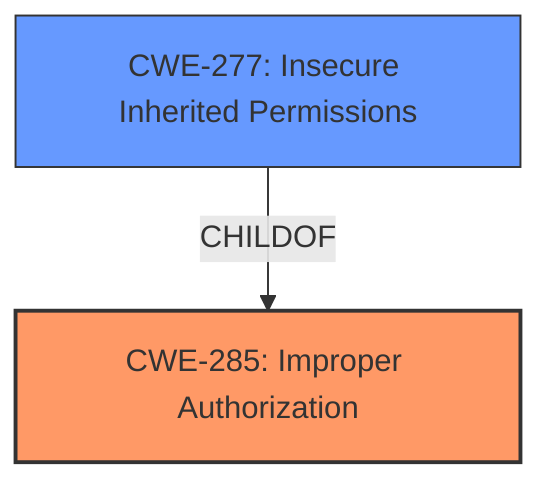

# Analysis Report for CVE-2024-40807

# Vulnerability Analysis Report: CVE-2024-40807

## Description

A **logic issue** was addressed with improved checks. This issue is fixed in macOS Sonoma 14.6, macOS Monterey 12.7.6, macOS Ventura 13.6.8. A shortcut may be able to use sensitive data with certain actions without prompting the user.

## Vulnerability Description Key Phrases

- **Rootcause:** logic issue
- **Impact:** use sensitive data without prompting user
- **Vector:** certain actions
- **Attacker:** shortcut
- **Product:** ['macOS Sonoma', 'macOS Monterey', 'macOS Ventura']
- **Version:** ['14.6', '12.7.6', '13.6.8']

## Analysis (with Relationship Data)

# Summary
| CWE ID | CWE Name | Confidence | CWE Abstraction Level | CWE Vulnerability Mapping Label | CWE-Vulnerability Mapping Notes |
|---|---|---|---|---|---|
| CWE-285 | Improper Authorization | 0.75 | Class | Primary CWE | Discouraged: CWE-285 is high-level and lower-level CWEs can frequently be used instead. It is a level-1 Class (i.e., a child of a Pillar). |
| CWE-277 | Insecure Inherited Permissions | 0.5 | Variant | Secondary Candidate | Allowed |

## Evidence and Confidence

*   **Confidence Score:** 0.7
*   **Evidence Strength:** MEDIUM

## Relationship Analysis
The primary relationship influencing the decision is the hierarchical one. CWE-285 is a Class-level CWE, and while it fits the description, it's generally recommended to find a more specific, lower-level CWE if possible. However, the available information doesn't provide enough detail to pinpoint a more specific authorization issue. CWE-277 is a more specific variant that might be applicable if the **logic issue** relates to permissions, but the information is limited.



## Vulnerability Chain
The vulnerability chain starts with a **logic issue** which leads to **improper authorization**, ultimately allowing a shortcut to **use sensitive data without prompting the user**.

## Summary of Analysis
The analysis is based on the provided evidence, primarily the vulnerability description and the CVE reference summary. The description mentions a "**logic issue**" that allows a shortcut to use sensitive data without prompting the user. The CVE reference summary confirms this, stating that the vulnerability stems from a "**logic issue** within the Shortcuts application" and that a "malicious shortcut may be able to use sensitive data with certain actions without prompting the user for consent".

Given this information, CWE-285 (Improper Authorization) is the most appropriate primary CWE. It captures the essence of the vulnerability: the system fails to properly authorize the shortcut's access to sensitive data, allowing it to bypass user prompts. While CWE-285 is a high-level class, the lack of detail prevents selecting a more specific base or variant CWE.

Other CWEs were considered but deemed less appropriate:

*   CWE-787 (Out-of-bounds Write), CWE-415 (Double Free), CWE-123 (Write-what-where Condition): These CWEs relate to memory corruption issues, which are not indicated in the description.
*   CWE-20 (Improper Input Validation): While input validation issues can lead to authorization bypasses, the description focuses on a **logic issue** rather than a specific input validation failure.
*   CWE-347 (Improper Verification of Cryptographic Signature): There's no mention of cryptographic signatures in the description.
*   CWE-843 (Access of Resource Using Incompatible Type ('Type Confusion')): There's no indication of type confusion in the description.

CWE-277 (Insecure Inherited Permissions) is a possible secondary candidate, especially if the logic issue relates to how permissions are assigned or inherited by shortcuts. However, without more information, it's difficult to confirm its applicability.

The selected CWEs are at an appropriate level of specificity given the available information. While a more specific CWE might be ideal, the current evidence doesn't support it.


## CWE Relationship Analysis

Current CWEs represent these abstraction levels: .


### Vulnerability Chain Analysis

**Chain starting from CWE-123:**
- 123 (Write-what-where Condition) - ROOT


**Chain starting from CWE-787:**
- 787 (Out-of-bounds Write) - ROOT


### CWE Relationship Diagram

```mermaid
graph TD
    classDef primary fill:#f96,stroke:#333,stroke-width:2px
    classDef secondary fill:#69f,stroke:#333
    classDef tertiary fill:#9e9,stroke:#333
```


*Report generated on 2025-07-13 12:34:20*
