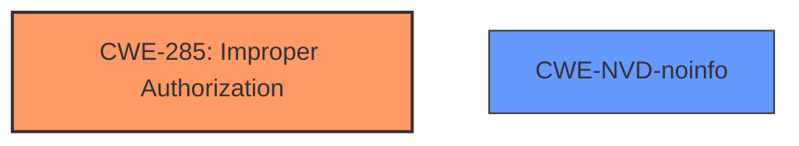

# Analysis Report for CVE-2024-40823

# Vulnerability Analysis Report: CVE-2024-40823

## Description

The issue was addressed with improved checks. This issue is fixed in macOS Sonoma 14.6, macOS Monterey 12.7.6, macOS Ventura 13.6.8. An app may be able to access user-sensitive data.

## Vulnerability Description Key Phrases

- **Impact:** access user-sensitive data
- **Attacker:** app
- **Product:** macOS
- **Version:** ['Sonoma 14.6', 'Monterey 12.7.6', 'Ventura 13.6.8']

## Analysis (with Relationship Data)

# Summary

| CWE ID  | CWE Name                                                        | Confidence | CWE Abstraction Level | CWE Vulnerability Mapping Label | CWE-Vulnerability Mapping Notes |
| :-------- | :-------------------------------------------------------------- | :--------- | :-------------------- | :------------------------------ | :-------------------------------- |
| CWE-285 | Improper Authorization                                              | 0.7        | Class               | Discouraged                     | Root cause                  |
| CWE-NVD-noinfo | NVD no information                                              | 0.5        | N/A               | N/A                     | No Description                  |

## Evidence and Confidence

*   **Confidence Score:** 0.7
*   **Evidence Strength:** MEDIUM

## Relationship Analysis

The primary CWE is CWE-285, which is a Class-level CWE. While it's generally preferred to use Base or Variant level CWEs, the available information does not provide enough detail to pinpoint a more specific weakness. It is also a level-1 Class (i.e., a child of a Pillar).



## Vulnerability Chain

The **root cause** appears to be an **improper authorization** issue (CWE-285) that leads to the **impact** of an app being able to access user-sensitive data.
1.  **Root Cause**: **Improper Authorization** (CWE-285)
2.  **Impact**: An app may be able to access user-sensitive data.

## Summary of Analysis

The vulnerability description indicates that an app may be able to access user-sensitive data. The provided CVE Reference Links Content Summary indicates the issue was addressed with improved checks. The **weakness** is that "An app may be able to access user-sensitive data". The **root_cause** "The issue was addressed with improved checks". Given this information, the most appropriate CWE is CWE-285, Improper Authorization.

CWE-NVD-noinfo was considered because it was the Primary CWE Match, but it contains no information and is not a real CWE.

CWE-787, Out-of-bounds Write, was considered, but there is no evidence to suggest that the vulnerability involves writing data past the end of a buffer. Similarly, CWE-843, Access of Resource Using Incompatible Type ('Type Confusion'), and CWE-347, Improper Verification of Cryptographic Signature were considered, but there is no evidence to suggest type confusion or signature verification issues.
The final decision is based on the evidence provided, which points towards an authorization issue, and the understanding that the provided retriever results are only suggestions.
The selected CWEs are at the optimal level of specificity given the limited information available.


## CWE Relationship Analysis

Current CWEs represent these abstraction levels: .


### Vulnerability Chain Analysis

**Chain starting from CWE-843:**
- 843 (Access of Resource Using Incompatible Type ('Type Confusion')) - ROOT


**Chain starting from CWE-787:**
- 787 (Out-of-bounds Write) - ROOT


### CWE Relationship Diagram

```mermaid
graph TD
    classDef primary fill:#f96,stroke:#333,stroke-width:2px
    classDef secondary fill:#69f,stroke:#333
    classDef tertiary fill:#9e9,stroke:#333
```


*Report generated on 2025-07-13 12:35:57*
