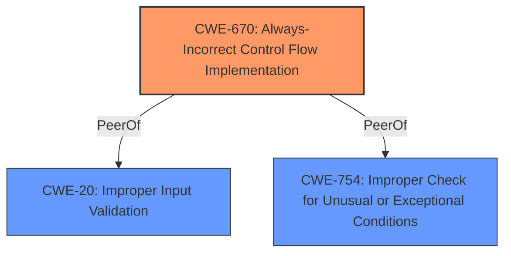

# Analysis for CVE-2024-40836

# Summary
| CWE ID  | CWE Name                                                                               | Confidence | CWE Abstraction Level | CWE Vulnerability Mapping Label | CWE-Vulnerability Mapping Notes |
| :-------- | :------------------------------------------------------------------------------------- | :--------- | :---------------------- | :------------------------------ | :-------------------------------- |
| CWE-670   | Always-Incorrect Control Flow Implementation                                         | 0.85       | Base                    | Primary                         | Allowed                           |
| CWE-20    | Improper Input Validation                                                            | 0.65       | Class                   | Secondary                       | Discouraged                       |
| CWE-754   | Improper Check for Unusual or Exceptional Conditions                                 | 0.60       | Class                   | Secondary                       | Allowed-with-Review               |

## Evidence and Confidence

*   **Confidence Score:** 0.75
*   **Evidence Strength:** MEDIUM

## Relationship Analysis
The primary weakness is a **logic issue** due to **insufficient checks** that results in the ability to use sensitive data without prompting. The most specific CWE for this issue is CWE-670 (Always-Incorrect Control Flow Implementation), which represents a flaw in the implementation of the control flow logic. Other relevant CWEs include CWE-20 (Improper Input Validation) and CWE-754 (Improper Check for Unusual or Exceptional Conditions), which are broader classifications related to input handling and exception handling.

## Vulnerability Chain
The vulnerability chain starts with a **logic issue** caused by **insufficient checks** (CWE-670), potentially related to improper input validation (CWE-20) or improper handling of exceptional conditions (CWE-754), leading to the ability to use sensitive data without prompting the user.
  - Root cause: CWE-670 (Always-Incorrect Control Flow Implementation)
  - Contributing factors: CWE-20 (Improper Input Validation), CWE-754 (Improper Check for Unusual or Exceptional Conditions)
  - Impact: Use of sensitive data without prompting the user.

## Summary of Analysis
The primary CWE is CWE-670 because the vulnerability stems from a flaw in the implementation of the control flow logic, specifically in the context of shortcuts using sensitive data. The supporting evidence is the vulnerability description mentioning a **logic issue** addressed with improved checks. The Retriever Results also suggest relevant CWEs such as CWE-787, CWE-843, and CWE-20, but these are not as directly applicable as CWE-670.

CWE-20 (Improper Input Validation) is considered as a secondary CWE, as it is possible that the **logic issue** involves a failure to validate input properly before using it in a sensitive operation. However, the description does not explicitly state that the input is invalid, only that the data can be used without prompting. The mapping guidance discourages the use of CWE-20 as it is commonly misused and a more specific CWE should be found, so the confidence score is reduced.

CWE-754 (Improper Check for Unusual or Exceptional Conditions) is also considered as a secondary CWE, as the **logic issue** and **insufficient checks** could potentially involve failing to handle unusual or exceptional conditions. The mapping guidance suggests to use more specific CWEs, so the confidence score is reduced.

The selected CWEs are at an appropriate level of specificity, with CWE-670 being a base-level CWE that directly addresses the flaw in control flow implementation. The relationship analysis reinforces this selection, as it highlights the connection between the **logic issue** and the need for improved checks.

Relevant CWE Information:

# Enhanced Context (25 CWEs)
The following CWEs were identified as potentially relevant to this vulnerability:

## CWE-451: User Interface (UI) Misrepresentation of Critical Information
**Abstraction Level**: Class
**Similarity Score**: 0.74
**Source**: dense

**Description**:
The user interface (UI) does not properly represent critical information to the user, allowing the information - or its source - to be obscured or spoofed. This is often a component in phishing attacks.

**Mapping Guidance**:
- Usage: Allowed-with-Review
- Rationale: This CWE entry is a Class and might have Base-level children that would be more appropriate

*Not Used:* While the impact is that sensitive data is used without prompting the user, the root cause is not a UI misrepresentation.

## CWE-843: Access of Resource Using Incompatible Type ('Type Confusion')
**Abstraction Level**: Base
**Similarity Score**: 0.73
**Source**: dense

**Description**:
The product allocates or initializes a resource such as a pointer, object, or variable using one type, but it later accesses that resource using a type that is incompatible with the original type.

**Mapping Guidance**:
- Usage: Allowed
- Rationale: This CWE entry is at the Base level of abstraction, which is a preferred level of abstraction for mapping to the root causes of vulnerabilities.

*Not Used:* There is no evidence of type confusion.

## CWE-754: Improper Check for Unusual or Exceptional Conditions
**Abstraction Level**: Class
**Similarity Score**: 0.73
**Source**: dense

**Description**:
The product does not check or incorrectly checks for unusual or exceptional conditions that are not expected to occur frequently during day to day operation of the product.

**Mapping Guidance**:
- Usage: Allowed-with-Review
- Rationale: This CWE entry is a Class and might have Base-level children that would be more appropriate

*Used:* Considered as a secondary factor because **insufficient checks** could potentially involve failing to handle unusual or exceptional conditions.

## CWE-203: Observable Discrepancy
**Abstraction Level**: Base
**Similarity Score**: 0.73
**Source**: dense

**Description**:
The product behaves differently or sends different responses under different circumstances in a way that is observable to an unauthorized actor, which exposes security-relevant information about the state of the product, such as whether a particular operation was successful or not.

**Mapping Guidance**:
- Usage: Allowed
- Rationale: This CWE entry is at the Base level of abstraction, which is a preferred level of abstraction for mapping to the root causes of vulnerabilities.

*Not Used:* There is no evidence of observable discrepancy.

## CWE-667: Improper Locking
**Abstraction Level**: Class
**Similarity Score**: 0.73
**Source**: dense

**Description**:
The product does not properly acquire or release a lock on a resource, leading to unexpected resource state changes and behaviors.

**Mapping Guidance**:
- Usage: Allowed-with-Review
- Rationale: This CWE entry is a Class and might have Base-level children that would be more appropriate

*Not Used:* There is no evidence of improper locking.

## CWE-345: Insufficient Verification of Data Authenticity
**Abstraction Level**: Class
**Similarity Score**: 0.72
**Source**: dense

**Description**:
The product does not sufficiently verify the origin or authenticity of data, in a way that causes it to accept invalid data.

**Mapping Guidance**:
- Usage: Discouraged
- Rationale: This CWE entry is a level-1 Class (i.e., a child of a Pillar). It might have lower-level children that would be more appropriate

*Not Used:* There is no evidence of data authenticity issues.

## CWE-703: Improper Check or Handling of Exceptional Conditions
**Abstraction Level**: Pillar
**Similarity Score**: 0.72
**Source**: dense

**Description**:
The product does not properly anticipate or handle exceptional conditions that rarely occur during normal operation of the product.

**Mapping Guidance**:
- Usage: Discouraged
- Rationale: This CWE entry is extremely high-level, a Pillar.

*Not Used:* Too general.

## CWE-208: Observable Timing Discrepancy
**Abstraction Level**: Base
**Similarity Score**: 0.72
**Source**: dense

**Description**:
Two separate operations in a product require different amounts of time to complete, in a way that is observable to an actor and reveals security-relevant information about the state of the product, such as whether a particular operation was successful or not.

**Mapping Guidance**:
- Usage: Allowed
- Rationale: This CWE entry is at the Base level of abstraction, which is a preferred level of abstraction for mapping to the root causes of vulnerabilities.

*Not Used:* There is no evidence of timing discrepancy.

## CWE-131: Incorrect Calculation of Buffer Size
**Abstraction Level**: Base
**Similarity Score**: 0.72
**Source**: dense

**Description**:
The product does not correctly calculate the