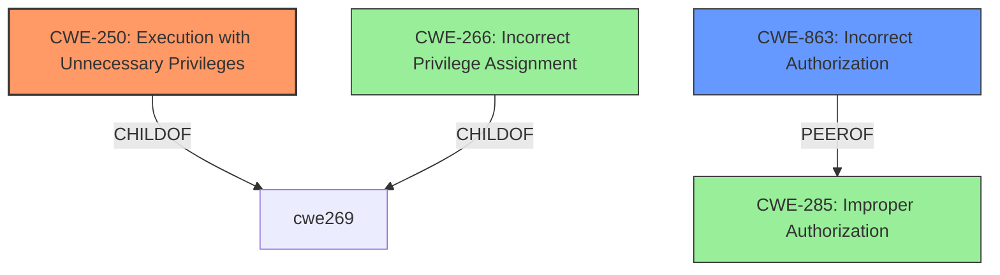

# Analysis for CVE-2024-40861

# Summary
| CWE ID | CWE Name | Confidence | CWE Abstraction Level | CWE Vulnerability Mapping Label | CWE-Vulnerability Mapping Notes |
|---|---|---|---|---|---|
| **CWE-250** | Execution with Unnecessary Privileges | 0.9 | Base | Primary | Allowed |
| CWE-863 | Incorrect Authorization | 0.6 | Class | Secondary Candidate | Allowed-with-Review |

## Evidence and Confidence

*   **Confidence Score:** 0.75
*   **Evidence Strength:** MEDIUM

## Relationship Analysis
The primary relationship influencing the decision is the guidance provided that maps "Runs as root" or "Should not run as admin" to CWE-250. The description states "An app may be able to gain root privileges" and the fix was to improve checks, so the app was running with root privileges when it should not have. CWE-863 is considered as the authorization checks were not correctly performed.

## Vulnerability Chain
The vulnerability chain starts with the application running with unnecessary privileges (CWE-250). The **improper** authorization (CWE-863) allows the application to **gain root privileges**.

## Summary of Analysis
The initial analysis focused on identifying the root cause of the vulnerability. The vulnerability description and CVE reference links content summary provide sufficient evidence to support the selection of CWE-250 as the primary CWE. The key phrase "gain root privileges" suggests an issue related to privilege management. However, further analysis is needed to pinpoint the exact nature of the weakness.

The retriever results offer several candidate CWEs, including CWE-250 (Execution with Unnecessary Privileges), CWE-863 (Incorrect Authorization), and CWE-285 (Improper Authorization). Based on the mapping guidance, CWE-250 is the most appropriate choice, as it directly addresses the scenario where code runs with higher privileges than needed. The guidance specifically mentions phrases like "Runs as root" or "Should not run as admin" as indicators of CWE-250.

The relationship analysis further supports the selection of CWE-250. It is a base-level CWE, which is preferred for mapping root causes. Additionally, it has a parent-child relationship with CWE-269 (Improper Privilege Management), indicating a connection to privilege-related issues.

The vulnerability description states that the issue was addressed with improved checks, suggesting that the authorization process was **incorrect**. This supports the inclusion of CWE-863 as a secondary CWE, indicating that the application was not properly authorized to perform certain actions.

The selected CWEs are at the optimal level of specificity, providing a clear understanding of the vulnerability's root cause and contributing factors.