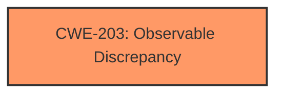

# Raw Analyzer Response for CVE-2024-40864

# Summary
| CWE ID | CWE Name | Confidence | CWE Abstraction Level | CWE Vulnerability Mapping Label | CWE-Vulnerability Mapping Notes |
|---|---|---|---|---|---|
| CWE-203 | Observable Discrepancy | 0.6 | Base | Primary | Allowed |

## Evidence and Confidence

*   **Confidence Score:** 0.6
*   **Evidence Strength:** LOW

## Relationship Analysis
The primary focus is on CWE-203, which is at the Base level. There aren't clear parent-child or chain relationships evident from the provided data to strongly support alternative classifications.

## Vulnerability Chain
The chain of events involves an attacker in a privileged network position being able to **track a user's activity** due to a discrepancy in how protocols are handled. The root cause is the **improper handling of protocols** leading to an observable discrepancy.

## Summary of Analysis
The initial assessment considered several CWEs based on the retriever results, however, the final decision leans towards CWE-203, Observable Discrepancy. This choice is primarily due to the vulnerability description explicitly mentioning that "an attacker in a privileged network position can **track a users activity**," which aligns well with the concept of observing differences in behavior to infer sensitive information. The **improved handling of protocols** also suggests a fix addressing an observable discrepancy.

The decision is heavily based on the provided evidence, which is not very detailed, and the retriever results that are also not very descriptive.

The selected CWE is at the optimal level of specificity given the limited information.

Relevant CWE Information:

# Enhanced Context (25 CWEs)
The following CWEs were identified as potentially relevant to this vulnerability:

## CWE-203: Observable Discrepancy
**Abstraction Level**: Base
**Similarity Score**: 0.73
**Source**: dense

**Description**:
The product behaves differently or sends different responses under different circumstances in a way that is observable to an unauthorized actor, which exposes security-relevant information about the state of the product, such as whether a particular operation was successful or not.

**Mapping Guidance**:
- Usage: Allowed
- Rationale: This CWE entry is at the Base level of abstraction, which is a preferred level of abstraction for mapping to the root causes of vulnerabilities.