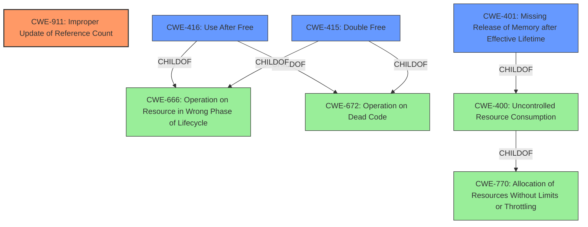

# Analysis Report for CVE-2024-40910

# Vulnerability Analysis Report: CVE-2024-40910

## Description

In the Linux kernel, the following vulnerability has been resolved ax25 Fix **refcount imbalance** on inbound connections When releasing a socket in ax25_release(), we call netdev_put() to decrease the refcount on the associated ax.25 device. However, the execution path for accepting an incoming connection never calls netdev_hold(). This imbalance leads to refcount errors, and ultimately to kernel crashes. A typical call trace for the above situation will start with one of the following errors refcount_t decrement hit 0 leaking memory. refcount_t underflow use-after-free. And will then have a trace like Call Trace ? show_regs+0x64/0x70 ? __warn+0x83/0x120 ? refcount_warn_saturate+0xb2/0x100 ? report_bug+0x158/0x190 ? prb_read_valid+0x20/0x30 ? handle_bug+0x3e/0x70 ? exc_invalid_op+0x1c/0x70 ? asm_exc_invalid_op+0x1f/0x30 ? refcount_warn_saturate+0xb2/0x100 ? refcount_warn_saturate+0xb2/0x100 ax25_release+0x2ad/0x360 __sock_release+0x35/0xa0 sock_close+0x19/0x20 [...] On reboot (or any attempt to remove the interface), the kernel gets stuck in an infinite loop unregister_netdevice waiting for ax0 to become free. Usage count = 0 This patch corrects these issues by ensuring that we call netdev_hold() and ax25_dev_hold() for new connections in ax25_accept(). This makes the logic leading to ax25_accept() match the logic for ax25_bind() in both cases we increment the refcount, which

## Vulnerability Description Key Phrases

- **Rootcause:** refcount imbalance
- **Impact:** ['kernel crashes', 'infinite loop']
- **Product:** Linux kernel
- **Component:** ax25

## Analysis (with Relationship Data)

# Summary
| CWE ID | CWE Name | Confidence | CWE Abstraction Level | CWE Vulnerability Mapping Label | CWE-Vulnerability Mapping Notes |
|---|---|---|---|---|---|
| **CWE-911** | **Improper Update of Reference Count** | 1.0 | Base | Primary | Allowed |
| CWE-416 | Use After Free | 0.7 | Variant | Secondary Candidate | Allowed |
| CWE-415 | Double Free | 0.6 | Variant | Secondary Candidate | Allowed |
| CWE-401 | Missing Release of Memory after Effective Lifetime | 0.5 | Variant | Secondary Candidate | Allowed |

## Evidence and Confidence

*   **Confidence Score:** 0.9
*   **Evidence Strength:** HIGH

## Relationship Analysis
The primary weakness is CWE-911 (Improper Update of Reference Count), a Base level CWE. The vulnerability description clearly states a "**refcount imbalance**". Due to the **refcount imbalance**, a Use-After-Free condition (CWE-416) can occur, as the resource might be freed prematurely. A Double Free (CWE-415) could also arise from improper refcount management, as could a Missing Release of Memory after Effective Lifetime (CWE-401). These are all variants and thus more specific than their parents.



## Vulnerability Chain
The vulnerability chain starts with the **refcount imbalance** (CWE-911) caused by the missing `netdev_hold()` call. This can lead to a premature freeing of the network device, resulting in a use-after-free condition (CWE-416) or a double free (CWE-415), and possibly a memory leak (CWE-401). The ultimate impact is a kernel crash or an infinite loop.

## Summary of Analysis
The primary weakness is the **refcount imbalance** (CWE-911). The "CVE Reference Links Content Summary" clearly states: "The root cause of the vulnerability is a refcount imbalance in the ax25 networking module of the Linux kernel... This discrepancy leads to a refcount imbalance." The fix involves ensuring that `netdev_hold()` is called, which directly addresses the **refcount imbalance**. The retriever results also pointed to CWE-911 as a strong candidate.

CWE-416 (Use After Free) is a potential consequence of the **refcount imbalance**, as noted in the "CVE Reference Links Content Summary": "The refcount imbalance can lead to a use-after-free condition when the network device's refcount drops to zero prematurely." Similarly, CWE-415 (Double Free) and CWE-401 (Missing Release of Memory after Effective Lifetime) are possible outcomes, though less directly stated.

The selected CWEs are at the optimal level of specificity. CWE-911 directly addresses the root cause. While use-after-free, double-free, and memory leak are possible consequences of incorrect reference counting, these are impacts, not the root cause.

Relevant CWE Information:

# Enhanced Context (25 CWEs)
The following CWEs were identified as potentially relevant to this vulnerability:

## CWE-755: Improper Handling of Exceptional Conditions
**Abstraction Level**: Class
**Similarity Score**: 0.75
**Source**: dense

**Description**:
The product does not handle or incorrectly handles an exceptional condition.

**Mapping Guidance**:
- Usage: Discouraged
- Rationale: This CWE entry is a level-1 Class (i.e., a child of a Pillar). It might have lower-level children that would be more appropriate

## CWE-362: Concurrent Execution using Shared Resource with Improper Synchronization ('Race Condition')
**Abstraction Level**: Class
**Similarity Score**: 0.75
**Source**: dense

**Description**:
The product contains a concurrent code sequence that requires temporary, exclusive access to a shared resource, but a timing window exists in which the shared resource can be modified by another code sequence operating concurrently.

**Mapping Guidance**:
- Usage: Allowed-with-Review
- Rationale: This CWE entry is a Class and might have Base-level children that would be more appropriate

## CWE-667: Improper Locking
**Abstraction Level**: Class
**Similarity Score**: 0.74
**Source**: dense

**Description**:
The product does not properly acquire or release a lock on a resource, leading to unexpected resource state changes and behaviors.

**Mapping Guidance**:
- Usage: Allowed-with-Review
- Rationale: This CWE entry is a Class and might have Base-level children that would be more appropriate

## CWE-252: Unchecked Return Value
**Abstraction Level**: Base
**Similarity Score**: 0.74
**Source**: dense

**Description**:
The product does not check the return value from a method or function, which can prevent it from detecting unexpected states and conditions.

**Mapping Guidance**:
- Usage: Allowed
- Rationale: This CWE entry is at the Base level of abstraction, which is a preferred level of abstraction for mapping to the root causes of vulnerabilities.

## CWE-131: Incorrect Calculation of Buffer Size
**Abstraction Level**: Base
**Similarity Score**: 0.74
**Source**: dense

**Description**:
The product does not correctly calculate the size to be used when allocating a buffer, which could lead to a buffer overflow.

**Mapping Guidance**:
- Usage: Allowed
- Rationale: This CWE entry is at the Base level of abstraction, which is a preferred level of abstraction for mapping to the root causes of vulnerabilities.

## CWE-833: Deadlock
**Abstraction Level**: Base
**Similarity Score**: 0.74
**Source**: dense

**Description**:
The product contains multiple threads or executable segments that are waiting for each other to release a necessary lock, resulting in deadlock.

**Mapping Guidance**:
- Usage: Allowed
- Rationale: This CWE entry is at the Base level of abstraction, which is a preferred level of abstraction for mapping to the root causes of vulnerabilities.

## CWE-824: Access of Uninitialized Pointer
**Abstraction Level**: Base
**Similarity Score**: 0.74
**Source**: dense

**Description**:
The product accesses or uses a pointer that has not been initialized.

**Mapping Guidance**:
- Usage: Allowed
- Rationale: This CWE entry is at the Base level of abstraction, which is a preferred level of abstraction for mapping to the root causes of vulnerabilities.

## CWE-191: Integer Underflow (Wrap or Wraparound)
**Abstraction Level**: Base
**Similarity Score**: 0.74
**Source**: dense

**Description**:
The product subtracts one value from another, such that the result is less than the minimum allowable integer value, which produces a value that is not equal to the correct result.

**Mapping Guidance**:
- Usage: Allowed
- Rationale: This CWE entry is at the Base level of abstraction, which is a preferred level of abstraction for mapping to the root causes of vulnerabilities.

## CWE-401: Missing Release of Memory after Effective Lifetime
**Abstraction Level**: Variant
**Similarity Score**: 0.74
**Source**: dense

**Description**:
The product does not sufficiently track and release allocated memory after it has been used, which slowly consumes remaining memory.

**Mapping Guidance**:
- Usage: Allowed
- Rationale: This CWE entry is at the Variant level of abstraction, which is a preferred level of abstraction for mapping to the root causes of vulnerabilities.

## CWE-617: Reachable Assertion
**Abstraction Level**: Base


## CWE Relationship Analysis

Current CWEs represent these abstraction levels: .


### Vulnerability Chain Analysis

**Chain starting from CWE-672:**
- 672 (Operation on a Resource after Expiration or Release) - ROOT


**Chain starting from CWE-617:**
- 617 (Reachable Assertion) - ROOT


### CWE Relationship Diagram

```mermaid
graph TD
    classDef primary fill:#f96,stroke:#333,stroke-width:2px
    classDef secondary fill:#69f,stroke:#333
    classDef tertiary fill:#9e9,stroke:#333
```


*Report generated on 2025-07-13 12:41:40*
