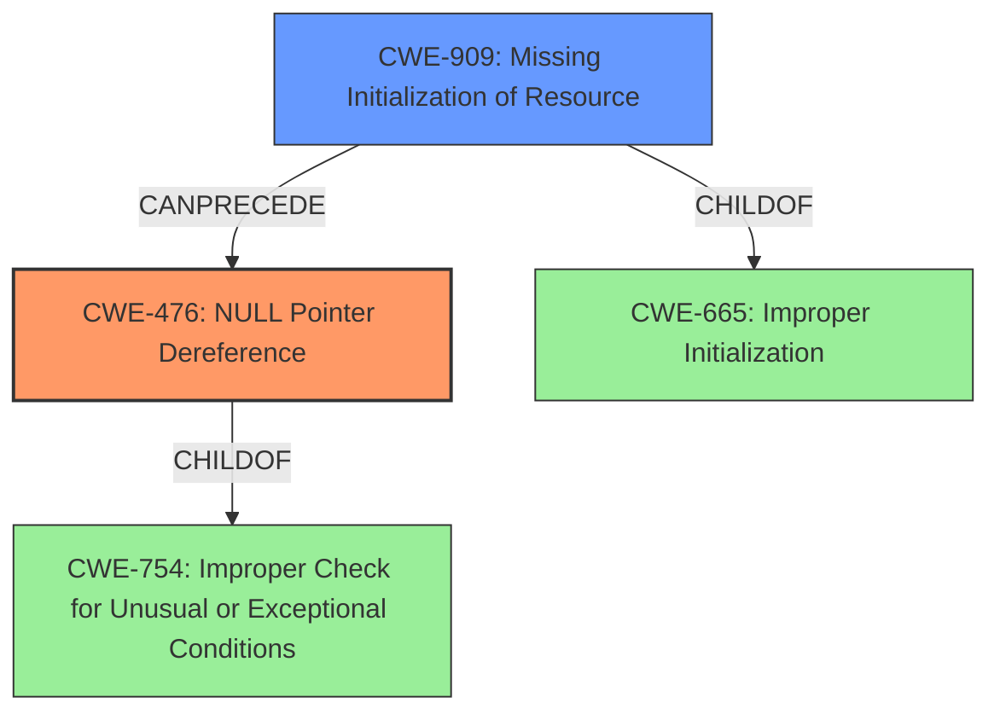

# Analysis for CVE-2024-40917

# Summary
| CWE ID | CWE Name | Confidence | CWE Abstraction Level | CWE Vulnerability Mapping Label | CWE-Vulnerability Mapping Notes |
|---|---|---|---|---|---|
| CWE-476 | NULL Pointer Dereference | 1.0 | Base | Primary | Allowed |
| CWE-909 | Missing Initialization of Resource | 0.7 | Class | Secondary | Allowed-with-Review |

## Evidence and Confidence

*   **Confidence Score:** 0.9
*   **Evidence Strength:** HIGH

## Relationship Analysis
The primary CWE is CWE-476 **(NULL Pointer Dereference)**, which directly results from the kernel attempting to access node data for an invalid node ID (`MAX_NUMNODES`). CWE-909 **(Missing Initialization of Resource)** is a potential contributing factor, as the failure to properly initialize the memory management structures could lead to the condition where an invalid node ID is used. While several other CWEs were considered, these two provide the most accurate and specific representation of the vulnerability based on the provided description and context.

## Vulnerability Chain
The vulnerability chain starts with an **incorrect NUMA node assignment**, potentially due to **Missing Initialization of Resource (CWE-909)**. The kernel then attempts to access the memory map for the invalid node, leading to **NULL Pointer Dereference (CWE-476)**, which ultimately causes a kernel crash and denial of service.

## Summary of Analysis
The analysis indicates a high confidence in mapping the vulnerability to **CWE-476 (NULL Pointer Dereference)** as the primary weakness. The vulnerability description explicitly mentions a NULL dereference in `memmap_init()` when accessing node data for node 64. This aligns perfectly with the definition of CWE-476. The evidence supporting this is: "This in turn led to memblock_alloc_range_nid()s warning about MAX_NUMNODES triggering, followed by a **NULL deref** in memmap_init() when trying to access node 64s (NODE_SHIFT=6) node data."

Additionally, the analysis considers **CWE-909 (Missing Initialization of Resource)** as a secondary weakness. The root cause involves the kernel not correctly interpreting the NUMA configuration. Specifically, "**faking a node** at [mem 0x0000000000000000-0x000000027fffffff] was seen", implying a possible failure in proper resource initialization which leads to the out-of-bounds access.

Other CWEs were considered but deemed less relevant. For example, CWE-252 (Unchecked Return Value) might seem relevant because the kernel might not be checking return values from memory allocation functions, but the primary issue is the access of an invalid memory location, not the failure to check a return value.

The selected CWEs are at the optimal level of specificity. **CWE-476** is a Base-level CWE and directly describes the observed vulnerability. **CWE-909** is a Class-level CWE and describes a possible underlying cause for the vulnerability. Selecting more general CWEs like CWE-754 (Improper Check for Unusual or Exceptional Conditions) or CWE-665 (Improper Initialization) would not be as precise or informative.