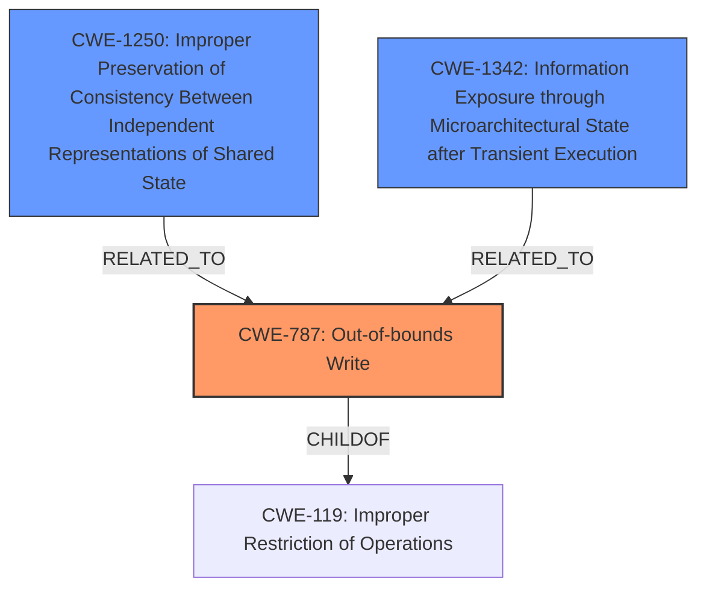

# Analysis Report for CVE-2024-40918

# Vulnerability Analysis Report: CVE-2024-40918

## Description

In the Linux kernel, the following vulnerability has been resolved parisc Try to fix random segmentation faults in package builds PA-RISC systems with PA8800 and PA8900 processors have had problems with random segmentation faults for many years. Systems with earlier processors are much more stable. Systems with PA8800 and PA8900 processors have a large L2 cache which needs per page flushing for decent performance when a large range is flushed. The combined cache in these systems is also more sensitive to **non-equivalent aliases** than the caches in earlier systems. The majority of random segmentation faults that I have looked at appear to be **memory corruption** in memory allocated using mmap and malloc. My first attempt at fixing the random faults didnt work. On reviewing the cache code, I realized that there were two issues which the existing code didnt handle correctly. Both relate to cache move-in. Another issue is that the present bit in PTEs is racy. 1) PA-RISC caches have a mind of their own and they can speculatively load data and instructions for a page as long as there is a entry in the TLB for the page which allows move-in. TLBs are local to each CPU. Thus, the TLB entry for a page must be purged before flushing the page. This is particularly important on SMP systems. In some of the flush routines, the flush routine would be called and then the TLB entry would be purged. This was because the flush routine needed the TLB entry to do the flush. 2) My initial a

## Vulnerability Description Key Phrases

- **Rootcause:** non-equivalent aliases
- **Weakness:** memory corruption
- **Impact:** random segmentation faults
- **Product:** Linux kernel
- **Component:** cache code

## Analysis (with Relationship Data)

# Summary
| CWE ID | CWE Name | Confidence | CWE Abstraction Level | CWE Vulnerability Mapping Label | CWE-Vulnerability Mapping Notes |
|---|---|---|---|---|---|
| CWE-787 | Out-of-bounds Write | 0.9 | Base | Allowed | Primary CWE: The vulnerability leads to memory corruption due to incorrect cache handling, potentially resulting in out-of-bounds writes. |
| CWE-1250 | Improper Preservation of Consistency Between Independent Representations of Shared State | 0.7 | Base | Allowed | The vulnerability involves cache inconsistencies leading to data corruption. |
| CWE-1342 | Information Exposure through Microarchitectural State after Transient Execution | 0.6 | Base | Allowed | The vulnerability involves transient execution and microarchitectural state related to cache behavior. |

## Evidence and Confidence

*   **Confidence Score:** 0.8
*   **Evidence Strength:** MEDIUM

## Relationship Analysis
The primary CWE is CWE-787, which represents the out-of-bounds write caused by the memory corruption. CWE-1250 is related because the cache inconsistencies are a contributing factor. CWE-1342 is related because of the microarchitectural details of the cache handling.



## Vulnerability Chain
1.  **Root Cause:** **Non-equivalent aliases**, inadequate cache flushing, racy PTE checks, improper TLB entry purging.
2.  **Weakness:** **Memory corruption** due to stale cache lines and synchronization issues.
3.  **Impact:** Random segmentation faults and application crashes.

## Summary of Analysis
The primary weakness is identified as CWE-787 (Out-of-bounds Write) due to the **memory corruption** leading to potential out-of-bounds writes. The vulnerability description mentions issues with cache handling and TLB entries, which can lead to **non-equivalent aliases** and data corruption. Supporting this, the CVE reference summary highlights "inadequate cache flushing," "racy PTE checks," and "improper TLB entry purging" as contributing factors.

CWE-1250 (Improper Preservation of Consistency Between Independent Representations of Shared State) is considered because the cache inconsistencies contribute to the **memory corruption**. CWE-1342 (Information Exposure through Microarchitectural State after Transient Execution) is also considered due to the microarchitectural details of cache handling.

The retriever results listed CWE-787 as the top candidate.
The evidence supports the selection of CWE-787 as the primary CWE, with CWE-1250 and CWE-1342 as related secondary CWEs, though with lower confidence.

Relevant CWE Information:

# Enhanced Context (25 CWEs)
The following CWEs were identified as potentially relevant to this vulnerability:

## CWE-667: Improper Locking
**Abstraction Level**: Class
**Similarity Score**: 0.79
**Source**: dense

**Description**:
The product does not properly acquire or release a lock on a resource, leading to unexpected resource state changes and behaviors.

**Mapping Guidance**:
- Usage: Allowed-with-Review
- Rationale: This CWE entry is a Class and might have Base-level children that would be more appropriate


## CWE-824: Access of Uninitialized Pointer
**Abstraction Level**: Base
**Similarity Score**: 0.77
**Source**: dense

**Description**:
The product accesses or uses a pointer that has not been initialized.

**Mapping Guidance**:
- Usage: Allowed
- Rationale: This CWE entry is at the Base level of abstraction, which is a preferred level of abstraction for mapping to the root causes of vulnerabilities.


## CWE-131: Incorrect Calculation of Buffer Size
**Abstraction Level**: Base
**Similarity Score**: 0.77
**Source**: dense

**Description**:
The product does not correctly calculate the size to be used when allocating a buffer, which could lead to a buffer overflow.

**Mapping Guidance**:
- Usage: Allowed
- Rationale: This CWE entry is at the Base level of abstraction, which is a preferred level of abstraction for mapping to the root causes of vulnerabilities.


## CWE-909: Missing Initialization of Resource
**Abstraction Level**: Class
**Similarity Score**: 0.77
**Source**: dense

**Description**:
The product does not initialize a critical resource.

**Mapping Guidance**:
- Usage: Allowed-with-Review
- Rationale: This CWE entry is a Class and might have Base-level children that would be more appropriate


## CWE-404: Improper Resource Shutdown or Release
**Abstraction Level**: Class
**Similarity Score**: 0.77
**Source**: dense

**Description**:
The product does not release or incorrectly releases a resource before it is made available for re-use.

**Mapping Guidance**:
- Usage: Allowed-with-Review
- Rationale: This CWE entry is a Class and might have Base-level children that would be more appropriate


## CWE-789: Memory Allocation with Excessive Size Value
**Abstraction Level**: Variant
**Similarity Score**: 0.76
**Source**: dense

**Description**:
The product allocates memory based on an untrusted, large size value, but it does not ensure that the size is within expected limits, allowing arbitrary amounts of memory to be allocated.

**Mapping Guidance**:
- Usage: Allowed
- Rationale: This CWE entry is at the Variant level of abstraction, which is a preferred level of abstraction for mapping to the root causes of vulnerabilities.


## CWE-125: Out-of-bounds Read
**Abstraction Level**: Base
**Similarity Score**: 0.76
**Source**: dense

**Description**:
The product reads data past the end, or before the beginning, of the intended buffer.

**Mapping Guidance**:
- Usage: Allowed
- Rationale: This CWE entry is at the Base level of abstraction, which is a preferred level of abstraction for mapping to the root causes of vulnerabilities.


## CWE-908: Use of Uninitialized Resource
**Abstraction Level**: Base
**Similarity Score**: 0.76
**Source**: dense

**Description**:
The product uses or accesses a resource that has not been initialized.

**Mapping Guidance**:
- Usage: Allowed
- Rationale: This CWE entry is at the Base level of abstraction, which is a preferred level of abstraction for mapping to the root causes of vulnerabilities.


## CWE-755: Improper Handling of Exceptional Conditions
**Abstraction Level**: Class
**Similarity Score**: 0.76
**Source**: dense

**Description**:
The product does not handle or incorrectly handles an exceptional condition.

**Mapping Guidance**:
- Usage: Discouraged
- Rationale: This CWE entry is a level-1 Class (i.e., a child of a Pillar). It might have lower-level children that would be more appropriate


## CWE-703: Improper Check or Handling of Exceptional Conditions
**Abstraction Level**: Pillar
**Similarity Score**: 0.76
**Source**: dense

**Description**:
The product does not properly anticipate or handle exceptional conditions that rarely occur during normal operation of the product.

**Mapping Guidance**:
- Usage: Discouraged
- Rationale: This CWE entry is extremely high-level, a Pillar.


## CWE-190: Integer Overflow or Wraparound
**Abstraction Level**: Base
**Similarity Score**: 1179.33
**Source**: sparse

**Description**:
The product performs a calculation that can
         produce an integer overflow or wraparound when the logic
         assumes that the resulting value will always be larger than
         the original value. This occurs when an integer value is
         incremented to a value that is too large to store in the
         associated representation. When this occurs, the value may
         become a very small or negative number.

**Mapping Guidance**:
- Usage: Allowed
- Rationale: This CWE entry is at the Base level of abstraction, which is a preferred level of abstraction for mapping to the root causes of vulnerabilities.


## CWE-667: Improper Locking
**Abstraction Level**: Class
**Similarity Score**: 1124.03
**Source**: sparse

**Description**:
The product does not properly acquire or release a lock on a resource, leading to unexpected resource state changes and behaviors.

**Mapping Guidance**:
- Usage:


## CWE Relationship Analysis

Current CWEs represent these abstraction levels: .


### Vulnerability Chain Analysis

**Chain starting from CWE-1250:**
- 1250 (Improper Preservation of Consistency Between Independent Representations of Shared State) - ROOT


**Chain starting from CWE-404:**
- 404 (Improper Resource Shutdown or Release) - ROOT


### CWE Relationship Diagram

```mermaid
graph TD
    classDef primary fill:#f96,stroke:#333,stroke-width:2px
    classDef secondary fill:#69f,stroke:#333
    classDef tertiary fill:#9e9,stroke:#333
```


*Report generated on 2025-07-13 12:42:33*
