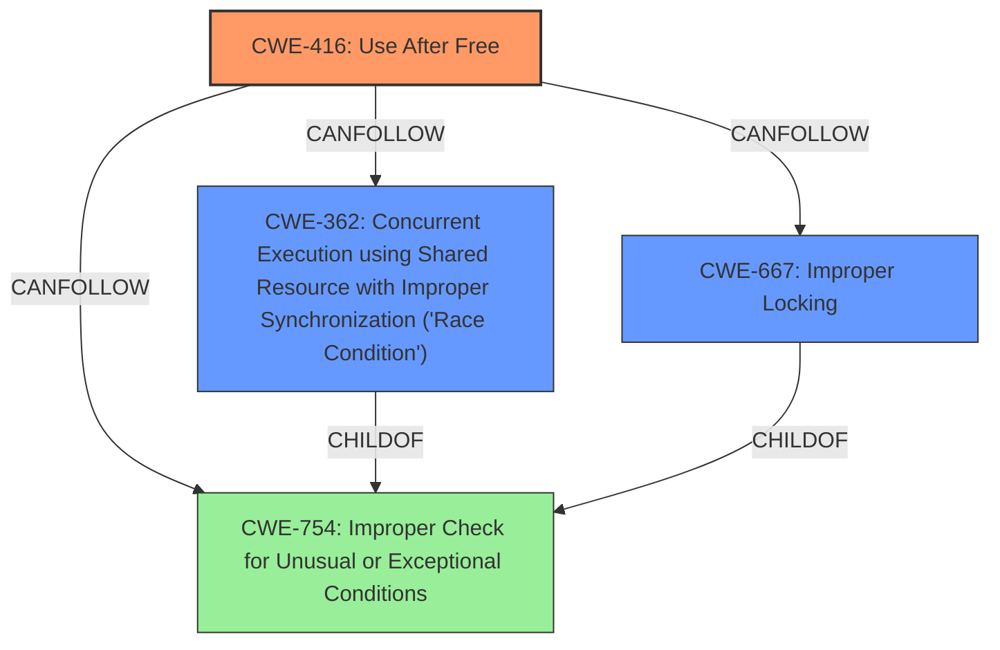

# Analysis Report for CVE-2024-40927

# Vulnerability Analysis Report: CVE-2024-40927

## Description

In the Linux kernel, the following vulnerability has been resolved xhci Handle TD clearing for multiple streams case When multiple streams are in use, **multiple TDs might be in flight when an endpoint is stopped**. We need to issue a Set TR Dequeue Pointer for each, to ensure everything is reset properly and the caches cleared. Change the logic so that any N>1 TDs found active for different streams are deferred until after the first one is processed, calling xhci_invalidate_cancelled_tds() again from xhci_handle_cmd_set_deq() to queue another command until we are done with all of them. Also change the error/should never happen paths to ensure we at least clear any affected TDs, even if we cant issue a command to clear the hardware cache, and complain loudly with an xhci_warn() if this ever happens. This problem case dates back to commit e9df17eb1408 (USB xhci Correct assumptions about number of rings per endpoint.) early on in the XHCI drivers life, when stream support was first added. It was then identified but not fixed nor made into a warning in commit 674f8438c121 (xhci split handling halted endpoints into two steps), which added a FIXME comment for the problem case (without materially changing the behavior as far as I can tell, though the new logic made the problem more obvious). Then later, in commit 94f339147fc3 (xhci Fix failure to give back some cached cancelled URBs.), it was acknowledged again. [Mathias commit 94f339147fc3 (xhci Fix failure to

## Vulnerability Description Key Phrases

- **Rootcause:** multiple TDs might be in flight when an endpoint is stopped
- **Impact:** insufficient cache flushing
- **Product:** Linux kernel
- **Component:** xhci

## Analysis (with Relationship Data)

# Summary
| CWE ID | CWE Name | Confidence | CWE Abstraction Level | CWE Vulnerability Mapping Label | CWE-Vulnerability Mapping Notes |
|---|---|---|---|---|---|
| CWE-416 | Use After Free | 0.9 | Variant | Allowed | Primary CWE |
| CWE-362 | Concurrent Execution using Shared Resource with Improper Synchronization ('Race Condition') | 0.7 | Class | Allowed-with-Review | Secondary Candidate |
| CWE-667 | Improper Locking | 0.6 | Class | Allowed-with-Review | Secondary Candidate |

## Evidence and Confidence

*   **Confidence Score:** 0.8
*   **Evidence Strength:** HIGH

## Relationship Analysis
The primary weakness identified is CWE-416 Use After Free, a variant-level CWE that is part of a vulnerability chain often involving race conditions. The concurrent execution and improper synchronization aspects are represented by CWE-362 Concurrent Execution using Shared Resource with Improper Synchronization ('Race Condition'), which is a class-level CWE. CWE-667 Improper Locking, another class-level CWE, represents a potential related issue but is less directly supported by the evidence.



## Vulnerability Chain
The vulnerability chain starts with **multiple TDs might be in flight when an endpoint is stopped** due to an incorrect assumption about the number of rings per endpoint. This leads to **improper TD clearing**, where some TDs are left in a cached state. This results in **Use After Free (CWE-416)**, causing xHC crashes, IOMMU faults, and memory corruption. A race condition (CWE-362) and improper locking (CWE-667) could contribute to the timing issues that exacerbate the UAF.

## Summary of Analysis
The primary assessment is that this vulnerability is a **Use After Free (CWE-416)**. This assessment is strongly supported by the evidence, particularly the "Root Cause" and "Weaknesses/Vulnerabilities" sections of the CVE Reference Links Content Summary, which explicitly mention improper TD clearing leading to a use-after-free condition.

The graph relationships influenced the decision to include CWE-362 and CWE-667 as secondary CWEs, as these relate to the concurrency and locking aspects of the vulnerability. However, the core issue remains the UAF due to the improper handling of TDs.

The selected CWEs are at the optimal level of specificity. CWE-416 is a variant-level CWE that directly describes the use-after-free condition. CWE-362 and CWE-667 are class-level CWEs that provide additional context about the concurrent execution and locking aspects of the vulnerability.

Relevant CWE Information:

# Enhanced Context (25 CWEs)
The following CWEs were identified as potentially relevant to this vulnerability:

## CWE-362: Concurrent Execution using Shared Resource with Improper Synchronization ('Race Condition')
**Abstraction Level**: Class
**Similarity Score**: 0.77
**Source**: dense

**Description**:
The product contains a concurrent code sequence that requires temporary, exclusive access to a shared resource, but a timing window exists in which the shared resource can be modified by another code sequence operating concurrently.

**Mapping Guidance**:
- Usage: Allowed-with-Review
- Rationale: This CWE entry is a Class and might have Base-level children that would be more appropriate

## CWE-755: Improper Handling of Exceptional Conditions
**Abstraction Level**: Class
**Similarity Score**: 0.76
**Source**: dense

**Description**:
The product does not handle or incorrectly handles an exceptional condition.

**Mapping Guidance**:
- Usage: Discouraged
- Rationale: This CWE entry is a level-1 Class (i.e., a child of a Pillar). It might have lower-level children that would be more appropriate

## CWE-191: Integer Underflow (Wrap or Wraparound)
**Abstraction Level**: Base
**Similarity Score**: 0.76
**Source**: dense

**Description**:
The product subtracts one value from another, such that the result is less than the minimum allowable integer value, which produces a value that is not equal to the correct result.

**Mapping Guidance**:
- Usage: Allowed
- Rationale: This CWE entry is at the Base level of abstraction, which is a preferred level of abstraction for mapping to the root causes of vulnerabilities.

## CWE-367: Time-of-check Time-of-use (TOCTOU) Race Condition
**Abstraction Level**: Base
**Similarity Score**: 0.75
**Source**: dense

**Description**:
The product checks the state of a resource before using that resource, but the resource's state can change between the check and the use in a way that invalidates the results of the check. This can cause the product to perform invalid actions when the resource is in an unexpected state.

**Mapping Guidance**:
- Usage: Allowed
- Rationale: This CWE entry is at the Base level of abstraction, which is a preferred level of abstraction for mapping to the root causes of vulnerabilities.

## CWE-667: Improper Locking
**Abstraction Level**: Class
**Similarity Score**: 0.75
**Source**: dense

**Description**:
The product does not properly acquire or release a lock on a resource, leading to unexpected resource state changes and behaviors.

**Mapping Guidance**:
- Usage: Allowed-with-Review
- Rationale: This CWE entry is a Class and might have Base-level children that would be more appropriate

## CWE-134: Use of Externally-Controlled Format String
**Abstraction Level**: Base
**Similarity Score**: 0.75
**Source**: dense

**Description**:
The product uses a function that accepts a format string as an argument, but the format string originates from an external source.

**Mapping Guidance**:
- Usage: Allowed
- Rationale: This CWE entry is at the Base level of abstraction, which is a preferred level of abstraction for mapping to the root causes of vulnerabilities.

## CWE-824: Access of Uninitialized Pointer
**Abstraction Level**: Base
**Similarity Score**: 0.75
**Source**: dense

**Description**:
The product accesses or uses a pointer that has not been initialized.

**Mapping Guidance**:
- Usage: Allowed
- Rationale: This CWE entry is at the Base level of abstraction, which is a preferred level of abstraction for mapping to the root causes of vulnerabilities.

## CWE-754: Improper Check for Unusual or Exceptional Conditions
**Abstraction Level**: Class
**Similarity Score**: 0.75
**Source**: dense

**Description**:
The product does not check or incorrectly checks for unusual or exceptional conditions that are not expected to occur frequently during day to day operation of the product.

**Mapping Guidance**:
- Usage: Allowed-with-Review
- Rationale: This CWE entry is a Class and might have Base-level children that would be more appropriate

## CWE-1285: Improper Validation of Specified Index, Position, or Offset in Input
**Abstraction Level**: Base
**Similarity Score**: 0.75
**Source**: dense

**Description**:
The product receives input that is expected to specify an index, position, or offset into an indexable resource such as a buffer or file, but it does not validate or incorrectly validates that the specified index/position/offset has the required properties.

**Mapping Guidance**:
- Usage: Allowed
- Rationale: This CWE entry is at the Base level of abstraction, which is a preferred level of abstraction for mapping to the root causes of vulnerabilities.

## CWE-131: Incorrect Calculation of Buffer Size
**Abstraction Level**: Base
**Similarity Score**: 0.74
**Source**: dense

**Description**:
The product does not correctly calculate the size to be used when allocating a buffer, which could lead to a buffer overflow.

**Mapping Guidance**:
- Usage: Allowed
- Rationale: This CWE entry is at the Base level of abstraction, which is a preferred level of abstraction for mapping to the root causes of vulnerabilities.

## CWE-362: Concurrent Execution using Shared Resource with Improper Synchronization ('Race Condition')
**Abstraction Level**: Class
**Similarity Score**: 1330.81


## CWE Relationship Analysis

Current CWEs represent these abstraction levels: .


### Vulnerability Chain Analysis

**Chain starting from CWE-416:**
- 416 (Use After Free) - ROOT


**Chain starting from CWE-131:**
- 131 (Incorrect Calculation of Buffer Size) - ROOT


### CWE Relationship Diagram

```mermaid
graph TD
    classDef primary fill:#f96,stroke:#333,stroke-width:2px
    classDef secondary fill:#69f,stroke:#333
    classDef tertiary fill:#9e9,stroke:#333
```


*Report generated on 2025-07-13 12:43:12*
