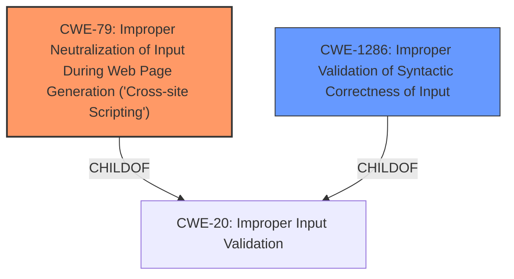

# Raw Analyzer Response for CVE-2024-4099

# Summary
| CWE ID | CWE Name | Confidence | CWE Abstraction Level | CWE Vulnerability Mapping Label | CWE-Vulnerability Mapping Notes |
|---|---|---|---|---|---|
| CWE-79 | Improper Neutralization of Input During Web Page Generation ('Cross-site Scripting') | 0.9 | Base | Primary | Allowed |
| CWE-1286 | Improper Validation of Syntactic Correctness of Input | 0.7 | Base | Secondary | Allowed |

## Evidence and Confidence

*   **Confidence Score:** 0.8
*   **Evidence Strength:** HIGH

## Relationship Analysis
The primary CWE selected is CWE-79, which focuses on the **improper neutralization of input during web page generation**. This aligns with the vulnerability where unsanitized content leads to potential **prompt injection**. CWE-1286 is considered as a contributing factor, addressing the **improper validation of syntactic correctness of input**, which in this case is the unsanitized HTML content. The analysis considered parent-child relationships and abstraction levels to ensure the most specific and accurate classification.

## Vulnerability Chain
1.  **Root Cause:** **Improper Validation of Syntactic Correctness of Input** (CWE-1286) - The application fails to properly validate the syntactic correctness of input, allowing unsanitized HTML content.
2.  **Weakness:** **Improper Neutralization of Input During Web Page Generation ('Cross-site Scripting')** (CWE-79) - The unsanitized content is used in the AI feature without proper neutralization, leading to potential **prompt injection**.
3.  **Impact:** Attackers can manipulate AI-generated content, inject phishing links, or cause other malicious actions.

## Summary of Analysis
The analysis is heavily based on the provided evidence, specifically the "CVE Reference Links Content Summary," which highlights the **root cause** as the use of unsanitized data in the AI feature.

> The vulnerability stems from GitLab AI features using unsanitized data as input for generating summaries and responses.

This directly relates to CWE-79 (Improper Neutralization of Input During Web Page Generation) because the AI feature does not properly sanitize the input before processing it.

> Attackers can inject malicious prompts within HTML tags (e.g., `<script>`) in comments, issue descriptions, or through the Service Desk email. These prompts are not visible in the user interface due to sanitization.

CWE-1286 (Improper Validation of Syntactic Correctness of Input) is considered a secondary weakness because the application's failure to validate input syntax contributes to the primary issue.

The selected CWEs are at the optimal level of specificity, with CWE-79 being a Base CWE and CWE-1286 also being a Base CWE. This provides a detailed representation of the vulnerability.

Relevant CWE Information:

# Enhanced Context (25 CWEs)
The following CWEs were identified as potentially relevant to this vulnerability:

## CWE-1286: Improper Validation of Syntactic Correctness of Input
**Abstraction Level**: Base
**Similarity Score**: 0.76
**Source**: dense

**Description**:
The product receives input that is expected to be well-formed - i.e., to comply with a certain syntax - but it does not validate or incorrectly validates that the input complies with the syntax.

**Mapping Guidance**:
- Usage: Allowed
- Rationale: This CWE entry is at the Base level of abstraction, which is a preferred level of abstraction for mapping to the root causes of vulnerabilities.

**Justification:** The description of CWE-1286 perfectly matches the scenario where the input (HTML content) is not validated for syntactic correctness, which leads to the possibility of **prompt injection**.

## CWE-79: Improper Neutralization of Input During Web Page Generation ('Cross-site Scripting')
**Abstraction Level**: Base
**Similarity Score**: 0.71
**Source**: dense

**Description**:
The product does not neutralize or incorrectly neutralizes user-controllable input before it is placed in output that is used as a web page that is served to other users.

**Mapping Guidance**:
- Usage: Allowed
- Rationale: This CWE entry is at the Base level of abstraction, which is a preferred level of abstraction for mapping to the root causes of vulnerabilities.

**Justification:** The description of CWE-79 accurately represents the vulnerability where user-controllable input (HTML content) is not neutralized before being processed by the AI feature, potentially leading to malicious output.

**CWEs Considered but Not Used:**

*   **CWE-113: Improper Neutralization of CRLF Sequences in HTTP Headers ('HTTP Request/Response Splitting')**: While CRLF injection is a type of injection, this vulnerability does not specifically involve HTTP headers or CRLF sequences. It is more related to the lack of sanitization of general input used by the AI feature.
*   **CWE-78: Improper Neutralization of Special Elements used in an OS Command ('OS Command Injection')**: This CWE is not applicable because the vulnerability does not involve OS command injection. The AI is processing unsanitized input, but it is not executing OS commands.
*   **CWE-77: Improper Neutralization of Special Elements used in a Command ('Command Injection')**: Similar to CWE-78, this is not applicable because it doesn't involve command injection, but rather **prompt injection** due to unsanitized input.
*   **CWE-94: Improper Control of Generation of Code ('Code Injection')**: While the impact could lead to generated malicious content, the root cause is not in the generation of code itself, but in the lack of sanitization of the input used by the AI.
*   **CWE-401: Missing Release of Memory after Effective Lifetime**, **CWE-410: Insufficient Resource Pool**, **CWE-494: Download of Code Without Integrity Check**, **CWE-770: Allocation of Resources Without Limits or Throttling**, **CWE-390: Detection of Error Condition Without Action**: These CWEs are not relevant as they address resource management, code integrity, or error handling issues, which are not the primary **root cause** of this vulnerability.