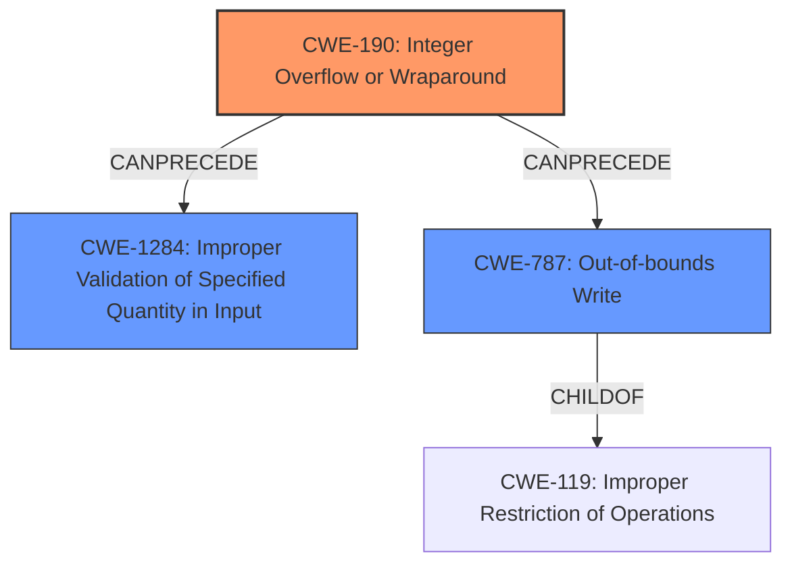

# Analysis Report for CVE-2024-41000

# Vulnerability Analysis Report: CVE-2024-41000

## Description

In the Linux kernel, the following vulnerability has been resolvedblock/ioctl prefer different overflow checkRunning syzkaller with the newly reintroduced signed integer overflowsanitizer shows this report[ 62.982337] ------------[ cut here ]------------[ 62.985692] cgroup Invalid name[ 62.986211] UBSAN signed-integer-overflow in ../block/ioctl.c3646[ 62.989370] 9pnet_fd p9_fd_create_tcp (7343) problem connecting socket to 127.0.0.1[ 62.992992] 9223372036854775807 + 4095 cannot be represented in type long long[ 62.997827] 9pnet_fd p9_fd_create_tcp (7345) problem connecting socket to 127.0.0.1[ 62.999369] random crng reseeded on system resumption[ 63.000634] GUP no longer grows the stack in syz-executor.2 (7353) 20002000-20003000 (20001000)[ 63.000668] CPU 0 PID 7353 Comm syz-executor.2 Not tainted 6.8.0-rc2-00035-gb3ef86b5a957 #1[ 63.000677] Hardware name QEMU Standard PC (i440FX + PIIX, 1996), BIOS 1.16.3-debian-1.16.3-2 04/01/2014[ 63.000682] Call Trace[ 63.000686] [ 63.000731] dump_stack_lvl+0x93/0xd0[ 63.000919] __get_user_pages+0x903/0xd30[ 63.001030] __gup_longterm_locked+0x153e/0x1ba0[ 63.001041] ? _raw_read_unlock_irqrestore+0x17/0x50[ 63.001072] ? try_get_folio+0x29c/0x2d0[ 63.001083] internal_get_user_pages_fast+0x1119/0x1530[ 63.001109] iov_iter_extract_pages+0x23b/0x580[ 63.001206] bio_iov_iter_get_pages+0x4de/0x1220[ 63.001235] iomap_dio_bio_iter+0x9b6/0x1410[ 63.001297] __iomap_dio_rw+0xab4/0x1810[ 63.001316] iomap_dio_rw+0x45/0xa0[ 63.001328] ext4_file_write_iter+0xdde/0x1390[ 63.001372] vfs_write+0x599/0xbd0[ 63.001394] ksys_write+0xc8/0x190[ 63.001403] do_syscall_64+0xd4/0x1b0[ 63.001421] ? arch_exit_to_user_mode_prepare+0x3a/0x60[ 63.001479] entry_SYSCALL_64_after_hwframe+0x6f/0x77[ 63.001535] RIP 00330x7f7fd3ebf539[ 63.001551] Code 28 00 00 00 75 05 48 83 c4 28 c3 e8 f1 14 00 00 90 48 89 f8 48 89 f7 48 89 d6 48 89 ca 4d 89 c2 4d 89 c8 4c 8b 4c 24 08 0f 05 3d 01 f0 ff ff 73 01 c3 48 c7 c1 b8 ff ff ff f7 d8 64 89 01 48[ 63.001562] RSP 002b00007f7fd32570c8 EFLAGS 00000246 ORIG_RAX 0000000000000001[ 63.001584] RAX ffffffffffffffda RBX 00007f7fd3ff3f80 RCX 00007f7fd3ebf539[ 63.001590] RDX 4db6d1e4f7e43360 RSI 0000000020000000 RDI 0000000000000004[ 63.001595] RBP 00007f7fd3f1e496 R08 0000000000000000 R09 0000000000000000[ 63.001599] R10 0000000000000000 R11 0000000000000246 R12 0000000000000000[ 63.001604] R13 0000000000000006 R14 00007f7fd3ff3f80 R15 00007ffd415ad2b8...[ 63.018142] ---[ end trace ]---Historically, the signed integer overflow sanitizer did not work in thekernel due to its interaction with `-fwrapv` but this has since beenchanged [1] in the newest version of Clang It was re-enabled in thekernel with Commit 557f8c582a9ba8ab (ubsan Reintroduce signed overflowsanitizer).Lets rework this overflow checking logic to not actually perform anoverflow during the check itself, thus avoiding the UBSAN splat.[1] https//github.com/llvm/llvm-project/pull/82432

## Vulnerability Description Key Phrases

- **Rootcause:** Signed integer overflow during overflow check in block/ioctl.c
- **Weakness:** Incorrect overflow check logic leading to an actual overflow during the check itself.
- **Impact:** Kernel crash due to signed-integer-overflow sanitizer.
- **Vector:** ioctl system call with specific parameters.
- **Attacker:** Local user.
- **Product:** Linux Kernel
- **Version:** 6.8.0-rc2-00035-gb3ef86b5a957
- **Component:** block/ioctl.c

## Analysis (with Relationship Data)

# Summary
| CWE ID  | CWE Name                                                                                   | Confidence | CWE Abstraction Level | CWE Vulnerability Mapping Label | CWE-Vulnerability Mapping Notes |
| :-------- | :----------------------------------------------------------------------------------------- | :--------- | :---------------------- | :------------------------------ | :-------------------------------- |
| CWE-190 | Integer Overflow or Wraparound                                                             | 1.0        | Base                    | Primary                         | Allowed                           |
| CWE-1284 | Improper Validation of Specified Quantity in Input                                         | 0.8        | Base                    | Secondary                       | Allowed                           |
| CWE-787 | Out-of-bounds Write                                                                        | 0.7        | Base                    | Secondary                       | Allowed                           |

## Evidence and Confidence

*   **Confidence Score:** 0.9
*   **Evidence Strength:** HIGH

## Relationship Analysis

The primary CWE is CWE-190 Integer Overflow or Wraparound. This is a base-level CWE that accurately reflects the root cause of the vulnerability. CWE-1284 is a possible secondary CWE since the quantity (length) was not properly validated which led to the integer overflow. CWE-787 is another possible secondary CWE since the integer overflow could lead to an out-of-bounds write.



## Vulnerability Chain

The vulnerability chain starts with an **integer overflow** (CWE-190) due to the sum of `p.start` and `p.length` exceeding the maximum value for a signed long long. This occurs because of **improper validation of the specified quantity in input** (CWE-1284). If unchecked, this can potentially lead to an **out-of-bounds write** (CWE-787), although this is speculative based on the provided information.

## Summary of Analysis

The analysis is based on the provided vulnerability description and CVE reference links. The **root cause** is the **signed integer overflow during the overflow check in block/ioctl.c**. The vulnerability description key phrases identify this as the root cause and state that the **weakness** is the **incorrect overflow check logic leading to an actual overflow during the check itself**. The CVE reference links content summary confirms that the vulnerability arises from a signed integer overflow in the `blkpg_do_ioctl` function due to the sum of `p.start` and `p.length` without proper checks. The provided evidence strongly supports CWE-190 as the primary CWE. The retriever results also list CWE-190 with a high similarity score. The optimal level of specificity is the Base level since it accurately identifies the root cause.

Relevant CWE Information:

# Enhanced Context (25 CWEs)
The following CWEs were identified as potentially relevant to this vulnerability:

## CWE-191: Integer Underflow (Wrap or Wraparound)
**Abstraction Level**: Base
**Similarity Score**: 0.81
**Source**: dense

**Description**:
The product subtracts one value from another, such that the result is less than the minimum allowable integer value, which produces a value that is not equal to the correct result.

**Mapping Guidance**:
- Usage: Allowed
- Rationale: This CWE entry is at the Base level of abstraction, which is a preferred level of abstraction for mapping to the root causes of vulnerabilities.

## CWE-190: Integer Overflow or Wraparound
**Abstraction Level**: Base
**Similarity Score**: 0.78
**Source**: dense

**Description**:
The product performs a calculation that can
         produce an integer overflow or wraparound when the logic
         assumes that the resulting value will always be larger than
         the original value. This occurs when an integer value is
         incremented to a value that is too large to store in the
         associated representation. When this occurs, the value may
         become a very small or negative number.

**Mapping Guidance**:
- Usage: Allowed
- Rationale: This CWE entry is at the Base level of abstraction, which is a preferred level of abstraction for mapping to the root causes of vulnerabilities.

## CWE-667: Improper Locking
**Abstraction Level**: Class
**Similarity Score**: 0.76
**Source**: dense

**Description**:
The product does not properly acquire or release a lock on a resource, leading to unexpected resource state changes and behaviors.

**Mapping Guidance**:
- Usage: Allowed-with-Review
- Rationale: This CWE entry is a Class and might have Base-level children that would be more appropriate

## CWE-362: Concurrent Execution using Shared Resource with Improper Synchronization ('Race Condition')
**Abstraction Level**: Class
**Similarity Score**: 0.76
**Source**: dense

**Description**:
The product contains a concurrent code sequence that requires temporary, exclusive access to a shared resource, but a timing window exists in which the shared resource can be modified by another code sequence operating concurrently.

**Mapping Guidance**:
- Usage: Allowed-with-Review
- Rationale: This CWE entry is a Class and might have Base-level children that would be more appropriate

## CWE-125: Out-of-bounds Read
**Abstraction Level**: Base
**Similarity Score**: 0.75
**Source**: dense

**Description**:
The product reads data past the end, or before the beginning, of the intended buffer.

**Mapping Guidance**:
- Usage: Allowed
- Rationale: This CWE entry is at the Base level of abstraction, which is a preferred level of abstraction for mapping to the root causes of vulnerabilities.

## CWE-193: Off-by-one Error
**Abstraction Level**: Base
**Similarity Score**: 0.74
**Source**: dense

**Description**:
A product calculates or uses an incorrect maximum or minimum value that is 1 more, or 1 less, than the correct value.

**Mapping Guidance**:
- Usage: Allowed
- Rationale: This CWE entry is at the Base level of abstraction, which is a preferred level of abstraction for mapping to the root causes of vulnerabilities.

## CWE-1285: Improper Validation of Specified Index, Position, or Offset in Input
**Abstraction Level**: Base
**Similarity Score**: 0.74
**Source**: dense

**Description**:
The product receives input that is expected to specify an index, position, or offset into an indexable resource such as a buffer or file, but it does not validate or incorrectly validates that the specified index/position/offset has the required properties.

**Mapping Guidance**:
- Usage: Allowed
- Rationale: This CWE entry is at the Base level of abstraction, which is a preferred level of abstraction for mapping to the root causes of vulnerabilities.

## CWE-119: Improper Restriction of Operations within the Bounds of a Memory Buffer
**Abstraction Level**: Class
**Similarity Score**: 0.74
**Source**: dense

**Description**:
The product performs operations on a memory buffer, but it reads from or writes to a memory location outside the buffer's intended boundary. This may result in read or write operations on unexpected memory locations that could be linked to other variables, data structures, or internal program data.

**Mapping Guidance**:
- Usage: Discouraged
- Rationale: CWE-119 is commonly misused in low-information vulnerability reports when lower-level CWEs could be used instead, or when more details about the vulnerability are available.

## CWE-1284: Improper Validation of Specified Quantity in Input
**Abstraction Level**: Base
**Similarity Score**: 0.74
**Source**: dense

**Description**:
The product receives input that is expected to specify a quantity (such as size or length), but it does not validate or incorrectly validates that the quantity has the required properties.

**Mapping Guidance**:
- Usage: Allowed
- Rationale: This CWE entry is at the Base level of abstraction, which is a preferred level of abstraction for mapping to the root causes of vulnerabilities.

## CWE-131: Incorrect Calculation of Buffer Size
**Abstraction Level**: Base
**Similarity Score**: 0.74
**Source**: dense

**Description**:
The product does not correctly calculate the size to be used when allocating a buffer, which could lead to a buffer overflow.

**Mapping Guidance**:
- Usage: Allowed
- Rationale: This CWE entry is at the Base level of abstraction, which is a preferred level of abstraction for mapping to the root causes of vulnerabilities.

## CWE-190:


## CWE Relationship Analysis

Current CWEs represent these abstraction levels: .


### Vulnerability Chain Analysis

**Chain starting from CWE-1284:**
- 1284 (Improper Validation of Specified Quantity in Input) - ROOT


**Chain starting from CWE-125:**
- 125 (Out-of-bounds Read) - ROOT


### CWE Relationship Diagram

```mermaid
graph TD
    classDef primary fill:#f96,stroke:#333,stroke-width:2px
    classDef secondary fill:#69f,stroke:#333
    classDef tertiary fill:#9e9,stroke:#333
```


*Report generated on 2025-07-13 12:47:58*
