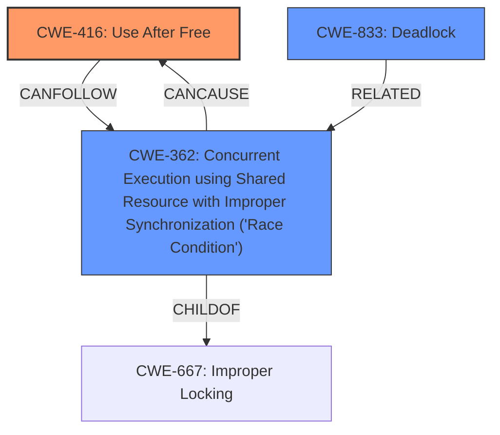

# Analysis Report for CVE-2024-41045

# Vulnerability Analysis Report: CVE-2024-41045

## Description

In the Linux kernel, the following vulnerability has been resolved bpf Defer work in bpf_timer_cancel_and_free Currently, the same case as previous patch (two timer callbacks trying to cancel each other) can be invoked through bpf_map_update_elem as well, or more precisely, freeing map elements containing timers. Since this relies on hrtimer_cancel as well, it is prone to the same deadlock situation as the previous patch. It would be sufficient to use hrtimer_try_to_cancel to fix this problem, as the timer cannot be enqueued after async_cancel_and_free. Once async_cancel_and_free has been done, the timer must be reinitialized before it can be armed again. The callback running in parallel trying to arm the timer will fail, and freeing bpf_hrtimer without waiting is sufficient (given kfree_rcu), and bpf_timer_cb will return HRTIMER_NORESTART, preventing the timer from being rearmed again. However, there exists a UAF scenario where the callback arms the timer before entering this function, such that if cancellation fails (due to timer callback invoking this routine, or the target timer callback running concurrently). In such a case, if the timer expiration is significantly far in the future, the RCU grace period expiration happening before it will free the bpf_hrtimer state and along with it the struct hrtimer, that is enqueued. Hence, it is clear cancellation needs to occur after async_cancel_and_free, and yet it cannot be done inline due to deadlock issues. We thus modi

## Vulnerability Description Key Phrases

- **Rootcause:** Use After Free
- **Impact:** deadlock
- **Vector:** freeing map elements containing timers
- **Product:** Linux kernel
- **Component:** bpf

## Analysis (with Relationship Data)

# Summary
| CWE ID | CWE Name | Confidence | CWE Abstraction Level | CWE Vulnerability Mapping Label | CWE-Vulnerability Mapping Notes |
|---|---|---|---|---|---|
| CWE-416 | Use After Free | 0.9 | Variant | Allowed | Primary CWE. The vulnerability description explicitly mentions a **Use After Free (UAF)** scenario. |
| CWE-362 | Concurrent Execution using Shared Resource with Improper Synchronization ('Race Condition') | 0.8 | Class | Allowed-with-Review | Secondary candidate. The vulnerability arises due to **race conditions** in the BPF timer implementation. |
| CWE-833 | Deadlock | 0.7 | Base | Allowed | Secondary candidate. The original implementation could lead to a **deadlock** if the function was called from within a timer callback. |

## Evidence and Confidence

*   **Confidence Score:** 0.8
*   **Evidence Strength:** HIGH

## Relationship Analysis
The primary weakness is CWE-416 [Use After Free], which can be a consequence of other weaknesses like CWE-362 [Concurrent Execution using Shared Resource with Improper Synchronization ('Race Condition')] or improper resource management. The deadlock condition (CWE-833) can also be related to concurrency issues. The abstraction levels were considered to choose the most specific CWEs. CWE-416 is chosen as the primary CWE due to the explicit mention of the UAF condition in the description.



## Vulnerability Chain
The vulnerability chain starts with a **race condition** (CWE-362) in the BPF timer implementation, which can lead to a **deadlock** (CWE-833) or a **use-after-free** condition (CWE-416). Specifically, the race condition occurs when two timer callbacks attempt to cancel each other or when a timer callback tries to arm a timer concurrently with its cancellation. If cancellation fails and the timer expiration is far in the future, the RCU grace period could expire, freeing the `bpf_hrtimer` state, leading to a UAF. Thus, the chain is: CWE-362 -> (CWE-833 or CWE-416).

## Summary of Analysis
The analysis is based on the provided vulnerability description and the CVE reference links content summary. The primary **rootcause** identified is a **Use After Free (UAF)** condition (CWE-416), which is explicitly mentioned in the description. The vulnerability also involves **race conditions** (CWE-362) and potential **deadlocks** (CWE-833).

The selected CWEs are at the optimal level of specificity. CWE-416 is a Variant, which is preferred over a Class or Pillar. CWE-362 and CWE-833 are Classes but accurately represent the concurrent execution and deadlock aspects of the vulnerability.

The **Vulnerability Description Key Phrases** section has the following entry:
- **rootcause:** **Use After Free**
and 
the **CVE Reference Links Content Summary** states:
2.  **Use-After-Free (UAF):** There was a UAF scenario where a timer callback could arm the timer just before `bpf_timer_cancel_and_free` is invoked. If the cancellation fails (due to the deadlock condition or concurrent cancellation), and the timer expiration is far in the future, the RCU grace period could expire, freeing the `bpf_hrtimer` state along with the enqueued `hrtimer`, leading to a UAF.

Based on this, CWE-416 is a good fit.

Other CWEs Considered but Not Used:
*   CWE-367 [Time-of-check Time-of-use (TOCTOU) Race Condition]: While a race condition is present, the specific TOCTOU pattern is not explicitly described.
*   CWE-667 [Improper Locking]: The vulnerability description doesn't focus on locking mechanisms.
*   CWE-404 [Improper Resource Shutdown or Release]: While resource release is involved, the core issue is the use of a freed resource, not the shutdown itself.
*   CWE-770 [Allocation of Resources Without Limits or Throttling]: This CWE isn't relevant to the vulnerability.


## CWE Relationship Analysis

Current CWEs represent these abstraction levels: .


### Vulnerability Chain Analysis

**Chain starting from CWE-416:**
- 416 (Use After Free) - ROOT


**Chain starting from CWE-770:**
- 770 (Allocation of Resources Without Limits or Throttling) - ROOT


### CWE Relationship Diagram

```mermaid
graph TD
    classDef primary fill:#f96,stroke:#333,stroke-width:2px
    classDef secondary fill:#69f,stroke:#333
    classDef tertiary fill:#9e9,stroke:#333
```


*Report generated on 2025-07-13 12:51:02*
