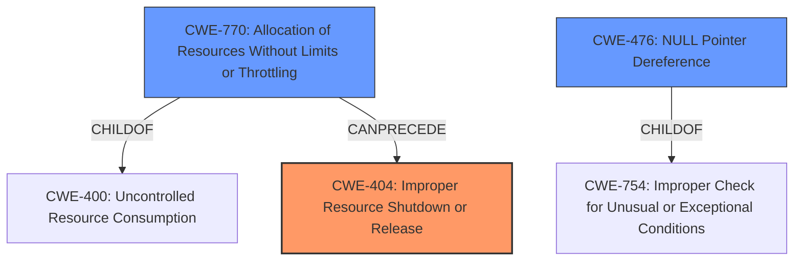

# Analysis for CVE-2024-41074

# Summary
| CWE ID | CWE Name | Confidence | CWE Abstraction Level | CWE Vulnerability Mapping Label | CWE-Vulnerability Mapping Notes |
|---|---|---|---|---|---|
| CWE-404 | Improper Resource Shutdown or Release | 0.75 | Class | Primary | Allowed-with-Review |
| CWE-770 | Allocation of Resources Without Limits or Throttling | 0.6 | Base | Secondary | Allowed |
| CWE-476 | NULL Pointer Dereference | 0.5 | Base | Secondary | Allowed |

## Evidence and Confidence

*   **Confidence Score:** 0.7
*   **Evidence Strength:** MEDIUM

## Relationship Analysis
The primary CWE is CWE-404, which is a Class-level CWE. It is related to resource management issues. CWE-770 (Allocation of Resources Without Limits or Throttling) and CWE-476 (NULL Pointer Dereference) were considered as secondary CWEs. CWE-770 could precede CWE-404. CWE-476 is a common consequence of resource management problems.

## Vulnerability Chain
The vulnerability chain starts with a call to `copen` with a negative `ondemand_id`. This leads to the deletion of a pending request before it is read. The object is set to reopen, but the request is skipped in `select_req`, so the read request never completes, blocking other processes.

The chain is:
1.  Improper input (`ondemand_id < 0`) leading to ...
2.  **Improper Resource Shutdown or Release** (CWE-404) because the request is deleted prematurely, causing a resource (read request) not to be completed. This leads to ...
3.  Potential denial of service due to blocked processes.
4.  Possibly **NULL Pointer Dereference** (CWE-476) or **Allocation of Resources Without Limits or Throttling** (CWE-770) although the description doesn't give enough detail to be certain.

## Summary of Analysis
The primary weakness is the **improper resource shutdown or release** (CWE-404). The vulnerability description clearly states that a request is deleted before being read, which perfectly aligns with the concept of a resource not being properly released. The "CVE Reference Links Content Summary" section confirms this by stating that the code did not properly handle cases where `ondemand_id` is negative, leading to incorrect object state management, resulting in a read request never completing.

The evidence supports the selection of CWE-404 as the primary CWE. While other CWEs like CWE-770 and CWE-476 are possibilities, they are not as directly supported by the description. CWE-770 might be relevant if the improper shutdown leads to resource exhaustion, but this is not explicitly stated. CWE-476 could occur if the deleted request results in a null pointer dereference, but again, this is speculative. Therefore, CWE-404 is the most appropriate primary CWE based on the available evidence.

*   **CWE-404: Improper Resource Shutdown or Release**
    *   **Technical Explanation:** The `copen` function's failure to properly handle negative `ondemand_id` values results in premature deletion of a pending request, which is an instance of improper resource release.
    *   **Security Implications:** This leads to a denial-of-service condition as a read request will never complete, blocking other processes.
    *   **Relationship Analysis:** It is a Class-level CWE, indicating a general category of resource management issues.
    *   **Mapping Guidance Influence:** The usage is Allowed-with-Review, acknowledging that more specific Base-level CWEs could exist, but CWE-404 accurately captures the essence of the problem.
    *   **Primary/Secondary:** Primary.
*   **CWE-770: Allocation of Resources Without Limits or Throttling**
    *   **Technical Explanation:** If the improper release contributes to resource exhaustion.
    *   **Security Implications:** Could exacerbate DoS.
    *   **Relationship Analysis:** Is a Base-level CWE and a child of CWE-400.
    *   **Mapping Guidance Influence:** Allowed.
    *   **Primary/Secondary:** Secondary.
*   **CWE-476: NULL Pointer Dereference**
    *   **Technical Explanation:** Is a possible consequence of the resource being improperly shutdown or released.
    *   **Security Implications:** Could cause the system to crash.
    *   **Relationship Analysis:** Is a Base-level CWE and a child of CWE-754.
    *   **Mapping Guidance Influence:** Allowed.
    *   **Primary/Secondary:** Secondary.

CWEs considered but not used:

*   CWE-639, CWE-863, CWE-362, CWE-1321, CWE-125, CWE-212, CWE-923: These relate to Authorization Bypass, Incorrect Authorization, Race Conditions, Prototype Pollution, Out-of-bounds Read, Removal of Sensitive Information, and Restriction of Communication Channel. They are not directly relevant to the **improper release** of the resource in the vulnerability description.
*   CWE-403: Exposure of File Descriptor to Unintended Control Sphere ('File Descriptor Leak') - Not relevant.
*   CWE-364: Signal Handler Race Condition - Not relevant.