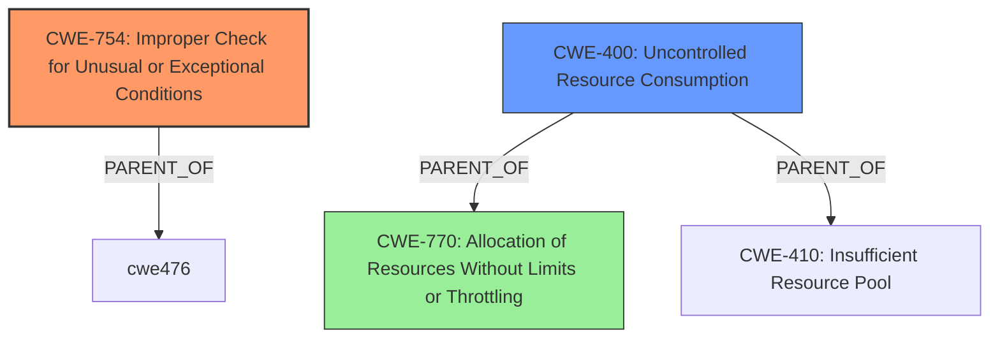

# Enhanced Analysis for CVE-2024-41075

# Summary
| CWE ID | CWE Name | Confidence | CWE Abstraction Level | CWE Vulnerability Mapping Label | CWE-Vulnerability Mapping Notes |
|---|---|---|---|---|---|
| CWE-754 | Improper Check for Unusual or Exceptional Conditions | 0.8 | Class | Primary | Allowed-with-Review |
| CWE-400 | Uncontrolled Resource Consumption | 0.6 | Class | Secondary | Discouraged |
| CWE-770 | Allocation of Resources Without Limits or Throttling | 0.5 | Base | Secondary | Allowed |

## Evidence and Confidence

*   **Confidence Score:** 0.7
*   **Evidence Strength:** MEDIUM

## Relationship Analysis
The primary relationship influencing the CWE selection is the parent-child relationship. CWE-754 is a class-level CWE, and while more specific child CWEs might exist, the provided information does not definitively point to one. CWE-400 is a parent of CWE-770, so it is a more general case of resource consumption issues that is triggered by the **improper check** of CWE-754.



## Vulnerability Chain
The vulnerability chain starts with the **improper check** (CWE-754), which leads to uncontrolled resource consumption (CWE-400) because the system is not properly validating `copen` and `cread` requests, eventually causing a system crash. The allocation of resources without limits or throttling (CWE-770) contributes to the resource exhaustion.

## Summary of Analysis
The analysis focuses on the root cause of the vulnerability, which is the **improper check** for unusual conditions when handling `copen` and `cread` requests in the Linux kernel's `cachefiles` functionality. This allows malicious processes to complete random requests, eventually crashing the system due to uncontrolled resource consumption.

The primary CWE is CWE-754, "Improper Check for Unusual or Exceptional Conditions," as the core issue is the **lack of proper validation** of the requests. The description highlights that the code **does not check** for specific conditions (e.g., `ondemand_id` not being 0 for `copen`, object association for `cread`). The evidence is the "Weaknesses/vulnerabilities present:" section that states there is "Inadequate request validation" from "CVE Reference Links Content Summary". Confidence is high, at 0.8, based on this direct evidence.

CWE-400, "Uncontrolled Resource Consumption," is considered a secondary CWE because the **improper checks** directly lead to the possibility of exhausting system resources, causing a crash. This is listed as the "Impact of exploitation:" in "CVE Reference Links Content Summary" where it says "System Crash". Confidence is slightly lower, at 0.6, as the resource consumption is a consequence of the primary weakness.

CWE-770, "Allocation of Resources Without Limits or Throttling," is considered a tertiary CWE because it is related to CWE-400, but not exactly precise to the vulnerability. It has a retriever score of 957.38 but I rate my confidence lower at 0.5 since it is less descriptive of the vulnerability.

Other CWEs Considered:

*   CWE-476 (NULL Pointer Dereference): While a crash is mentioned, there's no specific indication of a NULL pointer dereference being the cause.
*   CWE-410 (Insufficient Resource Pool): Similar to CWE-770, this is related to resource management but not the primary issue.
*   CWE-252 (Unchecked Return Value): Not applicable as the issue isn't about unchecked return values.
*   CWE-770 (Allocation of Resources Without Limits or Throttling): Contributes to resource exhaustion but is a consequence of the primary weakness.
*   CWE-306 (Missing Authentication for Critical Function): Not relevant, as the issue is about request validation, not authentication.
*   CWE-863 (Incorrect Authorization): Could be considered, but the core issue is more about validation than authorization.
*   CWE-1284 (Improper Validation of Specified Quantity in Input): Partially applicable, but the validation issue extends beyond just quantity.
*   CWE-73 (External Control of File Name or Path): Not relevant, as the issue isn't about file paths.
*   CWE-41 (Improper Resolution of Path Equivalence): Not applicable.
*   CWE-639 (Authorization Bypass Through User-Controlled Key): Not applicable.

The selected CWEs are at the optimal level of specificity, providing a clear and accurate representation of the vulnerability's root cause and contributing factors.


## CWE Relationship Analysis

Current CWEs represent these abstraction levels: .


### Vulnerability Chain Analysis

**Chain starting from CWE-863:**
- 863 (Incorrect Authorization) - ROOT


**Chain starting from CWE-1284:**
- 1284 (Improper Validation of Specified Quantity in Input) - ROOT


### CWE Relationship Diagram

```mermaid
graph TD
    classDef primary fill:#f96,stroke:#333,stroke-width:2px
    classDef secondary fill:#69f,stroke:#333
    classDef tertiary fill:#9e9,stroke:#333
```