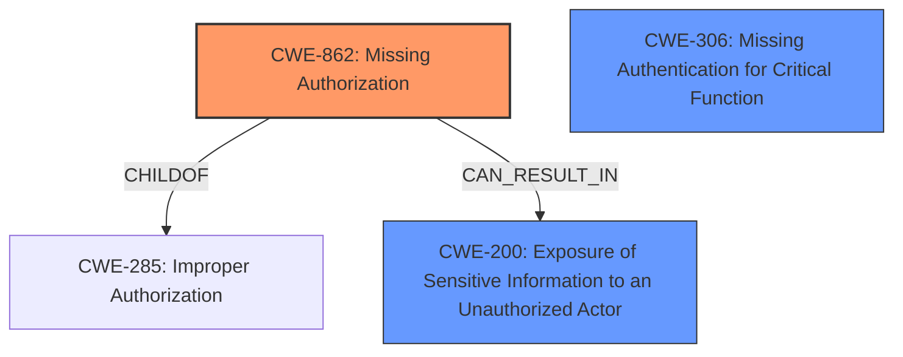

# Enhanced Analysis for CVE-2024-41108

# Summary
| CWE ID | CWE Name | Confidence | CWE Abstraction Level | CWE Vulnerability Mapping Label | CWE-Vulnerability Mapping Notes |
|---|---|---|---|---|---|
| CWE-862 | Missing Authorization | 1.0 | Base | Primary CWE | Allowed |
| CWE-200 | Exposure of Sensitive Information to an Unauthorized Actor | 0.7 | Class | Secondary Candidate | Discouraged |
| CWE-306 | Missing Authentication for Critical Function | 0.6 | Base | Secondary Candidate | Allowed |

## Evidence and Confidence

*   **Confidence Score:** 0.9
*   **Evidence Strength:** HIGH

## Relationship Analysis
The primary CWE is CWE-862, which is a Base level CWE and a child of the Class level CWE-285 (Improper Authorization). The vulnerability description clearly indicates a **missing authorization** check, making CWE-862 a more precise fit than its parent. CWE-306 (Missing Authentication) was considered but deemed less suitable since the vulnerability focuses on authorization after a potential (though not enforced) authentication. CWE-200 (Exposure of Sensitive Information) is related as it describes the impact of the missing authorization, but is a class level CWE and also less precise than CWE-862.



## Vulnerability Chain
The vulnerability chain starts with the **missing authorization** check (CWE-862) on the `hostinfo.php` page. This leads to the exposure of sensitive information (CWE-200), such as Active Directory credentials, when an attacker provides a valid MAC address for a host with a pending task. The initial flaw is the **lack of proper access control**, which directly leads to the information disclosure.

## Summary of Analysis
The primary CWE assignment is based on the clear evidence of a **missing authorization** check. The vulnerability description states that the `hostinfo.php` page allows access to sensitive host configuration data based solely on the host's MAC address and a pending task, without properly validating the requestor.

The evidence supporting this includes:
*   "The hostinfo page has **missing/improper access control** since only the hosts mac address is required to obtain the configuration information."
*   "The vulnerability stems from missing or **improper access control** in the `hostinfo.php` and `hostname.php` pages."
*   "These pages expose sensitive host configuration information when a task is pending for the host and the attacker has the MAC address."
*   "**Missing Access Control:** The `hostinfo.php` and `hostname.php` scripts do not properly validate the requestor."

The retriever results also listed CWE-863 (Incorrect Authorization), CWE-306 (Missing Authentication), CWE-201 (Insertion of Sensitive Information Into Sent Data), CWE-639 (Authorization Bypass Through User-Controlled Key), CWE-209 (Generation of Error Message Containing Sensitive Information), and CWE-285 (Improper Authorization). Of these, CWE-306 was considered since the description mentions a **lack of authentication**. However, since the primary issue is that a MAC address alone is sufficient to retrieve sensitive information for a host with a pending task, the issue is more accurately described as a **missing authorization** check *after* a potential, but not enforced, authentication.

CWE-200 is a reasonable secondary mapping, as it is a direct result of the **missing authorization**. However, it represents the impact, not the root cause.

CWE-862 is the most specific and appropriate CWE for this vulnerability. It aligns perfectly with the **missing authorization** identified in the vulnerability description and the CVE reference content summary. The CWE is at the Base level of abstraction, which is preferred.


## CWE Relationship Analysis

Current CWEs represent these abstraction levels: .


### Vulnerability Chain Analysis

**Chain starting from CWE-863:**
- 863 (Incorrect Authorization) - ROOT


**Chain starting from CWE-862:**
- 862 (Missing Authorization) - ROOT


### CWE Relationship Diagram

```mermaid
graph TD
    classDef primary fill:#f96,stroke:#333,stroke-width:2px
    classDef secondary fill:#69f,stroke:#333
    classDef tertiary fill:#9e9,stroke:#333
```