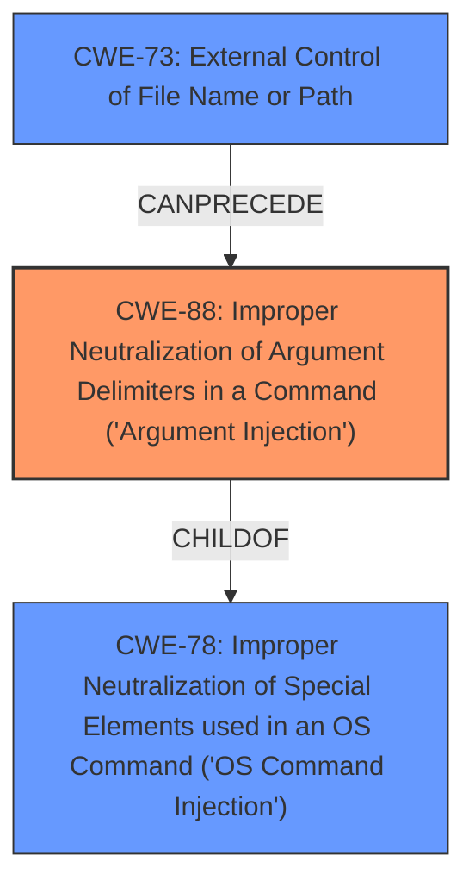

# Analysis Report for CVE-2024-41111

# Vulnerability Analysis Report: CVE-2024-41111

## Description

Sliver is an open source cross-platform adversary emulation/red team framework, it can be used by organizations of all sizes to perform security testing. Sliver version 1.6.0 (prerelease) is vulnerable to RCE on the teamserver by a low-privileged operator user. The RCE is as the system root user. The exploit is pretty fun as we make the Sliver server pwn itself. As described in a past issue (#65), there is a clear security boundary between the operator and server, an operator should not inherently be able to run commands or code on the server. An operator who exploited this vulnerability would be able to view all console logs, kick all other operators, view and modify files stored on the server, and ultimately delete the server. This issue has not yet be addressed but is expected to be resolved before the full release of version 1.6.0. Users of the 1.6.0 prerelease should avoid using Silver in production.

## Vulnerability Description Key Phrases

- **Impact:** ['modify files', 'remote code execution']
- **Attacker:** low-privileged operator user
- **Product:** Sliver
- **Version:** 1.6.0 (prerelease)
- **Component:** teamserver

## Analysis (with Relationship Data)

# Summary

| CWE ID | CWE Name | Confidence | CWE Abstraction Level | CWE Vulnerability Mapping Label | CWE-Vulnerability Mapping Notes |
|---|---|---|---|---|---|
| CWE-88 | Improper Neutralization of Argument Delimiters in a Command ('Argument Injection') | 0.9 | Base | Allowed | Primary CWE: This is the root cause of the vulnerability, where user-supplied input to a command is not properly sanitized, allowing for injection of arbitrary arguments. |
| CWE-78 | Improper Neutralization of Special Elements used in an OS Command ('OS Command Injection') | 0.7 | Base | Allowed | Secondary Candidate: While CWE-88 is more specific, CWE-78 is also relevant as the injected arguments lead to OS command execution. |
| CWE-73 | External Control of File Name or Path | 0.6 | Base | Allowed | Secondary Candidate: The `-out` parameter is used to write a file to a path. The attacker can control the path. |

## Evidence and Confidence

*   **Confidence Score:** 0.8
*   **Evidence Strength:** HIGH

## Relationship Analysis
The primary weakness is CWE-88, representing the improper neutralization of argument delimiters. CWE-78 is a parent of CWE-88 and represents the broader category of OS Command Injection, relevant as the injected arguments ultimately lead to OS command execution. CWE-73 is also related because the injected code is written to a file system location controlled by the attacker. The abstraction level of CWE-88 is Base, providing a more specific representation of the vulnerability than its parent class CWE-78.



## Vulnerability Chain
The vulnerability chain starts with **improper sanitization of user input** passed to the `generate msf-stager` command (CWE-88). This allows an attacker to inject arbitrary arguments into the `msfvenom` command, resulting in **OS command injection** (CWE-78). The injected command writes a file (CWE-73) to a location that results in arbitrary code execution as root. The final impact is **remote code execution** as root, leading to complete server compromise.

## Summary of Analysis
The analysis is based on the provided vulnerability description and the CVE Reference Links Content Summary, which explicitly details the **command injection** flaw in the `generate msf-stager` command due to **insufficient input validation**. The evidence strongly supports the selection of CWE-88 as the primary CWE, accurately representing the root cause of the vulnerability. The graph relationships highlight the connection between CWE-88 and its parent class CWE-78, as well as the relationship to CWE-73.

The selection of CWE-88 is at the optimal level of specificity because it directly addresses the **improper neutralization of argument delimiters** in the command, which is the root cause of the vulnerability. While CWE-78 and CWE-73 are also relevant, they are broader categories that do not fully capture the specific nature of the weakness.

Relevant CWE Information:

# Enhanced Context (25 CWEs)
The following CWEs were identified as potentially relevant to this vulnerability:

## CWE-346: Origin Validation Error
**Abstraction Level**: Class
**Similarity Score**: 0.70
**Source**: dense

**Description**:
The product does not properly verify that the source of data or communication is valid.

**Mapping Guidance**:
- Usage: Allowed-with-Review
- Rationale: This CWE entry is a Class and might have Base-level children that would be more appropriate

*Not Selected:* This is not relevant to the vulnerability. The source of the data is less important than the **improper handling of the data itself.**

## CWE-941: Incorrectly Specified Destination in a Communication Channel
**Abstraction Level**: Base
**Similarity Score**: 0.70
**Source**: dense

**Description**:
The product creates a communication channel to initiate an outgoing request to an actor, but it does not correctly specify the intended destination for that actor.

**Mapping Guidance**:
- Usage: Allowed
- Rationale: This CWE entry is at the Base level of abstraction, which is a preferred level of abstraction for mapping to the root causes of vulnerabilities.

*Not Selected:* The issue is not with the destination of a communication channel, but with the **improper handling of command arguments.**

## CWE-918: Server-Side Request Forgery (SSRF)
**Abstraction Level**: Base
**Similarity Score**: 0.70
**Source**: dense

**Description**:
The web server receives a URL or similar request from an upstream component and retrieves the contents of this URL, but it does not sufficiently ensure that the request is being sent to the expected destination.

**Mapping Guidance**:
- Usage: Allowed
- Rationale: This CWE entry is at the Base level of abstraction, which is a preferred level of abstraction for mapping to the root causes of vulnerabilities.

*Not Selected:* While SSRF could be a consequence of command injection, the root cause is not related to forging server-side requests. It's about **injecting commands.**

## CWE-267: Privilege Defined With Unsafe Actions
**Abstraction Level**: Base
**Similarity Score**: 0.69
**Source**: dense

**Description**:
A particular privilege, role, capability, or right can be used to perform unsafe actions that were not intended, even when it is assigned to the correct entity.

**Mapping Guidance**:
- Usage: Allowed
- Rationale: This CWE entry is at the Base level of abstraction, which is a preferred level of abstraction for mapping to the root causes of vulnerabilities.

*Not Selected:* The vulnerability does not stem from a privilege being defined with unsafe actions. It stems from **improper command argument handling.**

## CWE-88: Improper Neutralization of Argument Delimiters in a Command ('Argument Injection')
**Abstraction Level**: Base
**Similarity Score**: 0.69
**Source**: dense

**Description**:
The product constructs a string for a command to be executed by a separate component
in another control sphere, but it does not properly delimit the
intended arguments, options, or switches within that command string.

**Mapping Guidance**:
- Usage: Allowed
- Rationale: This CWE entry is at the Base level of abstraction, which is a preferred level of abstraction for mapping to the root causes of vulnerabilities.

*Selected:* This is the primary CWE. The vulnerability stems from the **lack of proper sanitization** of user-supplied input to the `msfvenom` command, specifically the filename passed through the `--out` flag within the `--advanced` flag. This allows an attacker to inject their own flags.

## CWE-184: Incomplete List of Disallowed Inputs
**Abstraction Level**: Base
**Similarity Score**: 0.68
**Source**: dense

**Description**:
The product implements a protection mechanism that relies on a list of inputs (or properties of inputs) that are not allowed by policy or otherwise require other action to neutralize before additional processing takes place, but the list is incomplete.

**Mapping Guidance**:
- Usage: Allowed
- Rationale: This CWE entry is at the Base level of abstraction, which is a preferred level of abstraction for mapping to the root causes of vulnerabilities.

*Not Selected:* The vulnerability is not related to an incomplete list of disallowed inputs, but rather the **lack of sanitization of allowed inputs.**

## CWE-212: Improper Removal of Sensitive Information Before Storage or Transfer
**Abstraction Level**: Base
**Similarity Score**: 0.68
**Source**: dense

**Description**:
The product stores, transfers, or shares a resource that contains sensitive information, but it does not properly remove that information before the product makes the resource available to unauthorized actors.

**Mapping Guidance**:
- Usage: Allowed
- Rationale: This CWE entry is at the Base level of abstraction, which is a preferred level of abstraction for mapping to the root causes of vulnerabilities.

*Not Selected:* The vulnerability is not related to the removal of sensitive information.

## CWE-116: Improper Encoding or Escaping of Output
**Abstraction Level**: Class
**Similarity Score**: 0.68
**Source**: dense

**Description**:
The product prepares a structured message for communication with another component, but encoding or escaping of the data is either missing or done incorrectly. As a result, the intended structure of the message is not preserved.

**Mapping Guidance**:
- Usage: Allowed-with-Review
- Rationale: This CWE entry is a Class and might have Base-level children that would be more appropriate

*Not Selected:* The vulnerability is not


## CWE Relationship Analysis

Current CWEs represent these abstraction levels: .


### Vulnerability Chain Analysis

**Chain starting from CWE-116:**
- 116 (Improper Encoding or Escaping of Output) - ROOT


**Chain starting from CWE-346:**
- 346 (Origin Validation Error) - ROOT


### CWE Relationship Diagram

```mermaid
graph TD
    classDef primary fill:#f96,stroke:#333,stroke-width:2px
    classDef secondary fill:#69f,stroke:#333
    classDef tertiary fill:#9e9,stroke:#333
```


*Report generated on 2025-07-13 12:53:49*
