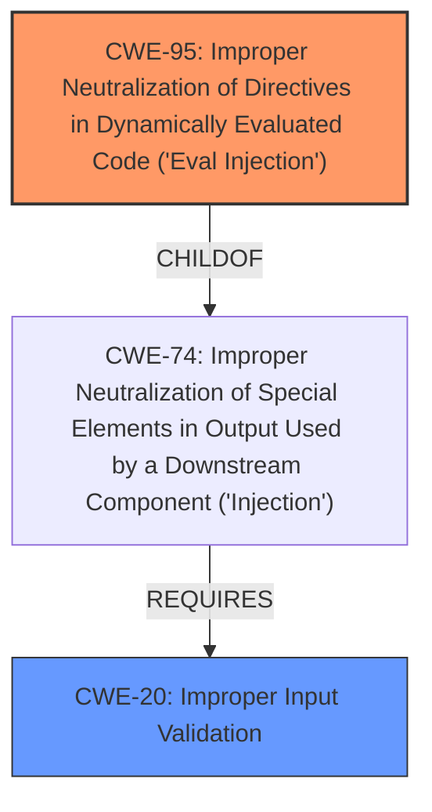

# Analysis Report for CVE-2024-41116

# Vulnerability Analysis Report: CVE-2024-41116

## Description

streamlit-geospatial is a streamlit multipage app for geospatial applications. Prior to commit c4f81d9616d40c60584e36abb15300853a66e489, the `vis_params` variable on line 1254 in `pages/1__Timelapse.py` takes user input, which is later used in the `eval()` function on line 1345, leading to remote code execution. Commit c4f81d9616d40c60584e36abb15300853a66e489 fixes this issue.

## Vulnerability Description Key Phrases

- **Rootcause:** improper input validation
- **Impact:** remote code execution
- **Product:** streamlit-geospatial
- **Version:** prior to commit c4f81d9616d40c60584e36abb15300853a66e489

## Analysis (with Relationship Data)

# Summary
| CWE ID | CWE Name | Confidence | CWE Abstraction Level | CWE Vulnerability Mapping Label | CWE-Vulnerability Mapping Notes |
|---|---|---|---|---|---|
| CWE-95 | Improper Neutralization of Directives in Dynamically Evaluated Code ('Eval Injection') | 1.0 | Variant | Allowed | Primary CWE. The application uses `eval()` with user-controlled input, allowing for arbitrary code execution. |
| CWE-20 | Improper Input Validation | 0.7 | Class | Discouraged | Secondary.  The application lacks proper input validation before using `eval()`. While present, it's a high-level classification and CWE-95 is more specific. |

## Evidence and Confidence

*   **Confidence Score:** 0.9
*   **Evidence Strength:** HIGH

## Relationship Analysis
The primary relationship that influenced the decision was the parent-child relationship between CWE-74 (Improper Neutralization of Special Elements in Output Used by a Downstream Component ('Injection')) and CWE-95 (Improper Neutralization of Directives in Dynamically Evaluated Code ('Eval Injection')). CWE-95 is a variant of CWE-74, providing a more specific classification for the vulnerability where the **improper neutralization** occurs specifically within dynamically evaluated code.



## Vulnerability Chain
The vulnerability chain starts with **improper input validation** (CWE-20), leading to the use of user-controlled input in a dynamically evaluated code block (`eval()`). This results in **code injection** (CWE-95) and ultimately, remote code execution.

## Summary of Analysis
The initial analysis focused on identifying the root cause of the remote code execution vulnerability. The description clearly states that user-provided input is directly passed to the `eval()` function without proper validation or sanitization. This aligns perfectly with the characteristics of CWE-95, "Improper Neutralization of Directives in Dynamically Evaluated Code ('Eval Injection')." The vulnerability description key phrases include "**improper input validation**" which helps to narrow the choices.

The CVE Reference Links Content Summary provides supporting evidence: "The application takes user-provided input for visualization parameters (`vis_params`) and uses it within an `eval()` function. This allows the user to execute arbitrary Python code."

The relationship analysis further supports this decision, as CWE-95 is a more specific variant of CWE-74 and falls under the broader category of injection vulnerabilities. While CWE-20 (Improper Input Validation) is also relevant, it represents a higher-level weakness. The retriever results also ranked CWE-95 highly.

CWE-95 is at the optimal level of specificity because it directly addresses the use of `eval()` with user-controlled input. Mitigations involve replacing `eval()` with `json.loads()` and implementing input validation, further reinforcing the relevance of CWE-95.


## CWE Relationship Analysis

Current CWEs represent these abstraction levels: .


### Vulnerability Chain Analysis

**Chain starting from CWE-74:**
- 74 (Improper Neutralization of Special Elements in Output Used by a Downstream Component ('Injection')) - ROOT


**Chain starting from CWE-20:**
- 20 (Improper Input Validation) - ROOT


### CWE Relationship Diagram

```mermaid
graph TD
    classDef primary fill:#f96,stroke:#333,stroke-width:2px
    classDef secondary fill:#69f,stroke:#333
    classDef tertiary fill:#9e9,stroke:#333
```


*Report generated on 2025-07-13 12:55:27*
