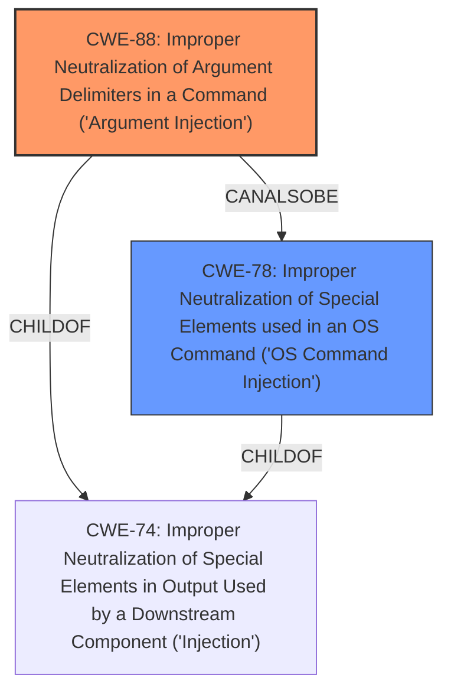

# Raw Analyzer Response for CVE-2024-41122

# Summary
| CWE ID | CWE Name | Confidence | CWE Abstraction Level | CWE Vulnerability Mapping Label | CWE-Vulnerability Mapping Notes |
|---|---|---|---|---|---|
| CWE-88 | Improper Neutralization of Argument Delimiters in a Command ('Argument Injection') | 0.9 | Base | Allowed | Primary CWE - Root cause |
| CWE-78 | Improper Neutralization of Special Elements used in an OS Command ('OS Command Injection') | 0.7 | Base | Allowed | Secondary CWE - Impact |

## Evidence and Confidence

*   **Confidence Score:** 0.8
*   **Evidence Strength:** HIGH

## Relationship Analysis
The primary weakness is CWE-88, as the injection of arbitrary environment variables allows attackers to control command arguments. CWE-78 is a potential consequence if the injected arguments lead to OS command execution. The graph relationships confirm that CWE-88 can be related to CWE-78 via parent child relationships through CWE-74, and peer relationships. The base level of abstraction is chosen for both to accurately reflect the specific weaknesses.

## Vulnerability Chain
The vulnerability chain starts with the **improper neutralization of argument delimiters** (CWE-88) when constructing commands with environment variables. This leads to potential **OS command injection** (CWE-78), ultimately resulting in host takeover and secret extraction.

## Summary of Analysis
The primary assessment is based on the CVE Reference Links Content Summary, which provides detailed evidence of the vulnerability. The key evidence is the **unrestricted environment variable injection**, which enables attackers to **overwrite environment variables** and **bypass plugin entrypoints**. The retriever results and graph relationships support mapping CWE-88 as the primary cause and CWE-78 as a potential impact.

The selected CWEs are at the optimal level of specificity because they accurately reflect the nature of the vulnerability. CWE-88 captures the root cause, while CWE-78 describes a potential consequence.

**CWE Considerations:**

*   **CWE-88 Improper Neutralization of Argument Delimiters in a Command ('Argument Injection'):** This is the primary CWE because the vulnerability lies in the improper handling of argument delimiters when constructing commands with environment variables. The "CVE Reference Links Content Summary" states: "The core weakness is that Woodpecker CI allowed users to set arbitrary environment variables that were passed directly to plugin executions. This permitted the use of "dangerous" environment variables like `LD_PRELOAD` or `PATH` which influence how binaries and libraries are loaded and executed."
*   **CWE-78 Improper Neutralization of Special Elements used in an OS Command ('OS Command Injection'):** This is a secondary CWE because it describes a potential impact of the vulnerability. If the injected arguments from CWE-88 are used in an OS command, it can lead to command injection. The "CVE Reference Links Content Summary" mentions the possibility of host takeover: "Attackers could potentially achieve host takeover on the machine running the agent that executes the vulnerable pipeline steps."

**CWEs Considered But Not Used:**

*   **CWE-22 Improper Limitation of a Pathname to a Restricted Directory ('Path Traversal'):** While path traversal could be a consequence of improper neutralization, it is not the primary weakness in this case.
*   **CWE-74 Improper Neutralization of Special Elements in Output Used by a Downstream Component ('Injection'):** This is a broader category of injection and is less specific than CWE-88.
*   **CWE-94 Improper Control of Generation of Code ('Code Injection'):** While code execution is a possible outcome, the root cause is related to argument injection rather than direct code injection.
*   **CWE-285 Improper Authorization:** The issue is not directly related to authorization, but rather to the injection of arguments.