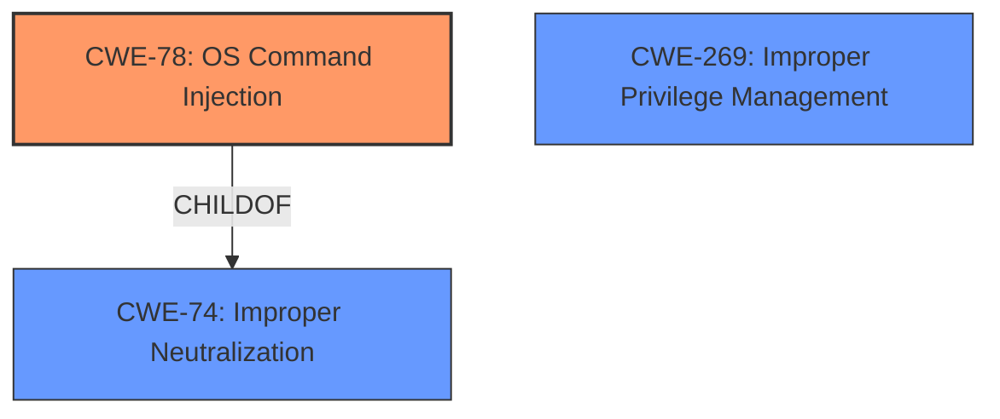

# Analysis Report for CVE-2024-41133

# Vulnerability Analysis Report: CVE-2024-41133

## Description

A vulnerability exists in the HPE Aruba Networking EdgeConnect SD-WAN gateways Command Line Interface that allows remote authenticated users to run arbitrary commands on the underlying host. Successful exploitation of this vulnerability will result in the ability to execute arbitrary commands as root on the underlying operating system leading to complete system compromise

## Vulnerability Description Key Phrases

- **Impact:** ['execute arbitrary commands as root on the underlying operating system leading to complete system compromise', 'run arbitrary commands']
- **Attacker:** remote authenticated users
- **Product:** HPE Aruba Networking EdgeConnect SD-WAN gateways
- **Component:** Command Line Interface

## Analysis (with Relationship Data)

# Summary
| CWE ID | CWE Name | Confidence | CWE Abstraction Level | CWE Vulnerability Mapping Label | CWE-Vulnerability Mapping Notes |
|---|---|---|---|---|---|
| CWE-78 | Improper Neutralization of Special Elements used in an OS Command ('OS Command Injection') | 1.0 | Base | Allowed | Primary CWE: The vulnerability allows remote authenticated users to run arbitrary commands on the underlying host due to improper neutralization of special elements in an OS command. |
| CWE-269 | Improper Privilege Management | 0.5 | Class | Discouraged | Secondary Candidate: The vulnerability leads to the ability to execute arbitrary commands as root, potentially indicating improper privilege management. However, CWE-78 is a more direct cause. |

## Evidence and Confidence

*   **Confidence Score:** 0.8
*   **Evidence Strength:** HIGH

## Relationship Analysis
The primary relationship that impacted my decision was the ChildOf relationship between CWE-78 and CWE-74 (Improper Neutralization of Special Elements in Output Used by a Downstream Component ('Injection')). CWE-78 is a specific type of injection related to OS commands, making it a more precise fit than the broader CWE-74.



## Vulnerability Chain
The vulnerability chain starts with the **improper neutralization** of special elements in the OS command (CWE-78), which allows an attacker to inject arbitrary commands. This leads to the ability to execute commands as root, potentially involving **improper privilege management** (CWE-269). The final impact is complete system compromise.

## Summary of Analysis
The initial analysis pointed strongly to CWE-78 due to the clear evidence of command injection. The vulnerability description and CVE summary both highlight the ability to run arbitrary commands due to **improper handling** of user-supplied input within the CLI. The retriever results also listed CWE-78 as the top candidate. While CWE-269 was considered due to the root access, it is more of an impact than a direct cause.

The selection of CWE-78 is based on concrete evidence from the CVE summary: "The vulnerability is related to **improper handling** of user-supplied input within the CLI, leading to command injection" and "Successful exploitation allows an attacker to execute arbitrary commands as root on the underlying operating system."

The graph relationships influenced the decision by highlighting that CWE-78 is a specific type of injection, making it a more appropriate choice than its parent CWE-74.

The selected CWE is at the optimal level of specificity because it directly addresses the root cause of the vulnerability, which is the **improper neutralization** of special elements in OS commands.

Relevant CWE Information:

# Enhanced Context (25 CWEs)
The following CWEs were identified as potentially relevant to this vulnerability:

## CWE-78: Improper Neutralization of Special Elements used in an OS Command ('OS Command Injection')
**Abstraction Level**: Base
**Similarity Score**: 0.76
**Source**: dense

**Description**:
The product constructs all or part of an OS command using externally-influenced input from an upstream component, but it does not neutralize or incorrectly neutralizes special elements that could modify the intended OS command when it is sent to a downstream component.

**Mapping Guidance**:
- Usage: Allowed
- Rationale: This CWE entry is at the Base level of abstraction, which is a preferred level of abstraction for mapping to the root causes of vulnerabilities.

**Justification**: The description aligns perfectly with the vulnerability where the CLI **fails to properly neutralize** special elements, enabling OS command injection.

## CWE-497: Exposure of Sensitive System Information to an Unauthorized Control Sphere
**Abstraction Level**: Base
**Similarity Score**: 0.75
**Source**: dense

**Description**:
The product does not properly prevent sensitive system-level information from being accessed by unauthorized actors who do not have the same level of access to the underlying system as the product does.

**Mapping Guidance**:
- Usage: Allowed
- Rationale: This CWE entry is at the Base level of abstraction, which is a preferred level of abstraction for mapping to the root causes of vulnerabilities.

**Justification**: While system compromise could lead to exposure of sensitive information, this is a consequence of the command injection, not the root cause. Therefore, this CWE is not appropriate.

## CWE-250: Execution with Unnecessary Privileges
**Abstraction Level**: Base
**Similarity Score**: 0.75
**Source**: dense

**Description**:
The product performs an operation at a privilege level that is higher than the minimum level required, which creates new weaknesses or amplifies the consequences of other weaknesses.

**Mapping Guidance**:
- Usage: Allowed
- Rationale: This CWE entry is at the Base level of abstraction, which is a preferred level of abstraction for mapping to the root causes of vulnerabilities.

**Justification**: While the attacker gains root privileges, the root cause is the command injection. This CWE is more of a contributing factor to the impact, not the primary weakness.

## CWE-88: Improper Neutralization of Argument Delimiters in a Command ('Argument Injection')
**Abstraction Level**: Base
**Similarity Score**: 0.74
**Source**: dense

**Description**:
The product constructs a string for a command to be executed by a separate component
in another control sphere, but it does not properly delimit the
intended arguments, options, or switches within that command string.

**Mapping Guidance**:
- Usage: Allowed
- Rationale: This CWE entry is at the Base level of abstraction, which is a preferred level of abstraction for mapping to the root causes of vulnerabilities.

**Justification**: This is a specific type of command injection. However, CWE-78 is the broader category that encompasses this, and is thus more appropriate.

## CWE-74: Improper Neutralization of Special Elements in Output Used by a Downstream Component ('Injection')
**Abstraction Level**: Class
**Similarity Score**: 0.74
**Source**: dense

**Description**:
The product constructs all or part of a command, data structure, or record using externally-influenced input from an upstream component, but it does not neutralize or incorrectly neutralizes special elements that could modify how it is parsed or interpreted when it is sent to a downstream component.

**Mapping Guidance**:
- Usage: Discouraged
- Rationale: CWE-74 is high-level and often misused when lower-level weaknesses are more appropriate.

**Justification**: CWE-78 is a specific type of injection (OS command injection) which makes it a better fit than this more general CWE.

## CWE-269: Improper Privilege Management
**Abstraction Level**: Class
**Similarity Score**: 0.74
**Source**: dense

**Description**:
The product does not properly assign, modify, track, or check privileges for an actor, creating an unintended sphere of control for that actor.

**Mapping Guidance**:
- Usage: Discouraged
- Rationale: CWE-269 is commonly misused. It can be conflated with "privilege escalation," which is a technical impact that is listed in many low-information vulnerability reports [REF-1287]. It is not useful for trend analysis.

**Justification**: While the vulnerability leads to root access, the root cause is the command injection. This CWE represents a potential consequence, not the primary weakness.

## CWE-912: Hidden Functionality
**Abstraction Level**: Class
**Similarity Score**: 0.73
**Source**: dense

**Description**:
The product contains functionality that is not documented, not part of the specification, and not accessible through an interface or command sequence that is obvious to the product's users or administrators.

**Mapping Guidance**:
- Usage: Allowed-with-Review
- Rationale: This CWE entry is a Class and might have Base-level children that would be more appropriate

**Justification**: There's no indication of hidden functionality in the description. The vulnerability is related to the CLI and improper neutralization, not undocumented features.

## CWE-755: Improper Handling of Exceptional Conditions
**Abstraction Level**: Class
**Similarity Score**: 0.73
**Source**: dense

**Description**:
The product does not handle or incorrectly handles an exceptional condition.

**Mapping Guidance**:
- Usage: Discouraged
- Rationale: This CWE entry is a level-1 Class (i.e., a child of a Pillar). It might have lower-level children that would be more appropriate

**Justification**: The vulnerability is due to improper neutralization of input, not necessarily the handling of exceptional conditions. Therefore, this is not the best fit.

## CWE-288: Authentication Bypass Using an Alternate Path or Channel
**Abstraction Level**: Base
**Similarity Score**: 0.73
**Source**: dense

**Description**:
The product requires authentication, but


## CWE Relationship Analysis

Current CWEs represent these abstraction levels: .


### Vulnerability Chain Analysis

**Chain starting from CWE-288:**
- 288 (Authentication Bypass Using an Alternate Path or Channel) - ROOT


**Chain starting from CWE-88:**
- 88 (Improper Neutralization of Argument Delimiters in a Command ('Argument Injection')) - ROOT


### CWE Relationship Diagram

```mermaid
graph TD
    classDef primary fill:#f96,stroke:#333,stroke-width:2px
    classDef secondary fill:#69f,stroke:#333
    classDef tertiary fill:#9e9,stroke:#333
```


*Report generated on 2025-07-13 12:58:30*
