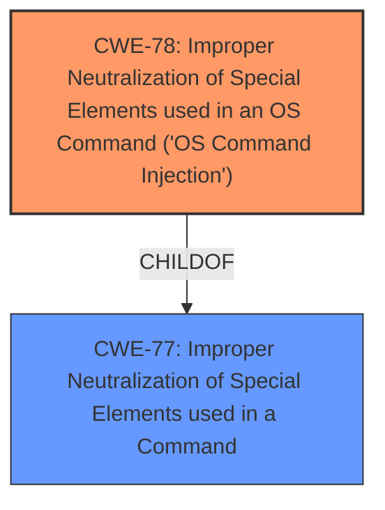

# Enhanced Analysis for CVE-2024-41134

# Summary
| CWE ID | CWE Name | Confidence | CWE Abstraction Level | CWE Vulnerability Mapping Label | CWE-Vulnerability Mapping Notes |
|---|---|---|---|---|---|
| CWE-78 | Improper Neutralization of Special Elements used in an OS Command ('OS Command Injection') | 0.9 | Base | Allowed | Primary CWE. The vulnerability allows remote authenticated users to run arbitrary commands on the underlying host due to **improper neutralization of special elements** in the OS command.|

## Evidence and Confidence

*   **Confidence Score:** 0.9
*   **Evidence Strength:** HIGH

## Relationship Analysis
The primary relationship considered was the parent-child relationship between CWE-78 and its parent CWEs. While CWE-77 (Improper Neutralization of Special Elements used in a Command) is a parent, CWE-78 is more specific as it directly relates to OS commands. The chain relationships (CanFollow, CanPrecede) for CWE-78, such as the relationship with CWE-184 (Incomplete List of Disallowed Inputs), were considered but not deemed directly applicable as the root cause is the **improper neutralization**, not necessarily an incomplete list of disallowed inputs. The base level of abstraction for CWE-78 is appropriate as it directly describes the vulnerability.



## Vulnerability Chain
The vulnerability chain starts with the **improper neutralization of special elements** within OS commands. This leads to the ability for authenticated users to inject and execute arbitrary commands. The final impact is complete system compromise, including the ability to execute arbitrary commands as root.

## Summary of Analysis
The initial analysis focused on the ability of remote authenticated users to run arbitrary commands. The retriever results suggested CWE-78, CWE-269 (Improper Privilege Management), and CWE-20 (Improper Input Validation). However, the root cause is more specifically related to the **improper handling of special elements** in OS commands, making CWE-78 the most appropriate choice.

The evidence for CWE-78 is the description stating that remote authenticated users can run arbitrary commands on the underlying host. This directly aligns with the definition of OS Command Injection.

CWE-269 was considered but deemed less appropriate because the core issue is not primarily about privilege management, but rather the **improper handling of input** that allows command injection. Similarly, CWE-20 is a broader category, and CWE-78 provides a more specific description of the vulnerability.

The selection of CWE-78 is at the optimal level of specificity as it directly addresses the root cause of the vulnerability: the **improper neutralization of special elements** in OS commands, leading to command injection.

Relevant CWE Information:

# Enhanced Context (25 CWEs)
The following CWEs were identified as potentially relevant to this vulnerability:

## CWE-78: Improper Neutralization of Special Elements used in an OS Command ('OS Command Injection')
**Technical Explanation:** The HPE Aruba Networking EdgeConnect SD-WAN gateways Command Line Interface contains a vulnerability where remote authenticated users can run arbitrary commands on the underlying host. This is because the system fails to properly neutralize special elements within the OS commands, allowing attackers to inject malicious commands.
**Security Implications:** An attacker can execute arbitrary commands as root on the underlying operating system, leading to complete system compromise.
**Relationship Analysis:** CWE-78 is a Base-level CWE, which is the preferred level for root causes. It is more specific than its parent, CWE-77 (Improper Neutralization of Special Elements used in a Command), because it focuses specifically on OS commands.
**Mapping Guidance Analysis:** The MITRE mapping guidance allows the use of CWE-78, and its rationale aligns with the vulnerability description.
**Mitigation Analysis:** Proper neutralization of special elements within OS commands would mitigate this vulnerability.

## CWE-497: Exposure of Sensitive System Information to an Unauthorized Control Sphere
**Justification for Exclusion:** While the attacker gains complete system compromise, the primary weakness is not the exposure of sensitive information. The root cause is the ability to execute arbitrary commands.

## CWE-250: Execution with Unnecessary Privileges
**Justification for Exclusion:** While the commands are executed as root, the primary weakness is the **improper neutralization of special elements**, not the unnecessary privilege.

## CWE-74: Improper Neutralization of Special Elements in Output Used by a Downstream Component ('Injection')
**Justification for Exclusion:** CWE-74 is a more general form of injection. CWE-78 is more specific to OS Command injection.

## CWE-912: Hidden Functionality
**Justification for Exclusion:** This CWE is not applicable as the vulnerability is not related to hidden functionality.

## CWE-88: Improper Neutralization of Argument Delimiters in a Command ('Argument Injection')
**Justification for Exclusion:** While related to command injection, CWE-88 is more specific to argument delimiters, which is not explicitly mentioned in the vulnerability description. CWE-78 is a better fit.

## CWE-288: Authentication Bypass Using an Alternate Path or Channel
**Justification for Exclusion:** The attacker needs to be an authenticated user.

## CWE-269: Improper Privilege Management
**Justification for Exclusion:** While the attacker gains root privileges, the root cause is not privilege management, but rather the **improper handling of input** that allows command injection.

## CWE-134: Use of Externally-Controlled Format String
**Justification for Exclusion:** The vulnerability is not related to format string usage.

## CWE-798: Use of Hard-coded Credentials
**Justification for Exclusion:** The vulnerability is not related to hard-coded credentials.

## CWE-22: Improper Limitation of a Pathname to a Restricted Directory ('Path Traversal')
**Justification for Exclusion:** The vulnerability is not related to path traversal.

## CWE-23: Relative Path Traversal
**Justification for Exclusion:** The vulnerability is not related to path traversal.

## CWE-184: Incomplete List of Disallowed Inputs
**Justification for Exclusion:** While an incomplete list of disallowed inputs could contribute, the core weakness is the **improper neutralization of special elements**, not necessarily an incomplete list.

## CWE-94: Improper Control of Generation of Code ('Code Injection')
**Justification for Exclusion:** This is a broader category. CWE-78 is more specific to OS Command injection.

## CWE-79: Improper Neutralization of Input During Web Page Generation ('Cross-site Scripting')
**Justification for Exclusion:** This is specific to web page generation and not applicable.

## CWE-20: Improper Input Validation
**Justification for Exclusion:** CWE-20 is a broad category, and CWE-78 provides a more specific description of the vulnerability.

## CWE-434: Unrestricted Upload of File with Dangerous Type
**Justification for Exclusion:** The vulnerability is not related to file uploads.

## CWE-770: Allocation of Resources Without Limits or Throttling
**Justification for Exclusion:** The vulnerability is not related to resource allocation.

## CWE-113: Improper Neutralization of CRLF Sequences in HTTP Headers ('HTTP Request/Response Splitting')
**Justification for Exclusion:** The vulnerability is not related to HTTP headers.


## CWE Relationship Analysis

Current CWEs represent these abstraction levels: .


### Vulnerability Chain Analysis

**Chain starting from CWE-94:**
- 94 (Improper Control of Generation of Code ('Code Injection')) - ROOT


**Chain starting from CWE-770:**
- 770 (Allocation of Resources Without Limits or Throttling) - ROOT


### CWE Relationship Diagram

```mermaid
graph TD
    classDef primary fill:#f96,stroke:#333,stroke-width:2px
    classDef secondary fill:#69f,stroke:#333
    classDef tertiary fill:#9e9,stroke:#333
```