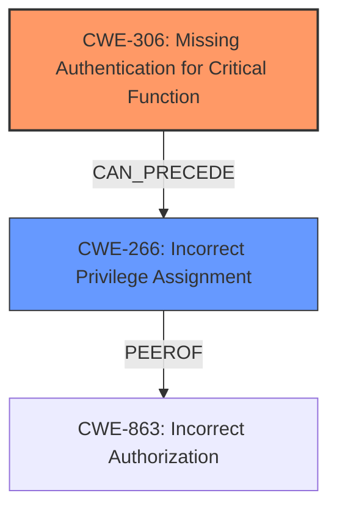

# Enhanced Analysis for CVE-2024-41195

# Summary
| CWE ID | CWE Name | Confidence | CWE Abstraction Level | CWE Vulnerability Mapping Label | CWE-Vulnerability Mapping Notes |
|---|---|---|---|---|---|
| CWE-306 | Missing Authentication for Critical Function | 1.0 | Base | Primary | Allowed |
| CWE-266 | Incorrect Privilege Assignment | 0.7 | Base | Secondary | Allowed |

## Evidence and Confidence

*   **Confidence Score:** 0.9
*   **Evidence Strength:** HIGH

## Relationship Analysis
The primary CWE is CWE-306, which indicates a complete lack of authentication for a critical function. The secondary CWE, CWE-266, suggests that incorrect privileges were assigned, potentially exacerbating the impact of the missing authentication. CWE-306 is a base-level CWE, providing a specific description of the authentication failure. The guidance suggests that if no identity check occurs, CWE-306 is appropriate.



## Vulnerability Chain
The vulnerability chain starts with the **missing authentication** (CWE-306). Because there is no authentication, an attacker can then leverage **incorrect privilege assignment** (CWE-266) to gain administrative access. The **impact** is bypass authentication and escalate privileges to Administrator.

## Summary of Analysis
The initial assessment identified CWE-306 as the primary weakness because the vulnerability description and the CVE summary clearly state a **lack of proper authentication checks**. The attacker crafts a TCP packet to bypass authentication. The subsequent privilege escalation is a direct result of this **missing authentication**, making CWE-306 the root cause.

The selection of CWE-306 is based on the evidence: "The vulnerability stems from a **lack of proper authentication checks** in the Ocuco Innovation software." This aligns perfectly with the description of CWE-306: "The product does not perform any authentication for functionality that requires a provable user identity or consumes a significant amount of resources."

The mapping guidance reinforces this decision: "If you know no login happened, lean toward authentication → CWE-306."

The additional identified weakness of **Incorrect Privilege Assignment** (CWE-266) is included as a secondary CWE to highlight the severity of the vulnerability. Had the application enforced correct privilege assignments, the impact of the **missing authentication** might have been lessened.

I considered many of the other CWEs in the Enhanced Context section but rejected them because of the explicit evidence pointing to missing authentication as the root cause. For example, while improper authorization (CWE-285) might seem relevant due to the "escalate privileges" impact, it is only a secondary consequence of the primary **lack of authentication** (CWE-306). Several other options, such as CWE-280, CWE-639, CWE-250 and CWE-248, were also considered but rejected because the initial **lack of authentication** is the key enabler for the exploit and privilege escalation.

Relevant CWE Information:

# Enhanced Context (25 CWEs)
The following CWEs were identified as potentially relevant to this vulnerability:

## CWE-266: Incorrect Privilege Assignment
**Abstraction Level**: Base
**Similarity Score**: 0.76
**Source**: dense

**Description**:
A product incorrectly assigns a privilege to a particular actor, creating an unintended sphere of control for that actor.

**Mapping Guidance**:
- Usage: Allowed
- Rationale: This CWE entry is at the Base level of abstraction, which is a preferred level of abstraction for mapping to the root causes of vulnerabilities.

## CWE-306: Missing Authentication for Critical Function
**Abstraction Level**: Base
**Similarity Score**: 2387.37
**Source**: sparse

**Description**:
The product does not perform any authentication for functionality that requires a provable user identity or consumes a significant amount of resources.

**Mapping Guidance**:
- Usage: Allowed
- Rationale: This CWE entry is at the Base level of abstraction, which is a preferred level of abstraction for mapping to the root causes of vulnerabilities.


## CWE Relationship Analysis

Current CWEs represent these abstraction levels: .


### Vulnerability Chain Analysis

**Chain starting from CWE-863:**
- 863 (Incorrect Authorization) - ROOT


**Chain starting from CWE-280:**
- 280 (Improper Handling of Insufficient Permissions or Privileges ) - ROOT


### CWE Relationship Diagram

```mermaid
graph TD
    classDef primary fill:#f96,stroke:#333,stroke-width:2px
    classDef secondary fill:#69f,stroke:#333
    classDef tertiary fill:#9e9,stroke:#333
```