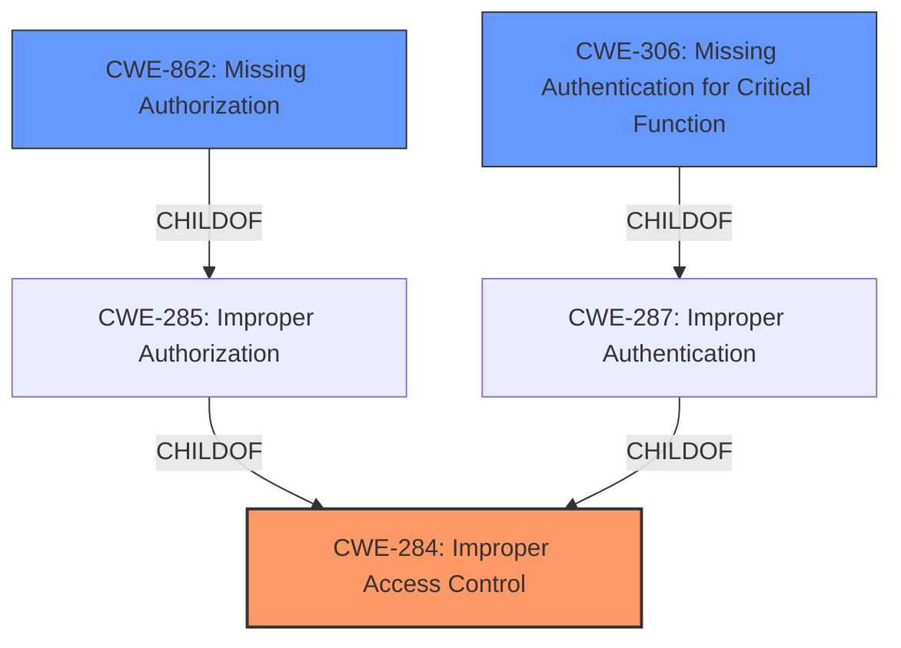

# Raw Analyzer Response for CVE-2024-41250

# Summary
| CWE ID | CWE Name | Confidence | CWE Abstraction Level | CWE Vulnerability Mapping Label | CWE-Vulnerability Mapping Notes |
|---|---|---|---|---|---|
| CWE-284 | Improper Access Control | 0.75 | Pillar | Allowed-with-Review | Primary CWE.  There is not enough information to determine if Authentication or Authorization is the weakness. |
| CWE-306 | Missing Authentication for Critical Function | 0.6 | Base | Allowed | Secondary candidate, if there is no authentication required to view student details. |
| CWE-862 | Missing Authorization | 0.6 | Base | Allowed | Secondary candidate, if there is authentication, but no authorization to view the student details. |

## Evidence and Confidence

*   **Confidence Score:** 0.75
*   **Evidence Strength:** LOW

## Relationship Analysis
The primary CWE is CWE-284, Improper Access Control, which is a high-level category. The more specific candidates, CWE-306 (Missing Authentication for Critical Function) and CWE-862 (Missing Authorization) are children of CWE-287 (Improper Authentication) and CWE-285 (Improper Authorization) respectively, and thus are more specific. The relationships show that access control issues can stem from authentication or authorization problems.

## Vulnerability Chain
The vulnerability chain starts with an **incorrect access control**, leading to the ability of remote unauthenticated attackers to **view STUDENT details**. This chain highlights a direct impact of the **root cause** on data confidentiality.

## Summary of Analysis
The initial analysis identified **incorrect access control** as the **root cause**, aligning with CWE-284 (Improper Access Control). The vulnerability description indicates that remote unauthenticated attackers can view student details in Kashipara Responsive School Management System v3.2.0.

The primary CWE match from similar CVE descriptions is CWE-NVD-Other. However, the retriever results suggest CWE-306 (Missing Authentication for Critical Function), CWE-425 (Direct Request ('Forced Browsing')), and CWE-639 (Authorization Bypass Through User-Controlled Key) as potential candidates.

Given the limited information, it is difficult to determine whether the **incorrect access control** stems from a missing authentication or authorization mechanism. Therefore, CWE-284 is selected as the primary CWE due to its broader scope. However, if further investigation reveals a missing authentication check, CWE-306 would be more appropriate. If authentication is present but bypassable, CWE-862 would be a better fit.

The selection of CWE-284 is based on the **rootcause** "**incorrect access control**" phrase from the "Vulnerability Description Key Phrases". The evidence is weak because the "CVE Reference Links Content Summary" section does not provide sufficient information to pinpoint the exact nature of the access control issue. Confidence is rated at 0.75 due to the ambiguity.

The additional CWEs were considered:

*   CWE-425: Direct Request ('Forced Browsing') - Rejected because it focuses on inadequate enforcement of authorization on restricted URLs, but the root cause is still **incorrect access control**.
*   CWE-639: Authorization Bypass Through User-Controlled Key - Rejected because the description doesn't point to the user controlled key, but rather **incorrect access control**.
* CWE-472: External Control of Assumed-Immutable Web Parameter - Rejected because there is no evidence of parameters being externally controlled.
* CWE-89: Improper Neutralization of Special Elements used in an SQL Command ('SQL Injection') - Rejected because there is no evidence of SQL injection.