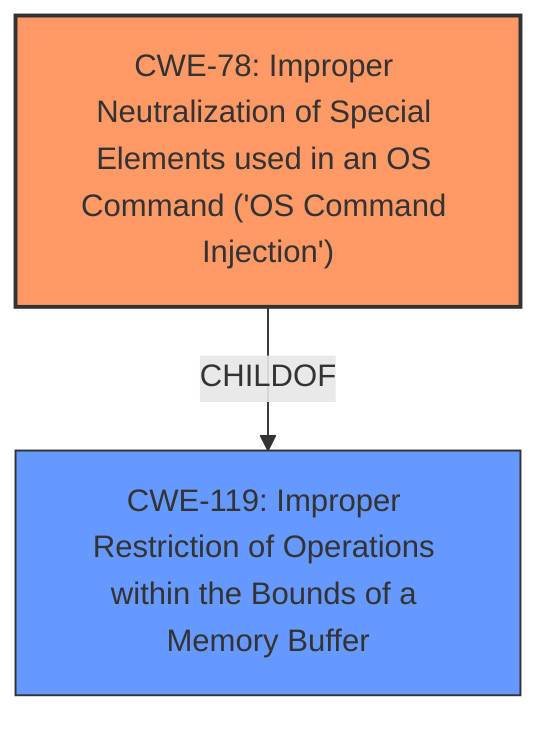

# Enhanced Analysis for CVE-2024-41319

# Summary
| CWE ID | CWE Name | Confidence | CWE Abstraction Level | CWE Vulnerability Mapping Label | CWE-Vulnerability Mapping Notes |
|---|---|---|---|---|---|
| CWE-78 | Improper Neutralization of Special Elements used in an OS Command ('OS Command Injection') | 1.0 | Base | Primary | Allowed |

## Evidence and Confidence

*   **Confidence Score:** 1.0
*   **Evidence Strength:** HIGH

## Relationship Analysis
The primary CWE is CWE-78, which is a base-level CWE. CWE-78 is a child of CWE-119 (Improper Restriction of Operations within the Bounds of a Memory Buffer). There are no direct chain relationships for CWE-78 that are relevant in this context. Choosing the base CWE provides enough specificity for the vulnerability detailed.



## Vulnerability Chain
The vulnerability chain starts with **improper neutralization** of the `cmd` parameter, leading to **command injection**, which allows an attacker to execute arbitrary commands on the router's operating system.

## Summary of Analysis
The vulnerability is a **command injection** vulnerability due to **improper neutralization** of input to the `webcmd` function. The most appropriate CWE is CWE-78.

The vulnerability description states: "TOTOLINK A6000R V1.0.1-B20201211.2000 was discovered to contain a **command injection** vulnerability via the cmd parameter in the webcmd function."

The CVE Reference Links Content Summary states: "The vulnerability stems from a lack of proper input sanitization in the `webcmd` function ... Specifically, the `cmd` parameter is directly used in a system call without any validation... The primary vulnerability is a command injection flaw. An attacker can inject arbitrary shell commands via the `cmd` parameter."

CWE-78 is the most appropriate because the vulnerability allows for the injection of OS commands.

I considered CWE-77 (Improper Neutralization of Special Elements used in a Command ('Command Injection')) but chose CWE-78 because the description and reference link content summaries specify that OS commands are being injected.

I considered CWE-74 (Improper Neutralization of Special Elements in Output Used by a Downstream Component ('Injection')) but the mapping guidance says it is discouraged.


## CWE Relationship Analysis

Current CWEs represent these abstraction levels: .


### Vulnerability Chain Analysis

**Chain starting from CWE-74:**
- 74 (Improper Neutralization of Special Elements in Output Used by a Downstream Component ('Injection')) - ROOT


**Chain starting from CWE-119:**
- 119 (Improper Restriction of Operations within the Bounds of a Memory Buffer) - ROOT


### CWE Relationship Diagram

```mermaid
graph TD
    classDef primary fill:#f96,stroke:#333,stroke-width:2px
    classDef secondary fill:#69f,stroke:#333
    classDef tertiary fill:#9e9,stroke:#333
```