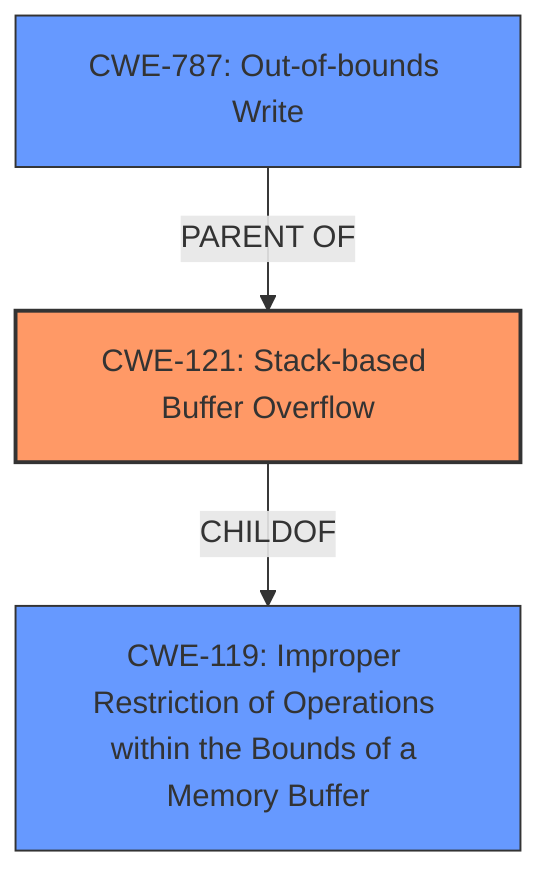

# Enhanced Analysis for CVE-2024-41461

# Summary
| CWE ID | CWE Name | Confidence | CWE Abstraction Level | CWE Vulnerability Mapping Label | CWE-Vulnerability Mapping Notes |
|---|---|---|---|---|---|
| CWE-121 | Stack-based Buffer Overflow | 1.0 | Variant | Allowed | Primary CWE |
| CWE-787 | Out-of-bounds Write | 0.7 | Base | Allowed | Secondary Candidate |
| CWE-119 | Improper Restriction of Operations within the Bounds of a Memory Buffer | 0.6 | Class | Discouraged | Secondary Candidate |

## Evidence and Confidence

*   **Confidence Score:** 0.9
*   **Evidence Strength:** HIGH

## Relationship Analysis
The primary CWE is CWE-121 Stack-based Buffer Overflow, a variant of CWE-119 Improper Restriction of Operations within the Bounds of a Memory Buffer. CWE-787 Out-of-bounds Write is a related weakness that can result from a buffer overflow. The selection of CWE-121 is more specific than CWE-119, reflecting the specific nature of the vulnerability occurring on the stack.



## Vulnerability Chain
The vulnerability chain starts with the **lack of input validation** on the `list1` parameter, leading to a **stack-based buffer overflow** when the data is copied without checking its size. This allows an attacker to **write beyond the allocated buffer on the stack** (Out-of-bounds Write), potentially leading to code execution or denial of service.

## Summary of Analysis
The vulnerability is clearly described as a **stack-based buffer overflow** due to the **lack of input validation** of the `list1` parameter. The CVE Reference Links Content Summary confirms this, stating that "The vulnerability occurs because the function doesn't validate the length of the `list1` parameter before copying it to the stack." This aligns perfectly with CWE-121, which is a variant-level CWE specifically addressing stack-based buffer overflows. The retriever results also list CWE-121 as a relevant CWE. While CWE-787 (Out-of-bounds Write) is also relevant, it is a more general weakness, and CWE-121 provides a more specific classification given the stack-based nature of the overflow. Therefore, CWE-121 is the most appropriate primary CWE.

Relevant CWE Information:

# Enhanced Context (25 CWEs)
The following CWEs were identified as potentially relevant to this vulnerability:

## CWE-121: Stack-based Buffer Overflow
**Abstraction Level**: Variant
**Similarity Score**: 0.73
**Source**: dense

**Description**:
A stack-based buffer overflow condition is a condition where the buffer being overwritten is allocated on the stack (i.e., is a local variable or, rarely, a parameter to a function).

**Mapping Guidance**:
- Usage: Allowed
- Rationale: This CWE entry is at the Variant level of abstraction, which is a preferred level of abstraction for mapping to the root causes of vulnerabilities.

## CWE-787: Out-of-bounds Write
**Abstraction Level**: base
**Similarity Score**: 3.30
**Source**: graph

**Description**:
CWE-787: Out-of-bounds Write

**Mapping Guidance**:
- Usage: Allowed
- Rationale: This CWE entry is at the Base level of abstraction, which is a preferred level of abstraction for mapping to the root causes of vulnerabilities.

## CWE-119: Improper Restriction of Operations within the Bounds of a Memory Buffer
**Abstraction Level**: Class
**Similarity Score**: 0.68
**Source**: dense

**Description**:
The product performs operations on a memory buffer, but it reads from or writes to a memory location outside the buffer's intended boundary. This may result in read or write operations on unexpected memory locations that could be linked to other variables, data structures, or internal program data.

**Mapping Guidance**:
- Usage: Discouraged
- Rationale: CWE-119 is commonly misused in low-information vulnerability reports when lower-level CWEs could be used instead, or when more details about the vulnerability are available.

CWE-120 Buffer Copy without Checking Size of Input ('Classic Buffer Overflow') was considered but not selected because the vulnerability description explicitly mentions the stack, making CWE-121 a better fit. CWE-119 was considered but not selected as CWE-121 is a child (more specific) CWE.


## CWE Relationship Analysis

Current CWEs represent these abstraction levels: .


### Vulnerability Chain Analysis

**Chain starting from CWE-119:**
- 119 (Improper Restriction of Operations within the Bounds of a Memory Buffer) - ROOT


**Chain starting from CWE-121:**
- 121 (Stack-based Buffer Overflow) - ROOT


### CWE Relationship Diagram

```mermaid
graph TD
    classDef primary fill:#f96,stroke:#333,stroke-width:2px
    classDef secondary fill:#69f,stroke:#333
    classDef tertiary fill:#9e9,stroke:#333
```